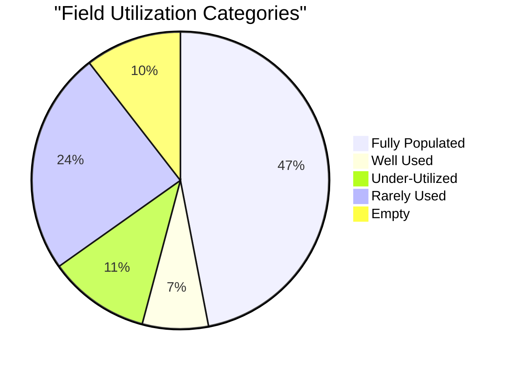
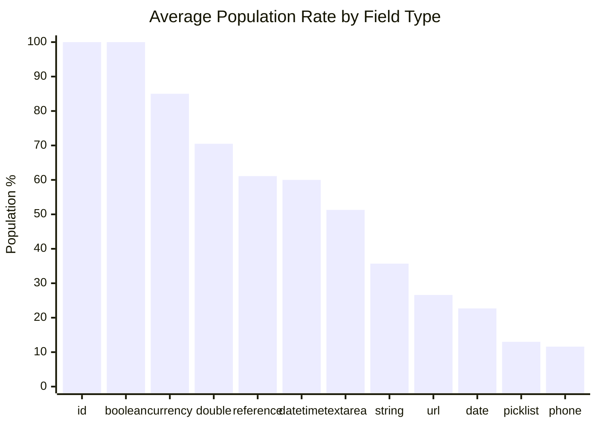
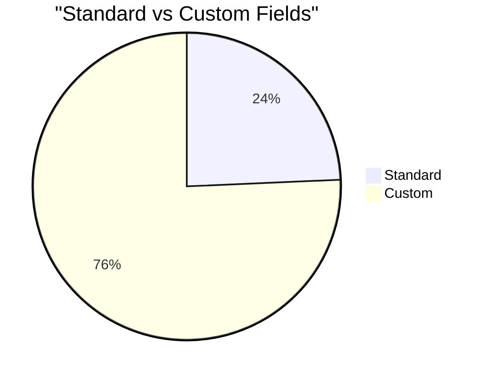
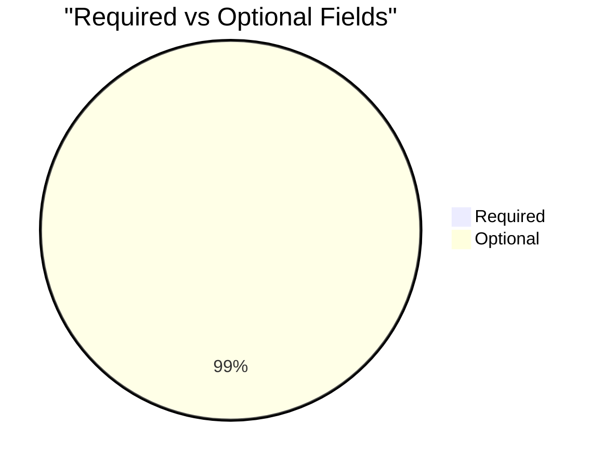

# Field Utilization Analysis: Organization (`Account`)

> Generated on 2026-03-19 14:28:29

## Executive Summary

| Metric | Value |
| --- | --- |
| **Object** | Organization (`Account`) |
| **Total Records** | 8,311 |
| **Total Fields Analyzed** | 181 |
| **Standard / Custom** | 44 / 137 |
| **Formula / Calculated** | 32 |
| **Required / Optional** | 1 / 180 |
| **Mean Population Rate** | 57.0% |
| **Median Population Rate** | 86.3% |

## Utilization Category Distribution

| Category | Threshold | Fields | % of Total |
| --- | --- | --- | --- |
| Fully Populated | > 95 % | 85 | 47.0% |
| Well Used | 50 – 95 % | 13 | 7.2% |
| Under-Utilized | 10 – 50 % | 20 | 11.0% |
| Rarely Used | 1 – 10 % | 44 | 24.3% |
| Empty | 0 % | 19 | 10.5% |

## Descriptive Statistics

Population-rate statistics across all analyzed fields:

| Statistic | Value |
| --- | --- |
| N (fields) | 181 |
| Mean | 56.96% |
| Median | 86.30% |
| Std Dev | 45.92% |
| Variance | 2109.03 |
| Min | 0.00% |
| Max | 100.00% |
| Q1 (25th pctl) | 1.65% |
| Q3 (75th pctl) | 100.00% |
| IQR | 98.35% |
| 5th Percentile | 0.00% |
| 95th Percentile | 100.00% |
| Skewness | -0.249 |
| Excess Kurtosis | -1.835 |
| Mode | 100.0% |

**Interpretation:**

- **Skewness (-0.249)** — Approximately symmetric distribution of population rates.
- **Kurtosis (-1.835)** — Platykurtic: light tails and a flat peak — population rates are broadly spread.

## Utilization by Field Type

| Field Type | Count | Avg Population Rate |
| --- | --- | --- |
| id | 1 | 100.0% |
| boolean | 19 | 100.0% |
| currency | 46 | 85.0% |
| double | 23 | 70.5% |
| reference | 8 | 61.1% |
| datetime | 5 | 60.0% |
| textarea | 4 | 51.3% |
| string | 30 | 35.7% |
| url | 4 | 26.6% |
| date | 15 | 22.7% |
| picklist | 17 | 13.0% |
| phone | 3 | 11.6% |
| percent | 2 | 3.9% |
| multipicklist | 3 | 0.7% |
| int | 1 | 0.0% |

## Standard vs Custom Field Comparison

| Segment | Fields | Avg Population Rate |
| --- | --- | --- |
| Standard | 44 | 38.7% |
| Custom | 137 | 62.8% |

## Required vs Optional Fields

| Segment | Fields | Avg Population Rate |
| --- | --- | --- |
| Required | 1 | 100.0% |
| Optional | 180 | 56.7% |

## Detailed Field Analysis

### Fully Populated (85 fields)

| Field API Name | Label | Type | Population | Rate | Custom | Required | Formula |
| --- | --- | --- | --- | --- | --- | --- | --- |
| `Id` | Organization ID | id | 8,311 | 100.0% |  |  |  |
| `Name` | Organization Name | string | 8,311 | 100.0% |  | Yes |  |
| `RecordTypeId` | Record Type | reference | 8,311 | 100.0% |  |  |  |
| `PhotoUrl` | Photo URL | url | 8,311 | 100.0% |  |  |  |
| `CurrencyIsoCode` | Organization Currency | picklist | 8,311 | 100.0% |  |  |  |
| `OwnerId` | Organization Owner | reference | 8,311 | 100.0% |  |  |  |
| `CreatedDate` | Created Date | datetime | 8,311 | 100.0% |  |  |  |
| `CreatedById` | Created By ID | reference | 8,311 | 100.0% |  |  |  |
| `LastModifiedDate` | Last Modified Date | datetime | 8,311 | 100.0% |  |  |  |
| `LastModifiedById` | Last Modified By ID | reference | 8,311 | 100.0% |  |  |  |
| `SystemModstamp` | System Modstamp | datetime | 8,311 | 100.0% |  |  |  |
| `Household_Soft_Credit_LY__c` | Household Soft Credit LY | currency | 8,311 | 100.0% | Yes |  |  |
| `SponsorOpps__c` | SponsorOpps | double | 8,311 | 100.0% | Yes |  | Yes |
| `Enrollments_this_year__c` | Enrollments last 12 | double | 8,311 | 100.0% | Yes |  |  |
| `Total_Non_Sponsorship_Donations__c` | Total Non-Sponsorship Donations | currency | 8,311 | 100.0% | Yes |  | Yes |
| `Map__c` | Map | string | 8,311 | 100.0% | Yes |  | Yes |
| `npe01__LifetimeDonationHistory_Amount__c` | DEPRECATED - Lifetime Donation Amount | currency | 8,311 | 100.0% | Yes |  | Yes |
| `npe01__LifetimeDonationHistory_Number__c` | DEPRECATED - Lifetime Donation Number | double | 8,311 | 100.0% | Yes |  | Yes |
| `npo02__AverageAmount__c` | Average Gift | currency | 8,311 | 100.0% | Yes |  |  |
| `npo02__LastMembershipAmount__c` | Last Membership Amount | currency | 8,311 | 100.0% | Yes |  |  |
| `npo02__NumberOfClosedOpps__c` | Total Number of Gifts | double | 8,311 | 100.0% | Yes |  |  |
| `npo02__NumberOfMembershipOpps__c` | Number of Memberships | double | 8,311 | 100.0% | Yes |  |  |
| `npo02__OppAmount2YearsAgo__c` | Total Gifts Two Years Ago | currency | 8,311 | 100.0% | Yes |  |  |
| `npo02__OppAmountLastNDays__c` | Total Gifts Last N Days | currency | 8,311 | 100.0% | Yes |  |  |
| `npo02__OppAmountLastYear__c` | Total Gifts Last Year | currency | 8,311 | 100.0% | Yes |  |  |
| `npo02__OppAmountThisYear__c` | Total Gifts This Year | currency | 8,311 | 100.0% | Yes |  |  |
| `npo02__OppsClosed2YearsAgo__c` | Number of Gifts Two Years Ago | double | 8,311 | 100.0% | Yes |  |  |
| `npo02__OppsClosedLastNDays__c` | Number of Gifts Last N Days | double | 8,311 | 100.0% | Yes |  |  |
| `npo02__OppsClosedLastYear__c` | Number of Gifts Last Year | double | 8,311 | 100.0% | Yes |  |  |
| `npo02__OppsClosedThisYear__c` | Number of Gifts This Year | double | 8,311 | 100.0% | Yes |  |  |
| `npo02__TotalMembershipOppAmount__c` | Total Membership Amount | currency | 8,311 | 100.0% | Yes |  |  |
| `npo02__TotalOppAmount__c` | Total Gifts | currency | 8,311 | 100.0% | Yes |  |  |
| `Total_In_Kind_Gifts__c` | Total Amount In-Kind Gifts | currency | 8,311 | 100.0% | Yes |  | Yes |
| `Total_Tax_Deductible_Gifts__c` | Total Tax Deductible Gifts | currency | 8,311 | 100.0% | Yes |  | Yes |
| `Household_Soft_Credit_All_Time__c` | Household Soft Credit All Time | currency | 8,311 | 100.0% | Yes |  |  |
| `DAF_Donations_all_Time__c` | DAF Donations all Time | currency | 8,311 | 100.0% | Yes |  |  |
| `Soft_Credit_DAF_Total__c` | Soft Credit + DAF Total | currency | 8,311 | 100.0% | Yes |  | Yes |
| `Total_Enrollments__c` | Total Enrollments | double | 8,311 | 100.0% | Yes |  |  |
| `Total_CAR_Records__c` | Total CAR Records | double | 8,311 | 100.0% | Yes |  |  |
| `CAR_Last_12__c` | CAR Last 12 | double | 8,311 | 100.0% | Yes |  |  |
| `Tax_Deductible_Gifts_Last_Year__c` | Tax Deductible Gifts Last Year | currency | 8,311 | 100.0% | Yes |  |  |
| `Total_Opptties_ALL_TYPES__c` | Total Opptties ALL TYPES | currency | 8,311 | 100.0% | Yes |  | Yes |
| `Total_Purchases__c` | Total Purchases | currency | 8,311 | 100.0% | Yes |  | Yes |
| `Aspect_Active_Sponsor_in_Household__c` | Aspect.Active Sponsor in Household | double | 8,311 | 100.0% | Yes |  |  |
| `DAF_Donations_Last_Year__c` | DAF Donations Last Year | currency | 8,311 | 100.0% | Yes |  |  |
| `Soft_Credit_DAF_Last_Year__c` | Soft Credit + DAF Last Year | currency | 8,311 | 100.0% | Yes |  | Yes |
| `MERGE_Formal_Greeting__c` | MERGE: Formal Greeting | string | 8,311 | 100.0% | Yes |  | Yes |
| `MERGE_Today__c` | MERGE: Today | date | 8,311 | 100.0% | Yes |  | Yes |
| `s_Total_Annual_School_Fee_Cost__c` | *s Total Annual School Fee Cost | currency | 8,311 | 100.0% | Yes |  | Yes |
| `Days_Since_Last_Leadership_Touchpoint__c` | Days Since Last Leadership Touchpoint | double | 8,311 | 100.0% | Yes |  | Yes |
| `Last_Gift_Month_Merge__c` | Last Gift Month (Merge) | string | 8,311 | 100.0% | Yes |  | Yes |
| `First_Gift_Month_Year_Merge__c` | First Gift Month & Year (Merge) | string | 8,311 | 100.0% | Yes |  | Yes |
| `IsDeleted` | Deleted | boolean | 8,311 | 100.0% |  |  |  |
| `IsPriorityRecord` | Important | boolean | 8,311 | 100.0% |  |  |  |
| `npe01__SYSTEMIsIndividual__c` | _SYSTEM: IsIndividual | boolean | 8,311 | 100.0% | Yes |  |  |
| `npsp__Grantmaker__c` | Grantmaker | boolean | 8,311 | 100.0% | Yes |  |  |
| `npsp__Matching_Gift_Company__c` | Matching Gift Company | boolean | 8,311 | 100.0% | Yes |  |  |
| `Handwritten_Note__c` | Handwritten Note? | boolean | 8,311 | 100.0% | Yes |  |  |
| `npsp__Undeliverable_Address__c` | Undeliverable Billing Address | boolean | 8,311 | 100.0% | Yes |  |  |
| `Inactive__c` | Inactive | boolean | 8,311 | 100.0% | Yes |  |  |
| `s_Has_Primary_and_JSS__c` | *s Has Primary and JSS | boolean | 8,311 | 100.0% | Yes |  |  |
| `s_Provides_Meals__c` | *s Provides Meals | boolean | 8,311 | 100.0% | Yes |  |  |
| `s_Has_a_Child__c` | *s Has a Child Protection Policy | boolean | 8,311 | 100.0% | Yes |  |  |
| `s_Has_Enough_Qualified_Teachers__c` | *s Has Enough Qualified Teachers | boolean | 8,311 | 100.0% | Yes |  |  |
| `s_Has_Adequate_Teaching_Resources__c` | *s Has Adequate Teaching Resources | boolean | 8,311 | 100.0% | Yes |  |  |
| `s_Has_Adequate_Infrastructure__c` | *s Has Adequate Infrastructure | boolean | 8,311 | 100.0% | Yes |  |  |
| `s_Has_a_Sports_Field__c` | *s Has a Sports Field | boolean | 8,311 | 100.0% | Yes |  |  |
| `s_Has_Science_Laboratory_Equipments__c` | *s Has Science Laboratory & Equipments | boolean | 8,311 | 100.0% | Yes |  |  |
| `s_Has_a_Computer_Lab_Equipment__c` | *s Has a Computer Lab & Equipment | boolean | 8,311 | 100.0% | Yes |  |  |
| `s_Has_a_Land_Space_for_Agriculture__c` | *s Has a Land/Space for Agriculture | boolean | 8,311 | 100.0% | Yes |  |  |
| `s_Has_Adequate_Clean_Sanitation__c` | *s Has Adequate & Clean Sanitation | boolean | 8,311 | 100.0% | Yes |  |  |
| `Total_Camp_Donation_This_Year__c` | Total Camp Donation This Year | currency | 8,301 | 99.9% | Yes |  |  |
| `Total_Camp_Donations_Last_Year__c` | Total Camp Donations Last Year | currency | 8,301 | 99.9% | Yes |  |  |
| `Total_Sponsorship_Donations_TY__c` | Total Sponsorship Donations TY | currency | 8,301 | 99.9% | Yes |  |  |
| `Total_Sponsorship_Donations_LY__c` | Total Sponsorship Donations LY | currency | 8,301 | 99.9% | Yes |  |  |
| `Total_General_Donations_TY__c` | Total General Donations TY | currency | 8,301 | 99.9% | Yes |  |  |
| `Total_General_Donations_LY__c` | Total General Donations LY | currency | 8,301 | 99.9% | Yes |  |  |
| `Total_Scholarship_Fund_Donations_TY__c` | Total Scholarship Fund Donations TY | currency | 8,301 | 99.9% | Yes |  |  |
| `Total_Scholarship_Fund_Donations_LY__c` | Total Scholarship Fund Donations LY | currency | 8,301 | 99.9% | Yes |  |  |
| `Total_Transition_Fund_Donation_TY__c` | Total Transition Fund Donation TY | currency | 8,301 | 99.9% | Yes |  |  |
| `Total_Transition_Fund_Donation_LY__c` | Total Transition Fund Donation LY | currency | 8,301 | 99.9% | Yes |  |  |
| `Total_Endowment_Fund_Donations_TY__c` | Total Endowment Fund Donations TY | currency | 8,301 | 99.9% | Yes |  |  |
| `Total_Endowment_Fund_Donations_LY__c` | Total Endowment Fund Donations LY | currency | 8,301 | 99.9% | Yes |  |  |
| `MERGE_Greeting__c` | MERGE: Greeting | string | 8,125 | 97.8% | Yes |  | Yes |
| `Type` | Type | picklist | 8,124 | 97.7% |  |  |  |

### Well Used (13 fields)

| Field API Name | Label | Type | Population | Rate | Custom | Required | Formula |
| --- | --- | --- | --- | --- | --- | --- | --- |
| `npo02__LargestAmount__c` | Largest Gift | currency | 7,795 | 93.8% | Yes |  |  |
| `npo02__SmallestAmount__c` | Smallest Gift | currency | 7,795 | 93.8% | Yes |  |  |
| `Total_Camp_Donation_Last_2_Y__c` | Total Camp Donations Last 24M | currency | 7,522 | 90.5% | Yes |  |  |
| `npe01__One2OneContact__c` | Primary Contact | reference | 7,297 | 87.8% | Yes |  |  |
| `QB_Donor_Name__c` | QB Donor Name | string | 7,297 | 87.8% | Yes |  | Yes |
| `npo02__LastOppAmount__c` | Last Gift Amount | currency | 7,172 | 86.3% | Yes |  |  |
| `Q4_Previous_FY_Total_Gifts__c` | Q4 Previous FY Total Gifts | currency | 7,108 | 85.5% | Yes |  |  |
| `Q4_Previous_FY_Total_Number_of_Gifts__c` | Q4 Previous FY Total Number of Gifts | double | 7,108 | 85.5% | Yes |  |  |
| `npo02__Formal_Greeting__c` | Formal Greeting | textarea | 6,966 | 83.8% | Yes |  |  |
| `npsp__Number_of_Household_Members__c` | Number of Household Members | double | 6,960 | 83.7% | Yes |  |  |
| `npe01__SYSTEM_AccountType__c` | _SYSTEM: AccountType | string | 6,945 | 83.6% | Yes |  |  |
| `BillingCountry` | Billing Country | string | 6,853 | 82.5% |  |  |  |
| `npo02__Informal_Greeting__c` | Informal Greeting | textarea | 6,767 | 81.4% | Yes |  |  |

### Under-Utilized (20 fields)

| Field API Name | Label | Type | Population | Rate | Custom | Required | Formula |
| --- | --- | --- | --- | --- | --- | --- | --- |
| `BillingCity` | Billing City | string | 3,824 | 46.0% |  |  |  |
| `LastActivityDate` | Last Activity | date | 3,288 | 39.6% |  |  |  |
| `MixmaxInsights__Last_Activity_Date__c` | Last Activity Date | date | 3,288 | 39.6% | Yes |  | Yes |
| `MixmaxInsights__Days_since_Last_Activity__c` | Days since Last Activity | double | 3,288 | 39.6% | Yes |  | Yes |
| `BillingStreet` | Billing Street | textarea | 3,247 | 39.1% |  |  |  |
| `RM_from_CR__c` | RM from CR | string | 3,037 | 36.5% | Yes |  | Yes |
| `npo02__Best_Gift_Year_Total__c` | Best Gift Year Total | currency | 2,926 | 35.2% | Yes |  |  |
| `Phone` | Phone | phone | 2,796 | 33.6% |  |  |  |
| `Primary_Contact_Email__c` | Primary Contact Email | string | 2,574 | 31.0% | Yes |  | Yes |
| `Last_Won_Opportunity_Any__c` | Last Won Opportunity (Any) | date | 2,346 | 28.2% | Yes |  | Yes |
| `npe01__FirstDonationDate__c` | DEPRECATED - First Donation Date | date | 2,342 | 28.2% | Yes |  | Yes |
| `npe01__LastDonationDate__c` | DEPRECATED - Last Donation Date | date | 2,342 | 28.2% | Yes |  | Yes |
| `Allocation_Types__c` | Allocation Types | string | 2,312 | 27.8% | Yes |  |  |
| `Total_Non_Sponsorship_Donations_Last_N_D__c` | Total Non-Sponsorship Donations Last N D | currency | 2,203 | 26.5% | Yes |  |  |
| `BillingState` | Billing State/Province | string | 2,044 | 24.6% |  |  |  |
| `BillingPostalCode` | Billing Zip/Postal Code | string | 2,044 | 24.6% |  |  |  |
| `Became_a_Donor__c` | *Became a Donor | date | 1,896 | 22.8% | Yes |  | Yes |
| `npo02__Best_Gift_Year__c` | Best Gift Year | string | 1,774 | 21.3% | Yes |  |  |
| `npo02__FirstCloseDate__c` | First Gift Date | date | 1,774 | 21.3% | Yes |  |  |
| `npo02__LastCloseDate__c` | Last Gift Date | date | 1,774 | 21.3% | Yes |  |  |

### Rarely Used (44 fields)

| Field API Name | Label | Type | Population | Rate | Custom | Required | Formula |
| --- | --- | --- | --- | --- | --- | --- | --- |
| `LastSponsorOpp__c` | LastSponsorOpp | date | 552 | 6.6% | Yes |  | Yes |
| `CAR_All_Time__c` | CAR % All Time | percent | 404 | 4.9% | Yes |  | Yes |
| `CAR_Score_All_Time__c` | CAR Score All Time | double | 404 | 4.9% | Yes |  | Yes |
| `School_Level__c` | School Level | picklist | 402 | 4.8% | Yes |  |  |
| `School_Category__c` | School Category | picklist | 378 | 4.5% | Yes |  |  |
| `Most_Recent_Close_Date_Last_Year__c` | Most Recent Close Date Last Year | date | 348 | 4.2% | Yes |  |  |
| `Website` | Website | url | 346 | 4.2% |  |  |  |
| `Sub__c` | Sub-Type | picklist | 304 | 3.7% | Yes |  |  |
| `CAR_Last_12_Months__c` | CAR % Last 12 Months | percent | 248 | 3.0% | Yes |  | Yes |
| `CAR_Score_last_12__c` | CAR Score last 12 | double | 248 | 3.0% | Yes |  | Yes |
| `Aspect_Students_Sponsored_Last_24_M__c` | Aspect.Students Sponsored Last 24 M | string | 233 | 2.8% | Yes |  |  |
| `County__c` | County | picklist | 221 | 2.7% | Yes |  |  |
| `Region__c` | Region | picklist | 221 | 2.7% | Yes |  |  |
| `SubCounty__c` | SubCounty | picklist | 220 | 2.6% | Yes |  |  |
| `Old_School_ID__c` | Old School ID | string | 182 | 2.2% | Yes |  |  |
| `Sponsor_Portal_School_Link__c` | Sponsor Portal School Link | url | 182 | 2.2% | Yes |  |  |
| `BillingLatitude` | Billing Latitude | double | 154 | 1.9% |  |  |  |
| `BillingLongitude` | Billing Longitude | double | 154 | 1.9% |  |  |  |
| `npo02__SYSTEM_CUSTOM_NAMING__c` | _SYSTEM: CUSTOM NAMING | multipicklist | 121 | 1.5% | Yes |  |  |
| `ShippingCity` | Shipping City | string | 104 | 1.3% |  |  |  |
| `Relationship_Type__c` | Relationship Type | picklist | 101 | 1.2% | Yes |  |  |
| `ParentId` | Parent Organization | reference | 84 | 1.0% |  |  |  |
| `ShippingState` | Shipping State/Province | string | 81 | 1.0% |  |  |  |
| `npo02__HouseholdPhone__c` | Household Phone | phone | 79 | 1.0% | Yes |  |  |
| `ShippingStreet` | Shipping Street | textarea | 77 | 0.9% |  |  |  |
| `ShippingPostalCode` | Shipping Zip/Postal Code | string | 76 | 0.9% |  |  |  |
| `ShippingCountry` | Shipping Country | string | 44 | 0.5% |  |  |  |
| `Will_Give_To__c` | Will Give To | multipicklist | 34 | 0.4% | Yes |  |  |
| `Fax` | Fax | phone | 25 | 0.3% |  |  |  |
| `RD_Active_Students__c` | RD Active Students | string | 20 | 0.2% | Yes |  |  |
| `NgongRoad_URL__c` | NgongRoad URL | url | 14 | 0.2% | Yes |  |  |
| `npsp__Funding_Focus__c` | Funding Focus | multipicklist | 8 | 0.1% | Yes |  |  |
| `s_Annual_School_Fees__c` | *s Annual School Fees | currency | 7 | 0.1% | Yes |  |  |
| `s_Other_School_Costs__c` | *s Other School Costs | currency | 7 | 0.1% | Yes |  |  |
| `s_Provision_of_Books_and_Materials__c` | *s Provision of Books and Materials | picklist | 7 | 0.1% | Yes |  |  |
| `s_Children_Safety_Rating__c` | *s Children Safety Rating | picklist | 7 | 0.1% | Yes |  |  |
| `s_Proximity_to_Students__c` | *s Proximity to Students | picklist | 7 | 0.1% | Yes |  |  |
| `s_Viable_Means_of_Transport_Available__c` | *s Viable Means of Transport Available | picklist | 7 | 0.1% | Yes |  |  |
| `s_Uniform_Cost__c` | *s Uniform Cost | currency | 6 | 0.1% | Yes |  |  |
| `s_Books_and_Materials__c` | *s Books and Materials | currency | 5 | 0.1% | Yes |  |  |
| `s_Transport_Cost__c` | *s Transport Cost | currency | 3 | 0.0% | Yes |  |  |
| `Latitude__c` | Latitude | string | 1 | 0.0% | Yes |  |  |
| `Longitude__c` | Longitude | string | 1 | 0.0% | Yes |  |  |
| `Last_Leadership_Touchpoint__c` | Last Leadership Touchpoint | date | 1 | 0.0% | Yes |  |  |

### Empty (19 fields)

| Field API Name | Label | Type | Population | Rate | Custom | Required | Formula |
| --- | --- | --- | --- | --- | --- | --- | --- |
| `MasterRecordId` | Master Record ID | reference | 0 | 0.0% |  |  |  |
| `BillingGeocodeAccuracy` | Billing Geocode Accuracy | picklist | 0 | 0.0% |  |  |  |
| `ShippingLatitude` | Shipping Latitude | double | 0 | 0.0% |  |  |  |
| `ShippingLongitude` | Shipping Longitude | double | 0 | 0.0% |  |  |  |
| `ShippingGeocodeAccuracy` | Shipping Geocode Accuracy | picklist | 0 | 0.0% |  |  |  |
| `Industry` | Industry | picklist | 0 | 0.0% |  |  |  |
| `NumberOfEmployees` | Employees | int | 0 | 0.0% |  |  |  |
| `LastViewedDate` | Last Viewed Date | datetime | 0 | 0.0% |  |  |  |
| `LastReferencedDate` | Last Referenced Date | datetime | 0 | 0.0% |  |  |  |
| `Jigsaw` | Data.com Key | string | 0 | 0.0% |  |  |  |
| `JigsawCompanyId` | Jigsaw Company ID | string | 0 | 0.0% |  |  |  |
| `AccountSource` | Account Source | picklist | 0 | 0.0% |  |  |  |
| `SicDesc` | SIC Description | string | 0 | 0.0% |  |  |  |
| `npo02__LastMembershipDate__c` | Last Membership Date | date | 0 | 0.0% | Yes |  |  |
| `npo02__LastMembershipLevel__c` | Last Membership Level | string | 0 | 0.0% | Yes |  |  |
| `npo02__LastMembershipOrigin__c` | Last Membership Origin | string | 0 | 0.0% | Yes |  |  |
| `npo02__MembershipEndDate__c` | Membership End Date | date | 0 | 0.0% | Yes |  |  |
| `npo02__MembershipJoinDate__c` | Membership Join Date | date | 0 | 0.0% | Yes |  |  |
| `npsp__Batch__c` | Batch | reference | 0 | 0.0% | Yes |  |  |

### Skipped Fields (compound / non-queryable)

| Field API Name | Label | Type |
| --- | --- | --- |
| `BillingAddress` | Billing Address | address |
| `ShippingAddress` | Shipping Address | address |
| `Description` | Description | textarea |

## Recommendations

### Fields Recommended for Deletion Review

These **custom** fields have **0 % population**, are not required, and are not formula fields.
They are strong candidates for removal after confirming they are not referenced in automation, reports, or integrations.

- `npo02__LastMembershipDate__c` (Last Membership Date) — date
- `npo02__LastMembershipLevel__c` (Last Membership Level) — string
- `npo02__LastMembershipOrigin__c` (Last Membership Origin) — string
- `npo02__MembershipEndDate__c` (Membership End Date) — date
- `npo02__MembershipJoinDate__c` (Membership Join Date) — date
- `npsp__Batch__c` (Batch) — reference

### Fields Needing a Data Collection Strategy

These fields are **< 25 % populated** and user-editable. Evaluate whether the data is valuable;
if so, consider validation rules, required-field configuration, screen flows, or training to improve collection.

| Field | Label | Type | Rate | Custom |
| --- | --- | --- | --- | --- |
| `Latitude__c` | Latitude | string | 0.0% | Yes |
| `Longitude__c` | Longitude | string | 0.0% | Yes |
| `Last_Leadership_Touchpoint__c` | Last Leadership Touchpoint | date | 0.0% | Yes |
| `s_Transport_Cost__c` | *s Transport Cost | currency | 0.0% | Yes |
| `s_Books_and_Materials__c` | *s Books and Materials | currency | 0.1% | Yes |
| `s_Uniform_Cost__c` | *s Uniform Cost | currency | 0.1% | Yes |
| `s_Annual_School_Fees__c` | *s Annual School Fees | currency | 0.1% | Yes |
| `s_Other_School_Costs__c` | *s Other School Costs | currency | 0.1% | Yes |
| `s_Provision_of_Books_and_Materials__c` | *s Provision of Books and Materials | picklist | 0.1% | Yes |
| `s_Children_Safety_Rating__c` | *s Children Safety Rating | picklist | 0.1% | Yes |
| `s_Proximity_to_Students__c` | *s Proximity to Students | picklist | 0.1% | Yes |
| `s_Viable_Means_of_Transport_Available__c` | *s Viable Means of Transport Available | picklist | 0.1% | Yes |
| `npsp__Funding_Focus__c` | Funding Focus | multipicklist | 0.1% | Yes |
| `NgongRoad_URL__c` | NgongRoad URL | url | 0.2% | Yes |
| `RD_Active_Students__c` | RD Active Students | string | 0.2% | Yes |
| `Fax` | Fax | phone | 0.3% |  |
| `Will_Give_To__c` | Will Give To | multipicklist | 0.4% | Yes |
| `ShippingCountry` | Shipping Country | string | 0.5% |  |
| `ShippingPostalCode` | Shipping Zip/Postal Code | string | 0.9% |  |
| `ShippingStreet` | Shipping Street | textarea | 0.9% |  |
| `npo02__HouseholdPhone__c` | Household Phone | phone | 1.0% | Yes |
| `ShippingState` | Shipping State/Province | string | 1.0% |  |
| `ParentId` | Parent Organization | reference | 1.0% |  |
| `Relationship_Type__c` | Relationship Type | picklist | 1.2% | Yes |
| `ShippingCity` | Shipping City | string | 1.3% |  |
| `npo02__SYSTEM_CUSTOM_NAMING__c` | _SYSTEM: CUSTOM NAMING | multipicklist | 1.5% | Yes |
| `BillingLatitude` | Billing Latitude | double | 1.9% |  |
| `BillingLongitude` | Billing Longitude | double | 1.9% |  |
| `Old_School_ID__c` | Old School ID | string | 2.2% | Yes |
| `Sponsor_Portal_School_Link__c` | Sponsor Portal School Link | url | 2.2% | Yes |
| `SubCounty__c` | SubCounty | picklist | 2.6% | Yes |
| `County__c` | County | picklist | 2.7% | Yes |
| `Region__c` | Region | picklist | 2.7% | Yes |
| `Aspect_Students_Sponsored_Last_24_M__c` | Aspect.Students Sponsored Last 24 M | string | 2.8% | Yes |
| `Sub__c` | Sub-Type | picklist | 3.7% | Yes |
| `Website` | Website | url | 4.2% |  |
| `Most_Recent_Close_Date_Last_Year__c` | Most Recent Close Date Last Year | date | 4.2% | Yes |
| `School_Category__c` | School Category | picklist | 4.5% | Yes |
| `School_Level__c` | School Level | picklist | 4.8% | Yes |
| `npo02__Best_Gift_Year__c` | Best Gift Year | string | 21.3% | Yes |
| `npo02__FirstCloseDate__c` | First Gift Date | date | 21.3% | Yes |
| `npo02__LastCloseDate__c` | Last Gift Date | date | 21.3% | Yes |
| `BillingState` | Billing State/Province | string | 24.6% |  |
| `BillingPostalCode` | Billing Zip/Postal Code | string | 24.6% |  |

---

*Analysis performed on 2026-03-19 14:28:29 against `Account` with 8,311 records.*
