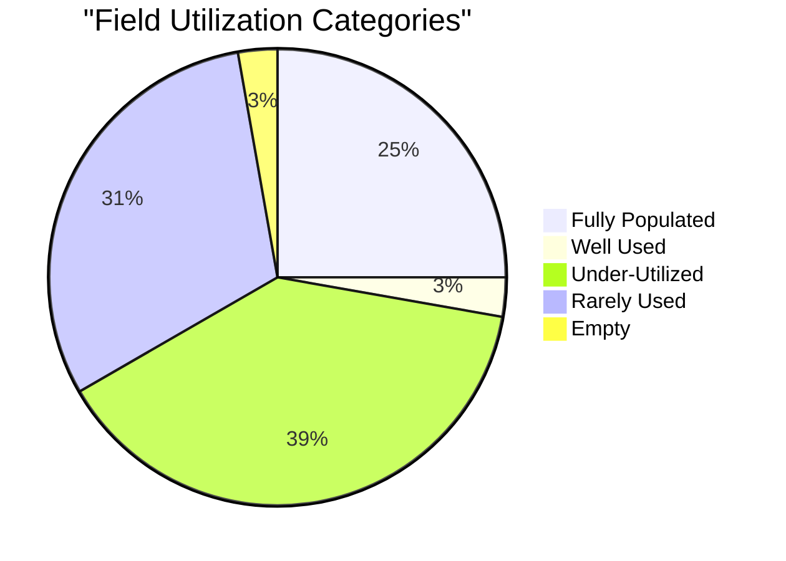
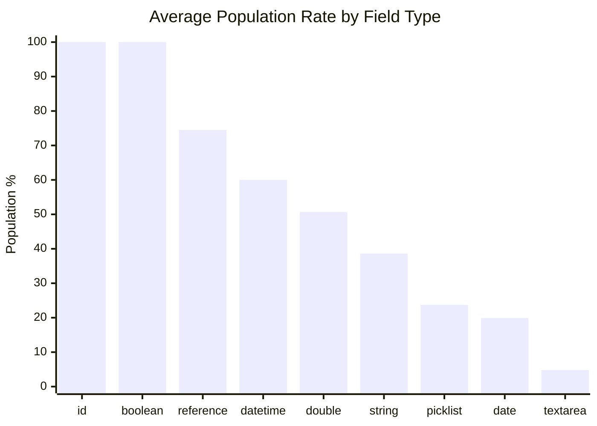
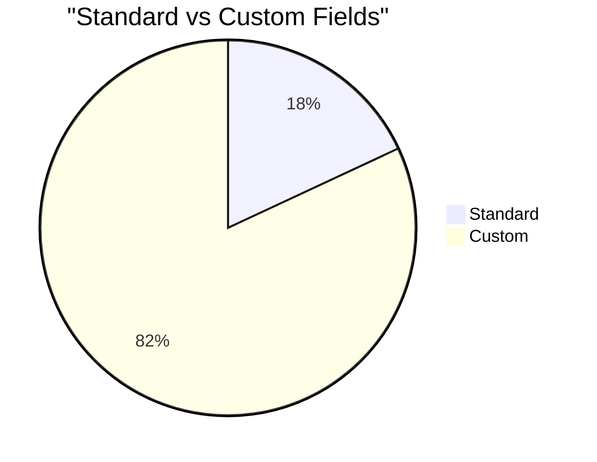
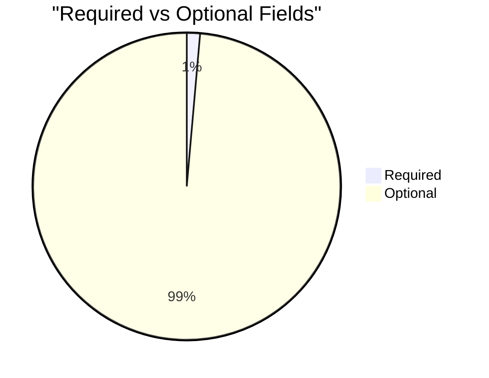

# Field Utilization Analysis: Assessment Report (`Assessment_Report__c`)

> Generated on 2026-03-19 16:10:22

## Executive Summary

| Metric | Value |
| --- | --- |
| **Object** | Assessment Report (`Assessment_Report__c`) |
| **Total Records** | 18,689 |
| **Total Fields Analyzed** | 72 |
| **Standard / Custom** | 13 / 59 |
| **Formula / Calculated** | 2 |
| **Required / Optional** | 1 / 71 |
| **Mean Population Rate** | 34.6% |
| **Median Population Rate** | 14.0% |

## Utilization Category Distribution

| Category | Threshold | Fields | % of Total |
| --- | --- | --- | --- |
| Fully Populated | > 95 % | 18 | 25.0% |
| Well Used | 50 – 95 % | 2 | 2.8% |
| Under-Utilized | 10 – 50 % | 28 | 38.9% |
| Rarely Used | 1 – 10 % | 22 | 30.6% |
| Empty | 0 % | 2 | 2.8% |

## Descriptive Statistics

Population-rate statistics across all analyzed fields:

| Statistic | Value |
| --- | --- |
| N (fields) | 72 |
| Mean | 34.65% |
| Median | 14.04% |
| Std Dev | 40.06% |
| Variance | 1605.19 |
| Min | 0.00% |
| Max | 100.00% |
| Q1 (25th pctl) | 3.70% |
| Q3 (75th pctl) | 94.99% |
| IQR | 91.29% |
| 5th Percentile | 0.97% |
| 95th Percentile | 100.00% |
| Skewness | 0.937 |
| Excess Kurtosis | -0.992 |
| Mode | 100.0% |

**Interpretation:**

- **Skewness (0.937)** — Right-skewed: most fields cluster at lower population rates with a few highly populated outliers.
- **Kurtosis (-0.992)** — Mesokurtic: distribution shape is close to normal.

## Utilization by Field Type

| Field Type | Count | Avg Population Rate |
| --- | --- | --- |
| id | 1 | 100.0% |
| boolean | 3 | 100.0% |
| reference | 6 | 74.5% |
| datetime | 5 | 60.0% |
| double | 2 | 50.7% |
| string | 8 | 38.6% |
| picklist | 33 | 23.7% |
| date | 6 | 19.9% |
| textarea | 8 | 4.8% |

## Standard vs Custom Field Comparison

| Segment | Fields | Avg Population Rate |
| --- | --- | --- |
| Standard | 13 | 77.1% |
| Custom | 59 | 25.3% |

## Required vs Optional Fields

| Segment | Fields | Avg Population Rate |
| --- | --- | --- |
| Required | 1 | 100.0% |
| Optional | 71 | 33.7% |

## Detailed Field Analysis

### Fully Populated (18 fields)

| Field API Name | Label | Type | Population | Rate | Custom | Required | Formula |
| --- | --- | --- | --- | --- | --- | --- | --- |
| `Id` | Record ID | id | 18,689 | 100.0% |  |  |  |
| `Name` | Assessmnt Rpt ID #: | string | 18,689 | 100.0% |  |  |  |
| `CurrencyIsoCode` | Currency ISO Code | picklist | 18,689 | 100.0% |  |  |  |
| `RecordTypeId` | Record Type ID | reference | 18,689 | 100.0% |  |  |  |
| `CreatedDate` | Created Date | datetime | 18,689 | 100.0% |  |  |  |
| `CreatedById` | Created By ID | reference | 18,689 | 100.0% |  |  |  |
| `LastModifiedDate` | Last Modified Date | datetime | 18,689 | 100.0% |  |  |  |
| `LastModifiedById` | Last Modified By ID | reference | 18,689 | 100.0% |  |  |  |
| `SystemModstamp` | System Modstamp | datetime | 18,689 | 100.0% |  |  |  |
| `Assessment_Snip__c` | Assessment Snip | string | 18,689 | 100.0% | Yes |  | Yes |
| `Assessment_Status__c` | Assessment Status | picklist | 18,689 | 100.0% | Yes |  |  |
| `c_Student__c` | *c Student | reference | 18,689 | 100.0% | Yes | Yes |  |
| `count__c` | count | double | 18,689 | 100.0% | Yes |  | Yes |
| `IsDeleted` | Deleted | boolean | 18,689 | 100.0% |  |  |  |
| `Student_has_had_special_achievement__c` | Student has had special achievement | boolean | 18,689 | 100.0% | Yes |  |  |
| `In_person_interaction_with_CW__c` | In-person interaction with CW? | boolean | 18,689 | 100.0% | Yes |  |  |
| `Assessment_Date__c` | Assessment Date | date | 18,680 | 100.0% | Yes |  |  |
| `Follow_Up_Required__c` | Follow-Up Required | picklist | 18,523 | 99.1% | Yes |  |  |

### Well Used (2 fields)

| Field API Name | Label | Type | Population | Rate | Custom | Required | Formula |
| --- | --- | --- | --- | --- | --- | --- | --- |
| `Is_anyone_in_the_home_working__c` | Is anyone in the home working? | picklist | 15,444 | 82.6% | Yes |  |  |
| `old_assessment_record_id__c` | old assessment record id | string | 11,214 | 60.0% | Yes |  |  |

### Under-Utilized (28 fields)

| Field API Name | Label | Type | Population | Rate | Custom | Required | Formula |
| --- | --- | --- | --- | --- | --- | --- | --- |
| `Contact_Type__c` | Contact Type | picklist | 8,290 | 44.4% | Yes |  |  |
| `Leadership_potential__c` | Leadership potential | picklist | 6,213 | 33.2% | Yes |  |  |
| `Contact_Interviewed2__c` | Home Contact Interviewed | reference | 5,285 | 28.3% | Yes |  |  |
| `Subject_which_most_needs_improvement__c` | Subject which most needs improvement? | string | 4,775 | 25.5% | Yes |  |  |
| `School5__c` | School | reference | 3,452 | 18.5% | Yes |  |  |
| `School_Contact_Interviewed2__c` | School Contact Interviewed | picklist | 3,447 | 18.4% | Yes |  |  |
| `Class_Participation__c` | Class Participation | picklist | 3,431 | 18.4% | Yes |  |  |
| `Social_Skills__c` | Social Skills | picklist | 3,408 | 18.2% | Yes |  |  |
| `Student_s_scholastic_strength__c` | Student's scholastic strength | picklist | 3,403 | 18.2% | Yes |  |  |
| `Time_Management__c` | Time Management | picklist | 3,382 | 18.1% | Yes |  |  |
| `General_behavior__c` | General behavior | picklist | 3,382 | 18.1% | Yes |  |  |
| `Relationship_to_Child__c` | x dep Relationship to Child | picklist | 3,065 | 16.4% | Yes |  |  |
| `Child_s_Health_Assessment__c` | Child's Health Assessment | picklist | 2,930 | 15.7% | Yes |  |  |
| `Best_subject__c` | Best subject? | string | 2,768 | 14.8% | Yes |  |  |
| `Does_student_respect_authority_figures__c` | Does student respect authority figures? | picklist | 2,767 | 14.8% | Yes |  |  |
| `Student_s_general_communication_skills__c` | Student's general communication skills? | picklist | 2,749 | 14.7% | Yes |  |  |
| `How_many_people_live_in_your_house__c` | How many people live in your house? | picklist | 2,499 | 13.4% | Yes |  |  |
| `Do_you_like_your_home__c` | Do you like your home? | picklist | 2,423 | 13.0% | Yes |  |  |
| `Do_you_feel_good_about_school__c` | Do you feel good about school? | picklist | 2,398 | 12.8% | Yes |  |  |
| `Child_s_home_situation_rating__c` | Child's home situation rating. | picklist | 2,397 | 12.8% | Yes |  |  |
| `Have_you_had_any_problems_at_home__c` | Have you had any problems at home? | picklist | 2,380 | 12.7% | Yes |  |  |
| `Next_of_Kin__c` | Next of Kin | textarea | 2,330 | 12.5% | Yes |  |  |
| `Talk_to_Home__c` | Talk to -- Home? | picklist | 2,267 | 12.1% | Yes |  |  |
| `If_yes_what_work_do_they_do__c` | If yes, what work do they do? | textarea | 2,243 | 12.0% | Yes |  |  |
| `First_or_Second_Report__c` | xdep First or Second Report | picklist | 2,119 | 11.3% | Yes |  |  |
| `Do_you_visit_the_child_s_school__c` | Do you visit the child's school? | picklist | 1,983 | 10.6% | Yes |  |  |
| `Open_conversations_with_your_child__c` | Open conversations with your child? | picklist | 1,983 | 10.6% | Yes |  |  |
| `Child_s_basic_support__c` | Child's basic support | picklist | 1,933 | 10.3% | Yes |  |  |

### Rarely Used (22 fields)

| Field API Name | Label | Type | Population | Rate | Custom | Required | Formula |
| --- | --- | --- | --- | --- | --- | --- | --- |
| `Talk_to_School__c` | Talk to - School? | picklist | 1,794 | 9.6% | Yes |  |  |
| `Second_School_Visit_Date__c` | xDEP Second School Visit Date | date | 1,773 | 9.5% | Yes |  |  |
| `Next_of_Kin_Phone__c` | Next of Kin Phone | string | 1,214 | 6.5% | Yes |  |  |
| `Rural_Relative_Contact_Info__c` | Rural Relative Contact Info | textarea | 898 | 4.8% | Yes |  |  |
| `Additional_Home_Visit_Date__c` | x DEP Additional Home Visit Date | date | 780 | 4.2% | Yes |  |  |
| `Student_has_special_Achievement__c` | *Student has special Achievement? | picklist | 741 | 4.0% | Yes |  |  |
| `School_Contact_Interviewed__c` | xDEP School Contact Interviewed | textarea | 675 | 3.6% | Yes |  |  |
| `Food__c` | Food | picklist | 632 | 3.4% | Yes |  |  |
| `Shelter__c` | Shelter | picklist | 631 | 3.4% | Yes |  |  |
| `Safety_Security__c` | Safety & Security | picklist | 631 | 3.4% | Yes |  |  |
| `Clothing__c` | Clothing | picklist | 630 | 3.4% | Yes |  |  |
| `Child_Overall_Health_Assessment__c` | Child Overall Health Assessment | picklist | 623 | 3.3% | Yes |  |  |
| `Third_School_Visit_Date__c` | xDEP Third School Visit Date | date | 473 | 2.5% | Yes |  |  |
| `LastActivityDate` | Last Activity Date | date | 311 | 1.7% |  |  |  |
| `Secondary_Grad_Year__c` | Secondary Grad Year | double | 250 | 1.3% | Yes |  |  |
| `Current_Residence_Location__c` | Current Residence Location | textarea | 250 | 1.3% | Yes |  |  |
| `Household_Residents__c` | Household Residents | textarea | 250 | 1.3% | Yes |  |  |
| `Current_Course__c` | Current Course | textarea | 250 | 1.3% | Yes |  |  |
| `Level__c` | Level | string | 250 | 1.3% | Yes |  |  |
| `Current_Stage__c` | Current Stage | textarea | 250 | 1.3% | Yes |  |  |
| `Planned_Graduation_Date__c` | Planned Graduation Date | date | 250 | 1.3% | Yes |  |  |
| `NRCA_ID__c` | NRCA ID | string | 54 | 0.3% | Yes |  |  |

### Empty (2 fields)

| Field API Name | Label | Type | Population | Rate | Custom | Required | Formula |
| --- | --- | --- | --- | --- | --- | --- | --- |
| `LastViewedDate` | Last Viewed Date | datetime | 0 | 0.0% |  |  |  |
| `LastReferencedDate` | Last Referenced Date | datetime | 0 | 0.0% |  |  |  |

### Skipped Fields (compound / non-queryable)

| Field API Name | Label | Type |
| --- | --- | --- |
| `Interests_and_Hobbies__c` | Interests and Hobbies | textarea |
| `School_Adtnl_Cmnts__c` | Additional Comments - School | textarea |
| `Secondary_Student_Camp_Essay__c` | Secondary Student Camp Essay | textarea |
| `Term_Update__c` | Home Life Update | textarea |
| `Employment__c` | Employment | textarea |
| `Steps_to_Achieve_Goals__c` | Steps to Achieve Goals | textarea |
| `Results_to_Date__c` | Results to Date | textarea |
| `Results_Feelings__c` | Results Feelings | textarea |
| `View_of_School_and_Course__c` | View of School and Course | textarea |
| `Graduation_Prerequisites__c` | Graduation Prerequisites | textarea |
| `School_Transportation__c` | School Transportation | textarea |
| `Current_Challenges__c` | Current Challenges | textarea |
| `New_in_School_Life__c` | New in School Life | textarea |
| `Details_about_home_situation__c` | Details about home situation-Guardian | textarea |
| `Case_Manager_Overall_Assessment__c` | Case Manager Overall Assessment | textarea |
| `If_unwell_name_issue_and_next_steps__c` | If unwell, what is the next steps? | textarea |
| `Details_about_school_achievement__c` | Details about school achievement | textarea |
| `If_you_don_t_like_your_home_why_not__c` | If you don't like your home, why not? | textarea |
| `If_yes_what_problems__c` | If yes, what problems? | textarea |
| `How_is_your_life_different_with_NRCF__c` | How is your life different with NRCF? | textarea |
| `What_would_you_change_in_your_life__c` | What would you change in your life? | textarea |
| `What_do_you_want_to_be_in_the_future__c` | What do you want to be / Career Goals | textarea |
| `Additional_Comments_interviewee__c` | Additional Comments (interviewee) | textarea |

## Recommendations

### Fields Recommended for Deletion Review

No custom fields with 0 % population found — all custom fields contain at least some data.

### Fields Needing a Data Collection Strategy

These fields are **< 25 % populated** and user-editable. Evaluate whether the data is valuable;
if so, consider validation rules, required-field configuration, screen flows, or training to improve collection.

| Field | Label | Type | Rate | Custom |
| --- | --- | --- | --- | --- |
| `NRCA_ID__c` | NRCA ID | string | 0.3% | Yes |
| `Secondary_Grad_Year__c` | Secondary Grad Year | double | 1.3% | Yes |
| `Current_Residence_Location__c` | Current Residence Location | textarea | 1.3% | Yes |
| `Household_Residents__c` | Household Residents | textarea | 1.3% | Yes |
| `Current_Course__c` | Current Course | textarea | 1.3% | Yes |
| `Level__c` | Level | string | 1.3% | Yes |
| `Current_Stage__c` | Current Stage | textarea | 1.3% | Yes |
| `Planned_Graduation_Date__c` | Planned Graduation Date | date | 1.3% | Yes |
| `Third_School_Visit_Date__c` | xDEP Third School Visit Date | date | 2.5% | Yes |
| `Child_Overall_Health_Assessment__c` | Child Overall Health Assessment | picklist | 3.3% | Yes |
| `Clothing__c` | Clothing | picklist | 3.4% | Yes |
| `Shelter__c` | Shelter | picklist | 3.4% | Yes |
| `Safety_Security__c` | Safety & Security | picklist | 3.4% | Yes |
| `Food__c` | Food | picklist | 3.4% | Yes |
| `School_Contact_Interviewed__c` | xDEP School Contact Interviewed | textarea | 3.6% | Yes |
| `Student_has_special_Achievement__c` | *Student has special Achievement? | picklist | 4.0% | Yes |
| `Additional_Home_Visit_Date__c` | x DEP Additional Home Visit Date | date | 4.2% | Yes |
| `Rural_Relative_Contact_Info__c` | Rural Relative Contact Info | textarea | 4.8% | Yes |
| `Next_of_Kin_Phone__c` | Next of Kin Phone | string | 6.5% | Yes |
| `Second_School_Visit_Date__c` | xDEP Second School Visit Date | date | 9.5% | Yes |
| `Talk_to_School__c` | Talk to - School? | picklist | 9.6% | Yes |
| `Child_s_basic_support__c` | Child's basic support | picklist | 10.3% | Yes |
| `Do_you_visit_the_child_s_school__c` | Do you visit the child's school? | picklist | 10.6% | Yes |
| `Open_conversations_with_your_child__c` | Open conversations with your child? | picklist | 10.6% | Yes |
| `First_or_Second_Report__c` | xdep First or Second Report | picklist | 11.3% | Yes |
| `If_yes_what_work_do_they_do__c` | If yes, what work do they do? | textarea | 12.0% | Yes |
| `Talk_to_Home__c` | Talk to -- Home? | picklist | 12.1% | Yes |
| `Next_of_Kin__c` | Next of Kin | textarea | 12.5% | Yes |
| `Have_you_had_any_problems_at_home__c` | Have you had any problems at home? | picklist | 12.7% | Yes |
| `Child_s_home_situation_rating__c` | Child's home situation rating. | picklist | 12.8% | Yes |
| `Do_you_feel_good_about_school__c` | Do you feel good about school? | picklist | 12.8% | Yes |
| `Do_you_like_your_home__c` | Do you like your home? | picklist | 13.0% | Yes |
| `How_many_people_live_in_your_house__c` | How many people live in your house? | picklist | 13.4% | Yes |
| `Student_s_general_communication_skills__c` | Student's general communication skills? | picklist | 14.7% | Yes |
| `Does_student_respect_authority_figures__c` | Does student respect authority figures? | picklist | 14.8% | Yes |
| `Best_subject__c` | Best subject? | string | 14.8% | Yes |
| `Child_s_Health_Assessment__c` | Child's Health Assessment | picklist | 15.7% | Yes |
| `Relationship_to_Child__c` | x dep Relationship to Child | picklist | 16.4% | Yes |
| `Time_Management__c` | Time Management | picklist | 18.1% | Yes |
| `General_behavior__c` | General behavior | picklist | 18.1% | Yes |
| `Student_s_scholastic_strength__c` | Student's scholastic strength | picklist | 18.2% | Yes |
| `Social_Skills__c` | Social Skills | picklist | 18.2% | Yes |
| `Class_Participation__c` | Class Participation | picklist | 18.4% | Yes |
| `School_Contact_Interviewed2__c` | School Contact Interviewed | picklist | 18.4% | Yes |
| `School5__c` | School | reference | 18.5% | Yes |

---

*Analysis performed on 2026-03-19 16:10:22 against `Assessment_Report__c` with 18,689 records.*
