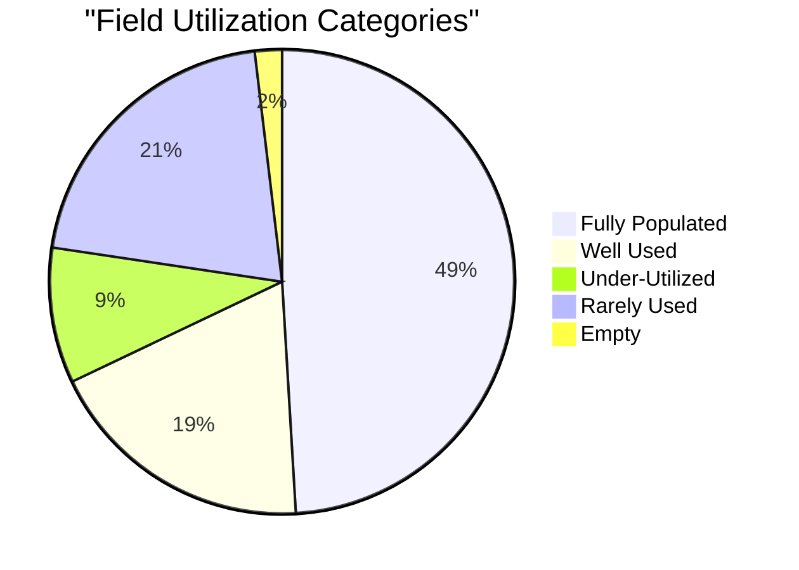
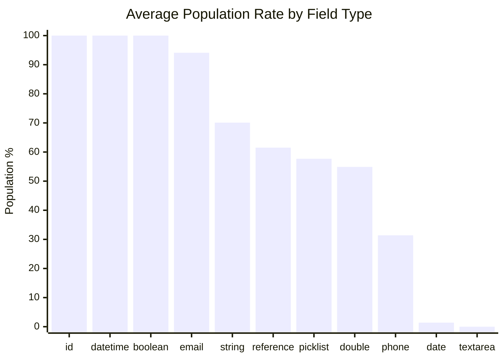
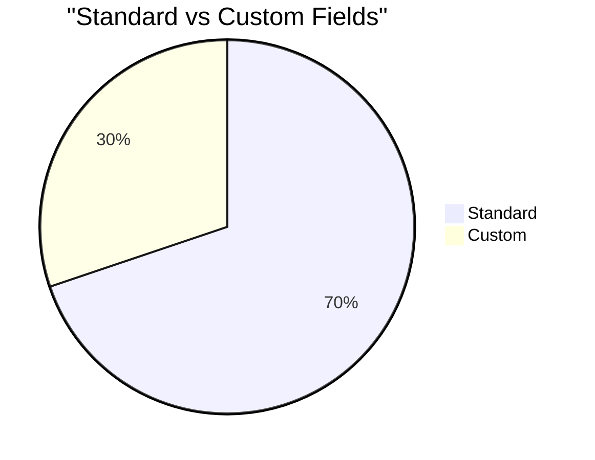
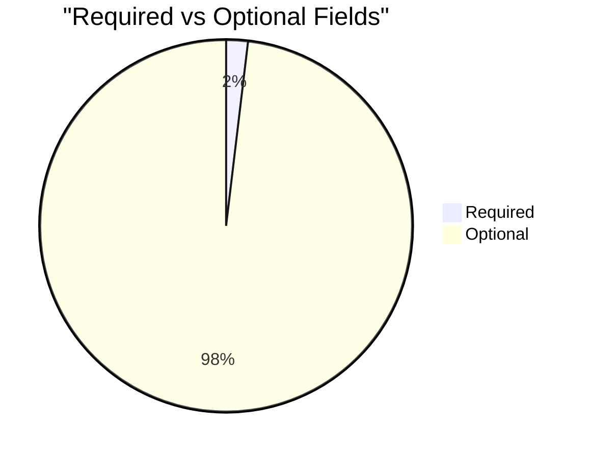

# Field Utilization Analysis: Campaign Member (`CampaignMember`)

> Generated on 2026-03-19 16:10:46

## Executive Summary

| Metric | Value |
| --- | --- |
| **Object** | Campaign Member (`CampaignMember`) |
| **Total Records** | 128,646 |
| **Total Fields Analyzed** | 53 |
| **Standard / Custom** | 37 / 16 |
| **Formula / Calculated** | 4 |
| **Required / Optional** | 1 / 52 |
| **Mean Population Rate** | 64.8% |
| **Median Population Rate** | 94.1% |

## Utilization Category Distribution

| Category | Threshold | Fields | % of Total |
| --- | --- | --- | --- |
| Fully Populated | > 95 % | 26 | 49.1% |
| Well Used | 50 – 95 % | 10 | 18.9% |
| Under-Utilized | 10 – 50 % | 5 | 9.4% |
| Rarely Used | 1 – 10 % | 11 | 20.8% |
| Empty | 0 % | 1 | 1.9% |

## Descriptive Statistics

Population-rate statistics across all analyzed fields:

| Statistic | Value |
| --- | --- |
| N (fields) | 53 |
| Mean | 64.80% |
| Median | 94.06% |
| Std Dev | 41.51% |
| Variance | 1723.18 |
| Min | 0.00% |
| Max | 100.00% |
| Q1 (25th pctl) | 15.97% |
| Q3 (75th pctl) | 100.00% |
| IQR | 84.03% |
| 5th Percentile | 0.05% |
| 95th Percentile | 100.00% |
| Skewness | -0.635 |
| Excess Kurtosis | -1.342 |
| Mode | 100.0% |

**Interpretation:**

- **Skewness (-0.635)** — Left-skewed: most fields are well-populated; a small tail of under-populated fields exists.
- **Kurtosis (-1.342)** — Platykurtic: light tails and a flat peak — population rates are broadly spread.

## Utilization by Field Type

| Field Type | Count | Avg Population Rate |
| --- | --- | --- |
| id | 1 | 100.0% |
| datetime | 3 | 100.0% |
| boolean | 6 | 100.0% |
| email | 1 | 94.1% |
| string | 16 | 70.1% |
| reference | 10 | 61.5% |
| picklist | 4 | 57.7% |
| double | 5 | 54.9% |
| phone | 3 | 31.4% |
| date | 3 | 1.4% |
| textarea | 1 | 0.0% |

## Standard vs Custom Field Comparison

| Segment | Fields | Avg Population Rate |
| --- | --- | --- |
| Standard | 37 | 75.6% |
| Custom | 16 | 39.7% |

## Required vs Optional Fields

| Segment | Fields | Avg Population Rate |
| --- | --- | --- |
| Required | 1 | 100.0% |
| Optional | 52 | 64.1% |

## Detailed Field Analysis

### Fully Populated (26 fields)

| Field API Name | Label | Type | Population | Rate | Custom | Required | Formula |
| --- | --- | --- | --- | --- | --- | --- | --- |
| `Id` | Campaign Member ID | id | 128,646 | 100.0% |  |  |  |
| `CampaignId` | Campaign ID | reference | 128,646 | 100.0% |  | Yes |  |
| `Status` | Status | picklist | 128,646 | 100.0% |  |  |  |
| `CreatedDate` | Created Date | datetime | 128,646 | 100.0% |  |  |  |
| `CreatedById` | Created By ID | reference | 128,646 | 100.0% |  |  |  |
| `LastModifiedDate` | Last Modified Date | datetime | 128,646 | 100.0% |  |  |  |
| `LastModifiedById` | Last Modified By ID | reference | 128,646 | 100.0% |  |  |  |
| `SystemModstamp` | System Modstamp | datetime | 128,646 | 100.0% |  |  |  |
| `CurrencyIsoCode` | Currency ISO Code | picklist | 128,646 | 100.0% |  |  |  |
| `Name` | Name | string | 128,646 | 100.0% |  |  |  |
| `CompanyOrAccount` | Company (Account) | string | 128,646 | 100.0% |  |  |  |
| `Type` | Type | string | 128,646 | 100.0% |  |  |  |
| `LeadOrContactId` | Related Record ID | reference | 128,646 | 100.0% |  |  |  |
| `LeadOrContactOwnerId` | Related Record Owner ID | reference | 128,646 | 100.0% |  |  |  |
| `Campaign_Name__c` | Campaign Name | string | 128,646 | 100.0% | Yes |  | Yes |
| `Counter__c` | Counter | double | 128,646 | 100.0% | Yes |  | Yes |
| `IsDeleted` | Deleted | boolean | 128,646 | 100.0% |  |  |  |
| `HasResponded` | Responded | boolean | 128,646 | 100.0% |  |  |  |
| `DoNotCall` | Do Not Call | boolean | 128,646 | 100.0% |  |  |  |
| `HasOptedOutOfEmail` | Email Opt Out | boolean | 128,646 | 100.0% |  |  |  |
| `HasOptedOutOfFax` | Fax Opt Out | boolean | 128,646 | 100.0% |  |  |  |
| `Deceased__c` | Deceased | boolean | 128,646 | 100.0% | Yes |  | Yes |
| `LastName` | Last Name | string | 128,412 | 99.8% |  |  |  |
| `FirstName` | First Name | string | 127,979 | 99.5% |  |  |  |
| `ContactId` | Contact ID | reference | 125,895 | 97.9% |  |  |  |
| `Country` | Country | string | 123,037 | 95.6% |  |  |  |

### Well Used (10 fields)

| Field API Name | Label | Type | Population | Rate | Custom | Required | Formula |
| --- | --- | --- | --- | --- | --- | --- | --- |
| `Email` | Email | email | 121,009 | 94.1% |  |  |  |
| `Campaign_Type__c` | Campaign Type | string | 112,684 | 87.6% | Yes |  | Yes |
| `City` | City | string | 92,620 | 72.0% |  |  |  |
| `Street` | Street | string | 89,328 | 69.4% |  |  |  |
| `State` | State/Province | string | 87,715 | 68.2% |  |  |  |
| `PostalCode` | Zip/Postal Code | string | 87,442 | 68.0% |  |  |  |
| `Clicks__c` | Clicks | double | 74,801 | 58.1% | Yes |  |  |
| `Opens__c` | Opens | double | 74,801 | 58.1% | Yes |  |  |
| `Bounces__c` | Bounces | double | 74,801 | 58.1% | Yes |  |  |
| `CazoomiId__c` | Campaign Member CazoomiId | string | 74,801 | 58.1% | Yes |  |  |

### Under-Utilized (5 fields)

| Field API Name | Label | Type | Population | Rate | Custom | Required | Formula |
| --- | --- | --- | --- | --- | --- | --- | --- |
| `Phone` | Phone | phone | 57,856 | 45.0% |  |  |  |
| `Fax` | Fax | phone | 40,783 | 31.7% |  |  |  |
| `LeadSource` | Lead Source | picklist | 33,709 | 26.2% |  |  |  |
| `MobilePhone` | Mobile | phone | 22,692 | 17.6% |  |  |  |
| `MailChimp_List_Contact__c` | MailChimp List Contact | reference | 18,394 | 14.3% | Yes |  |  |

### Rarely Used (11 fields)

| Field API Name | Label | Type | Population | Rate | Custom | Required | Formula |
| --- | --- | --- | --- | --- | --- | --- | --- |
| `Salutation` | Salutation | picklist | 5,993 | 4.7% |  |  |  |
| `FirstRespondedDate` | First Responded Date | date | 5,197 | 4.0% |  |  |  |
| `Title` | Title | string | 4,113 | 3.2% |  |  |  |
| `LeadId` | Lead ID | reference | 2,517 | 2.0% |  |  |  |
| `People_Group_Connector__c` | People Group Connector | reference | 911 | 0.7% | Yes |  |  |
| `AccountId` | Organization ID | reference | 234 | 0.2% |  |  |  |
| `Activity_Start_Date__c` | Activity Start Date | date | 198 | 0.2% | Yes |  |  |
| `number_of_attendees__c` | # of attendees | double | 189 | 0.1% | Yes |  |  |
| `Activity_End_Date__c` | Activity End Date | date | 94 | 0.1% | Yes |  |  |
| `Attendance__c` | Attendance | string | 79 | 0.1% | Yes |  |  |
| `Member_description__c` | Member description | textarea | 16 | 0.0% | Yes |  |  |

### Empty (1 fields)

| Field API Name | Label | Type | Population | Rate | Custom | Required | Formula |
| --- | --- | --- | --- | --- | --- | --- | --- |
| `RegistrantCustomStatus__c` | Custom Status | string | 0 | 0.0% | Yes |  |  |

### Skipped Fields (compound / non-queryable)

| Field API Name | Label | Type |
| --- | --- | --- |
| `Description` | Description | textarea |
| `EmailEvents__c` | Email Events | textarea |

## Recommendations

### Fields Recommended for Deletion Review

These **custom** fields have **0 % population**, are not required, and are not formula fields.
They are strong candidates for removal after confirming they are not referenced in automation, reports, or integrations.

- `RegistrantCustomStatus__c` (Custom Status) — string

### Fields Needing a Data Collection Strategy

These fields are **< 25 % populated** and user-editable. Evaluate whether the data is valuable;
if so, consider validation rules, required-field configuration, screen flows, or training to improve collection.

| Field | Label | Type | Rate | Custom |
| --- | --- | --- | --- | --- |
| `Member_description__c` | Member description | textarea | 0.0% | Yes |
| `Attendance__c` | Attendance | string | 0.1% | Yes |
| `Activity_End_Date__c` | Activity End Date | date | 0.1% | Yes |
| `number_of_attendees__c` | # of attendees | double | 0.1% | Yes |
| `Activity_Start_Date__c` | Activity Start Date | date | 0.2% | Yes |
| `People_Group_Connector__c` | People Group Connector | reference | 0.7% | Yes |
| `MailChimp_List_Contact__c` | MailChimp List Contact | reference | 14.3% | Yes |

---

*Analysis performed on 2026-03-19 16:10:46 against `CampaignMember` with 128,646 records.*
