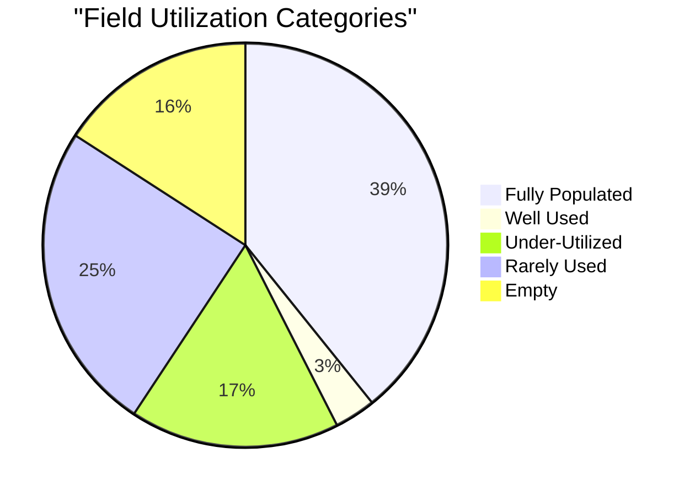
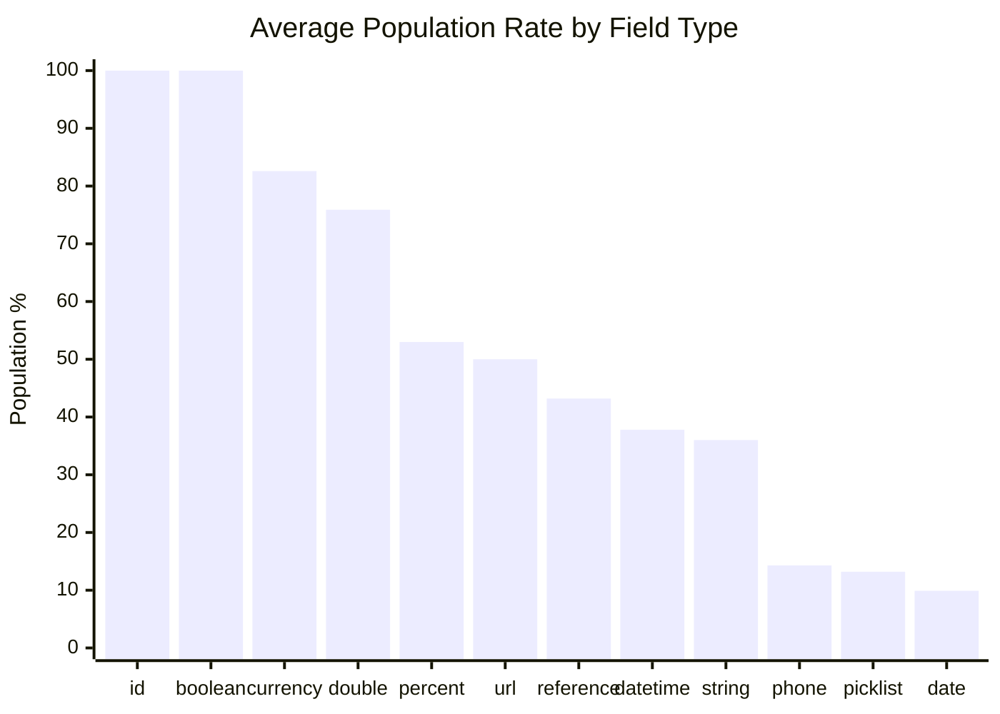
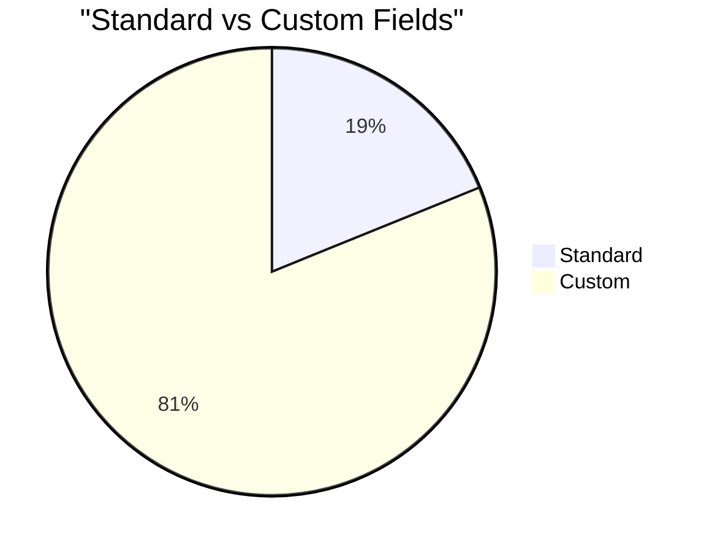
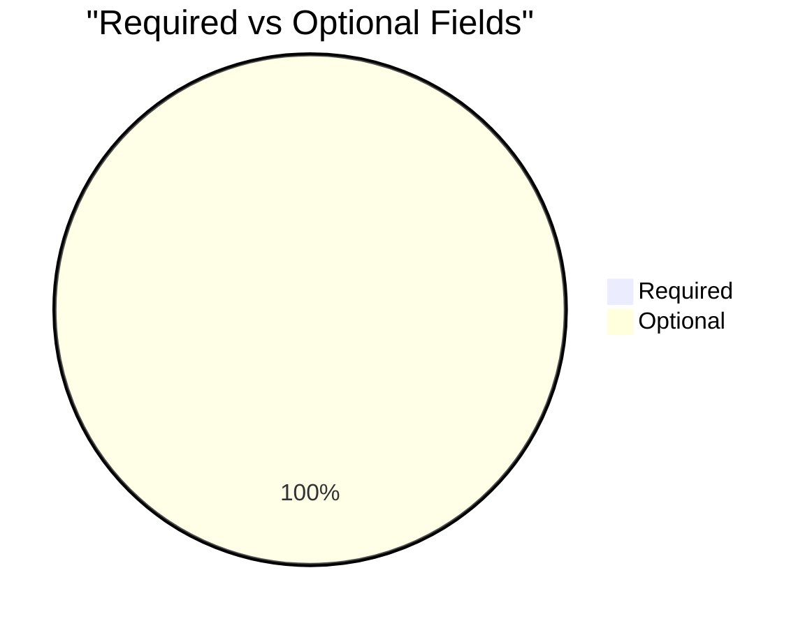

# Field Utilization Analysis: Contact (`Contact`)

> Generated on 2026-03-19 16:13:13

## Executive Summary

| Metric | Value |
| --- | --- |
| **Object** | Contact (`Contact`) |
| **Total Records** | 7,347 |
| **Total Fields Analyzed** | 334 |
| **Standard / Custom** | 63 / 271 |
| **Formula / Calculated** | 101 |
| **Required / Optional** | 1 / 333 |
| **Mean Population Rate** | 46.7% |
| **Median Population Rate** | 22.0% |

## Utilization Category Distribution

| Category | Threshold | Fields | % of Total |
| --- | --- | --- | --- |
| Fully Populated | > 95 % | 131 | 39.2% |
| Well Used | 50 – 95 % | 11 | 3.3% |
| Under-Utilized | 10 – 50 % | 56 | 16.8% |
| Rarely Used | 1 – 10 % | 83 | 24.9% |
| Empty | 0 % | 53 | 15.9% |

## Descriptive Statistics

Population-rate statistics across all analyzed fields:

| Statistic | Value |
| --- | --- |
| N (fields) | 334 |
| Mean | 46.66% |
| Median | 21.97% |
| Std Dev | 45.54% |
| Variance | 2074.16 |
| Min | 0.00% |
| Max | 100.00% |
| Q1 (25th pctl) | 2.12% |
| Q3 (75th pctl) | 100.00% |
| IQR | 97.88% |
| 5th Percentile | 0.00% |
| 95th Percentile | 100.00% |
| Skewness | 0.231 |
| Excess Kurtosis | -1.843 |
| Mode | 100.0% |

**Interpretation:**

- **Skewness (0.231)** — Approximately symmetric distribution of population rates.
- **Kurtosis (-1.843)** — Platykurtic: light tails and a flat peak — population rates are broadly spread.

## Utilization by Field Type

| Field Type | Count | Avg Population Rate |
| --- | --- | --- |
| id | 1 | 100.0% |
| boolean | 31 | 100.0% |
| currency | 24 | 82.6% |
| double | 66 | 75.9% |
| percent | 4 | 53.0% |
| url | 2 | 50.0% |
| reference | 14 | 43.2% |
| datetime | 8 | 37.8% |
| string | 86 | 36.0% |
| phone | 6 | 14.3% |
| picklist | 37 | 13.2% |
| date | 41 | 9.9% |
| email | 4 | 9.5% |
| textarea | 6 | 8.7% |
| multipicklist | 4 | 1.2% |

## Standard vs Custom Field Comparison

| Segment | Fields | Avg Population Rate |
| --- | --- | --- |
| Standard | 63 | 37.7% |
| Custom | 271 | 48.8% |

## Required vs Optional Fields

| Segment | Fields | Avg Population Rate |
| --- | --- | --- |
| Required | 1 | 100.0% |
| Optional | 333 | 46.5% |

## Detailed Field Analysis

### Fully Populated (131 fields)

| Field API Name | Label | Type | Population | Rate | Custom | Required | Formula |
| --- | --- | --- | --- | --- | --- | --- | --- |
| `Id` | Contact ID | id | 7,347 | 100.0% |  |  |  |
| `AccountId` | Organization Name | reference | 7,347 | 100.0% |  |  |  |
| `LastName` | Last Name | string | 7,347 | 100.0% |  | Yes |  |
| `Name` | Full Name | string | 7,347 | 100.0% |  |  |  |
| `RecordTypeId` | Record Type ID | reference | 7,347 | 100.0% |  |  |  |
| `CurrencyIsoCode` | Contact Currency | picklist | 7,347 | 100.0% |  |  |  |
| `OwnerId` | Owner ID | reference | 7,347 | 100.0% |  |  |  |
| `CreatedDate` | Created Date | datetime | 7,347 | 100.0% |  |  |  |
| `CreatedById` | Created By ID | reference | 7,347 | 100.0% |  |  |  |
| `LastModifiedDate` | Last Modified Date | datetime | 7,347 | 100.0% |  |  |  |
| `LastModifiedById` | Last Modified By ID | reference | 7,347 | 100.0% |  |  |  |
| `SystemModstamp` | System Modstamp | datetime | 7,347 | 100.0% |  |  |  |
| `PhotoUrl` | Photo URL | url | 7,347 | 100.0% |  |  |  |
| `Donor_Ident__c` | Donor Ident | string | 7,347 | 100.0% | Yes |  | Yes |
| `Map__c` | Map | string | 7,347 | 100.0% | Yes |  | Yes |
| `Contact_Name_Dashboard__c` | Contact Name - Dashboard | string | 7,347 | 100.0% | Yes |  | Yes |
| `C_Department__c` | *c Department | string | 7,347 | 100.0% | Yes |  | Yes |
| `Caseworker_Email_Owner__c` | *c Caseworker Email (Owner) | string | 7,347 | 100.0% | Yes |  | Yes |
| `c_Student_Portrait_URL__c` | *c Student Portrait URL | string | 7,347 | 100.0% | Yes |  | Yes |
| `npe01__Organization_Type__c` | Organization Type | string | 7,347 | 100.0% | Yes |  | Yes |
| `npe01__Type_of_Account__c` | Type of Account | string | 7,347 | 100.0% | Yes |  | Yes |
| `Contact_ID_CNTC__c` | Case Safe Contact ID | string | 7,347 | 100.0% | Yes |  | Yes |
| `c_Aspect_Graduated_Certificate__c` | *c Aspect.Graduated/Certificate | double | 7,347 | 100.0% | Yes |  | Yes |
| `npo02__AverageAmount__c` | Average Gift | currency | 7,347 | 100.0% | Yes |  |  |
| `npo02__Formula_HouseholdMailingAddress__c` | Household Mailing Address | string | 7,347 | 100.0% | Yes |  | Yes |
| `npo02__LastMembershipAmount__c` | Last Membership Amount | currency | 7,347 | 100.0% | Yes |  |  |
| `npo02__NumberOfClosedOpps__c` | Total Number of Gifts | double | 7,347 | 100.0% | Yes |  |  |
| `npo02__NumberOfMembershipOpps__c` | Number of Memberships | double | 7,347 | 100.0% | Yes |  |  |
| `npo02__OppAmount2YearsAgo__c` | Total Gifts Two Years Ago | currency | 7,347 | 100.0% | Yes |  |  |
| `npo02__OppAmountLastNDays__c` | Total Gifts Last N Days | currency | 7,347 | 100.0% | Yes |  |  |
| `npo02__OppAmountLastYearHH__c` | Total Household Gifts Last Year | currency | 7,347 | 100.0% | Yes |  | Yes |
| `npo02__OppAmountLastYear__c` | Total Gifts Last Year | currency | 7,347 | 100.0% | Yes |  |  |
| `npo02__OppAmountThisYearHH__c` | Total Household Gifts This Year | currency | 7,347 | 100.0% | Yes |  | Yes |
| `npo02__OppAmountThisYear__c` | Total Gifts This Year | currency | 7,347 | 100.0% | Yes |  |  |
| `npo02__OppsClosed2YearsAgo__c` | Number of Gifts Two Years Ago | double | 7,347 | 100.0% | Yes |  |  |
| `npo02__OppsClosedLastNDays__c` | Number of Gifts Last N Days | double | 7,347 | 100.0% | Yes |  |  |
| `npo02__OppsClosedLastYear__c` | Number of Gifts Last Year | double | 7,347 | 100.0% | Yes |  |  |
| `npo02__OppsClosedThisYear__c` | Number of Gifts This Year | double | 7,347 | 100.0% | Yes |  |  |
| `npo02__TotalMembershipOppAmount__c` | Total Membership Amount | currency | 7,347 | 100.0% | Yes |  |  |
| `npo02__TotalOppAmount__c` | Total Gifts | currency | 7,347 | 100.0% | Yes |  |  |
| `npo02__Total_Household_Gifts__c` | Total Household Gifts | currency | 7,347 | 100.0% | Yes |  | Yes |
| `CY_Hard_Donations_Paid__c` | CTY Hard Donations Paid | currency | 7,347 | 100.0% | Yes |  | Yes |
| `npsp__Soft_Credit_Last_N_Days__c` | Soft Credit Last N Days | currency | 7,347 | 100.0% | Yes |  |  |
| `c_Correspondence_LY__c` | *c Correspondence LY | double | 7,347 | 100.0% | Yes |  |  |
| `c_Correspondence_TY_Should_Be__c` | *c Correspondence TY Should Be | double | 7,347 | 100.0% | Yes |  | Yes |
| `c_Correspondence_TY__c` | *c Correspondence TY | double | 7,347 | 100.0% | Yes |  |  |
| `c_Dropped_PS_Enrollments__c` | *c Dropped PS Enrollments | double | 7,347 | 100.0% | Yes |  |  |
| `c_Graduated_Post_Secondary__c` | *c #Graduated Post-Secondary | double | 7,347 | 100.0% | Yes |  |  |
| `Affiliation_Counter__c` | Affiliation Counter | double | 7,347 | 100.0% | Yes |  | Yes |
| `Aspect_Active_Sponsor__c` | Aspect. Sponsor Active | double | 7,347 | 100.0% | Yes |  | Yes |
| `Aspect_Former_Sponsor__c` | Aspect. Sponsor Former | double | 7,347 | 100.0% | Yes |  | Yes |
| `Badges__c` | Badges | string | 7,347 | 100.0% | Yes |  | Yes |
| `How_many_Links__c` | How many Links | double | 7,347 | 100.0% | Yes |  | Yes |
| `Aspect_Active_Correspondent__c` | Aspect. Correspondent Active | double | 7,347 | 100.0% | Yes |  | Yes |
| `Aspect_Former_Correspondent__c` | Aspect. Correspondent Former | double | 7,347 | 100.0% | Yes |  | Yes |
| `Aspect_Current_Staff__c` | Aspect. Staff Current | double | 7,347 | 100.0% | Yes |  | Yes |
| `Aspect_Former_Staff__c` | Aspect. Staff Former | double | 7,347 | 100.0% | Yes |  | Yes |
| `Aspect_Current_Board__c` | Aspect. Board Current | double | 7,347 | 100.0% | Yes |  | Yes |
| `Aspect_Former_Board__c` | Aspect. Board Former | double | 7,347 | 100.0% | Yes |  | Yes |
| `c_Open_At_Risk__c` | *c Open At Risk | double | 7,347 | 100.0% | Yes |  | Yes |
| `c_Aspect_Graduated_Diploma__c` | *c Aspect.Graduated/Diploma | double | 7,347 | 100.0% | Yes |  | Yes |
| `c_Aspect_Graduated_Degree__c` | *c Aspect.Graduated/Degree | double | 7,347 | 100.0% | Yes |  | Yes |
| `c_Aspect_HasKCSE__c` | *c Aspect.HasKCSE | double | 7,347 | 100.0% | Yes |  | Yes |
| `c_Aspect_HasTradeSchool__c` | *c Aspect.HasTradeSchool | double | 7,347 | 100.0% | Yes |  | Yes |
| `c_Sponsor_Correspondence_Count__c` | *c Sponsor Correspondence Count | double | 7,347 | 100.0% | Yes |  |  |
| `c_Aspect_PS_Enrollments_w_Blank_Ex_Grad__c` | *c Aspect.PS Enrollments w Blank Ex Grad | double | 7,347 | 100.0% | Yes |  | Yes |
| `c_PS_Enrollments__c` | *c # PS Enrollments | double | 7,347 | 100.0% | Yes |  | Yes |
| `c_Sponsor_Corr_Count_PRE_PS__c` | *c Sponsor Corr Count PRE PS | double | 7,347 | 100.0% | Yes |  |  |
| `c_Sponsor_Corr_Count_PS__c` | *c Sponsor Corr Count PS | double | 7,347 | 100.0% | Yes |  |  |
| `c_Currently_Employed__c` | *c Currently Employed | double | 7,347 | 100.0% | Yes |  | Yes |
| `c_Full_Name_NRCF_ID__c` | *c Full Name + NRCF ID | string | 7,347 | 100.0% | Yes |  | Yes |
| `count__c` | count | double | 7,347 | 100.0% | Yes |  | Yes |
| `c_Child_at_Risk_Records_Last_365_days__c` | *c Child at Risk Records Last 365 days | double | 7,347 | 100.0% | Yes |  |  |
| `Completed_School_Assessments_This_Year__c` | *c Complete School Assessments This Year | double | 7,347 | 100.0% | Yes |  |  |
| `c_Complete_Home_Assessments_This_Year__c` | *c Complete Home Assessments This Year | double | 7,347 | 100.0% | Yes |  |  |
| `Complete_Student_Intervws_This_Year__c` | *c Complete Student Intvws This Year | double | 7,347 | 100.0% | Yes |  |  |
| `c_Student_Image__c` | *c_Student_Image | string | 7,347 | 100.0% | Yes |  | Yes |
| `Aspect_NRCF_Board_Current__c` | Aspect.NRCF Board Current | double | 7,347 | 100.0% | Yes |  | Yes |
| `Aspect_NRCF_Board_Former__c` | Aspect.NRCF Board Former | double | 7,347 | 100.0% | Yes |  | Yes |
| `h_cert__c` | h cert % | double | 7,347 | 100.0% | Yes |  | Yes |
| `h_degree__c` | h degree % | double | 7,347 | 100.0% | Yes |  | Yes |
| `h_diploma__c` | h diploma % | double | 7,347 | 100.0% | Yes |  | Yes |
| `Valid_Consent__c` | *Aspect.Valid Consent | double | 7,347 | 100.0% | Yes |  |  |
| `Consent_Status__c` | Consent Status | string | 7,347 | 100.0% | Yes |  | Yes |
| `Aspect_Has_Code_of_Conduct__c` | *Aspect.Has Code of Conduct | double | 7,347 | 100.0% | Yes |  |  |
| `c_Strong_Hold_Pathway__c` | *c Strong Hold Pathway | string | 7,347 | 100.0% | Yes |  | Yes |
| `Days_Since_Last_Leadership_Touchpoint__c` | Days Since Last Leadership Touchpoint | string | 7,347 | 100.0% | Yes |  | Yes |
| `c_Total_At_Risks__c` | *c Total At Risks | double | 7,347 | 100.0% | Yes |  | Yes |
| `Last_Gift_Close_Month_Merge__c` | Last Gift Close Month (Merge) | string | 7,347 | 100.0% | Yes |  | Yes |
| `Q4_Previous_FY_Total_Gifts__c` | Q4 Previous FY Total Gifts | currency | 7,347 | 100.0% | Yes |  | Yes |
| `Student_Portrait_URL_For_Email_Mail__c` | Student Portrait URL - For Email/Mail | string | 7,347 | 100.0% | Yes |  | Yes |
| `IsDeleted` | Deleted | boolean | 7,347 | 100.0% |  |  |  |
| `HasOptedOutOfEmail` | Email Opt Out | boolean | 7,347 | 100.0% |  |  |  |
| `DoNotCall` | Do Not Call | boolean | 7,347 | 100.0% |  |  |  |
| `IsEmailBounced` | Is Email Bounced | boolean | 7,347 | 100.0% |  |  |  |
| `IsPriorityRecord` | Important | boolean | 7,347 | 100.0% |  |  |  |
| `updater__c` | updater | boolean | 7,347 | 100.0% | Yes |  |  |
| `No_Postal__c` | No Postal | boolean | 7,347 | 100.0% | Yes |  |  |
| `Selected_for_Test__c` | Selected for Test | boolean | 7,347 | 100.0% | Yes |  |  |
| `npsp__Undeliverable_Address__c` | Undeliverable Mailing Address | boolean | 7,347 | 100.0% | Yes |  |  |
| `npe01__Private__c` | Private | boolean | 7,347 | 100.0% | Yes |  |  |
| `npe01__SystemIsIndividual__c` | _SYSTEM: IsIndividual - DEPRECATED | boolean | 7,347 | 100.0% | Yes |  |  |
| `npsp__Primary_Contact__c` | Primary Contact | boolean | 7,347 | 100.0% | Yes |  | Yes |
| `npsp__is_Address_Override__c` | Address Override | boolean | 7,347 | 100.0% | Yes |  |  |
| `npsp__Exclude_from_Household_Formal_Greeting__c` | Exclude from Household Formal Greeting | boolean | 7,347 | 100.0% | Yes |  |  |
| `npsp__Exclude_from_Household_Informal_Greeting__c` | Exclude from Household Informal Greeting | boolean | 7,347 | 100.0% | Yes |  |  |
| `npsp__Exclude_from_Household_Name__c` | Exclude from Household Name | boolean | 7,347 | 100.0% | Yes |  |  |
| `npsp__Deceased__c` | Deceased | boolean | 7,347 | 100.0% | Yes |  |  |
| `npsp__Do_Not_Contact__c` | Do Not Contact | boolean | 7,347 | 100.0% | Yes |  |  |
| `Sync_to_Portal__c` | Sync to Portal | boolean | 7,347 | 100.0% | Yes |  |  |
| `Aspect_Product_Buyer__c` | Aspect.Product Buyer | boolean | 7,347 | 100.0% | Yes |  | Yes |
| `In_active_alumni__c` | Inactive alumni? | boolean | 7,347 | 100.0% | Yes |  |  |
| `c_Aspect_OutOfProgram__c` | *c Aspect.OutOfProgram | boolean | 7,347 | 100.0% | Yes |  | Yes |
| `c_Is_Active_Student__c` | *c Is Active Student | boolean | 7,347 | 100.0% | Yes |  | Yes |
| `pmdm__IsClient__c` | Client | boolean | 7,347 | 100.0% | Yes |  |  |
| `Unreachable__c` | Unreachable | boolean | 7,347 | 100.0% | Yes |  |  |
| `MailChimp_Unsubscribe__c` | MailChimp Unsubscribe | boolean | 7,347 | 100.0% | Yes |  |  |
| `Owner_User__c` | Owner=User | boolean | 7,347 | 100.0% | Yes |  | Yes |
| `Junk_name__c` | Junk name | boolean | 7,347 | 100.0% | Yes |  | Yes |
| `Do_Not_Send_Unsolicited_Emails__c` | Do not Send Campaign Solicitation Emails | boolean | 7,347 | 100.0% | Yes |  |  |
| `guardian__c` | guardian | boolean | 7,347 | 100.0% | Yes |  |  |
| `c_Over_30days_Since_Move_to_ALumni__c` | *c Over 30days Since Move to ALumni? | boolean | 7,347 | 100.0% | Yes |  | Yes |
| `npsp__HHId__c` | HHId | string | 7,346 | 100.0% | Yes |  | Yes |
| `Household_Formal_Greeting__c` | Household Formal Greeting | string | 7,346 | 100.0% | Yes |  | Yes |
| `STEM_Average_Performance__c` | STEM Average Performance | double | 7,336 | 99.9% | Yes |  |  |
| `Arts_Sport_Science_Average_Performance__c` | Arts & Sport Science Average Performance | double | 7,329 | 99.8% | Yes |  |  |
| `c_Marks_Change__c` | *c Marks Change | percent | 7,307 | 99.5% | Yes |  | Yes |
| `c_Total_Marks__c` | *c Total Marks | percent | 7,284 | 99.1% | Yes |  |  |
| `Social_Sciences_Average_Performance__c` | Social Sciences Average Performance | double | 7,263 | 98.9% | Yes |  |  |
| `Household_Informal_Greeting__c` | Household Informal Greeting | string | 7,160 | 97.5% | Yes |  | Yes |
| `FirstName` | First Name | string | 7,159 | 97.4% |  |  |  |

### Well Used (11 fields)

| Field API Name | Label | Type | Population | Rate | Custom | Required | Formula |
| --- | --- | --- | --- | --- | --- | --- | --- |
| `npe01__Lifetime_Giving_History_Amount__c` | Lifetime Transaction Total | currency | 6,916 | 94.1% | Yes |  | Yes |
| `npo02__LargestAmount__c` | Largest Gift | currency | 6,847 | 93.2% | Yes |  |  |
| `npo02__SmallestAmount__c` | Smallest Gift | currency | 6,847 | 93.2% | Yes |  |  |
| `npsp__Current_Address__c` | Current Address | reference | 6,168 | 84.0% | Yes |  |  |
| `MailingCountry` | Mailing Country | string | 6,146 | 83.7% |  |  |  |
| `npo02__LastOppAmount__c` | Last Gift Amount | currency | 6,036 | 82.2% | Yes |  |  |
| `npe01__Primary_Address_Type__c` | Primary Address Type | picklist | 5,981 | 81.4% | Yes |  |  |
| `npe01__Home_Address__c` | Home Address | string | 5,962 | 81.1% | Yes |  | Yes |
| `AutoNumber__c` | AutoNumber | string | 4,600 | 62.6% | Yes |  |  |
| `MailingCity` | Mailing City | string | 3,930 | 53.5% |  |  |  |
| `Phone` | Business Phone | phone | 3,771 | 51.3% |  |  |  |

### Under-Utilized (56 fields)

| Field API Name | Label | Type | Population | Rate | Custom | Required | Formula |
| --- | --- | --- | --- | --- | --- | --- | --- |
| `LastActivityDate` | Last Activity | date | 3,347 | 45.6% |  |  |  |
| `MixmaxInsights__Last_Activity_Date__c` | Last Activity Date | date | 3,347 | 45.6% | Yes |  | Yes |
| `MixmaxInsights__Days_since_Last_Activity__c` | Days since Last Activity | double | 3,347 | 45.6% | Yes |  | Yes |
| `Relationship_Manager__c` | Relationship Manager | picklist | 3,307 | 45.0% | Yes |  |  |
| `MailingStreet` | Mailing Street | textarea | 3,278 | 44.6% |  |  |  |
| `WordPress_User_Email_c__c` | *c WordPress User Email | string | 3,229 | 43.9% | Yes |  | Yes |
| `npo02__Best_Gift_Year_Total__c` | Best Gift Year Total | currency | 2,997 | 40.8% | Yes |  |  |
| `npo02__Soft_Credit_Last_Year__c` | Soft Credit Last Year | currency | 2,729 | 37.1% | Yes |  |  |
| `npo02__Soft_Credit_This_Year__c` | Soft Credit This Year | currency | 2,729 | 37.1% | Yes |  |  |
| `npo02__Soft_Credit_Total__c` | Soft Credit Total | currency | 2,729 | 37.1% | Yes |  |  |
| `npo02__Soft_Credit_Two_Years_Ago__c` | Soft Credit Two Years Ago | currency | 2,729 | 37.1% | Yes |  |  |
| `Email` | Email | email | 2,612 | 35.6% |  |  |  |
| `Email_Domain__c` | Email Domain | string | 2,612 | 35.6% | Yes |  | Yes |
| `MailingState` | Mailing State/Province | string | 2,266 | 30.8% |  |  |  |
| `MailingPostalCode` | Mailing Zip/Postal Code | string | 2,263 | 30.8% |  |  |  |
| `Total_Paid_Gifts_Tax_Year__c` | Total Paid Deductible Gifts Tax Year | currency | 2,214 | 30.1% | Yes |  |  |
| `npe01__Last_Donation_Date__c` | DEPRECATED - Last Transaction Date | date | 2,153 | 29.3% | Yes |  | Yes |
| `Became_a_Donor__c` | *Became a Donor | date | 2,075 | 28.2% | Yes |  | Yes |
| `Household_Last_Gift_Date__c` | Household Last Gift Date | date | 1,980 | 26.9% | Yes |  | Yes |
| `npo02__LastCloseDateHH__c` | Last Household Gift Date | date | 1,979 | 26.9% | Yes |  | Yes |
| `npo02__Best_Gift_Year__c` | Best Gift Year | string | 1,686 | 22.9% | Yes |  |  |
| `npo02__FirstCloseDate__c` | First Gift Date | date | 1,686 | 22.9% | Yes |  |  |
| `npo02__LastCloseDate__c` | Last Gift Date | date | 1,686 | 22.9% | Yes |  |  |
| `App_Birth_Certificate__c` | App. Birth Certificate | picklist | 1,614 | 22.0% | Yes |  |  |
| `App_National_ID__c` | App. National ID | picklist | 1,614 | 22.0% | Yes |  |  |
| `Applicant_Status__c` | Applicant Status | picklist | 1,614 | 22.0% | Yes |  |  |
| `App_Home_Visit__c` | App. Home Visit | picklist | 1,609 | 21.9% | Yes |  |  |
| `MiddleName` | Middle Name | string | 1,555 | 21.2% |  |  |  |
| `App_Clinic_Card__c` | App. Clinic Card | picklist | 1,506 | 20.5% | Yes |  |  |
| `Gender_Contact__c` | Gender - Contact | picklist | 1,370 | 18.6% | Yes |  |  |
| `Old_Child_Record_ID__c` | Old Child Record ID | string | 1,287 | 17.5% | Yes |  |  |
| `Birthdate` | Birthdate | date | 1,283 | 17.5% |  |  |  |
| `Age__c` | Age | double | 1,283 | 17.5% | Yes |  | Yes |
| `Birthday__c` | Birthday | date | 1,281 | 17.4% | Yes |  | Yes |
| `Most_Recent_Enrollment_Type__c` | *c Most Recent Enrollment Type | string | 1,261 | 17.2% | Yes |  |  |
| `c_Most_Recent_Enrollment_Level__c` | *c Most Recent Enrollment Level | string | 1,261 | 17.2% | Yes |  |  |
| `c_Most_Recent_Enrollment_Status__c` | *c Most Recent Enrollment Status | string | 1,261 | 17.2% | Yes |  |  |
| `c_Most_Recent_School__c` | *c Most Recent School | string | 1,240 | 16.9% | Yes |  |  |
| `c_Ward__c` | *c Ward | picklist | 1,225 | 16.7% | Yes |  |  |
| `Fax` | Business Fax | phone | 1,205 | 16.4% |  |  |  |
| `MobilePhone` | Mobile Phone | phone | 1,181 | 16.1% |  |  |  |
| `Consent__c` | Opted-In for data use | string | 1,047 | 14.3% | Yes |  |  |
| `Sim_card_provider__c` | Sim Card Provider | picklist | 1,034 | 14.1% | Yes |  |  |
| `Street_Picklist__c` | *Street Picklist | picklist | 1,015 | 13.8% | Yes |  |  |
| `c_Previous_Total_Marks__c` | *c Previous Total Marks | percent | 978 | 13.3% | Yes |  |  |
| `LeadSource` | Lead Source | picklist | 906 | 12.3% |  |  |  |
| `NRCF_ID__c` | *c NRCF ID# | string | 875 | 11.9% | Yes |  |  |
| `c_Secondary_Class_of__c` | *c Senior Secondary Class of: | string | 859 | 11.7% | Yes |  |  |
| `c_Grammar_Primary_Class_of__c` | *c Grammar/Primary Class of | string | 859 | 11.7% | Yes |  | Yes |
| `c_Status__c` | *c Status | picklist | 854 | 11.6% | Yes |  |  |
| `c_Date_Entered_Program__c` | *c Date Entered Program | date | 796 | 10.8% | Yes |  |  |
| `c_Duration_in_Program__c` | *c Duration in Program | double | 796 | 10.8% | Yes |  | Yes |
| `c_Sponsor_Correspondence_Rate__c` | *c Sponsor Correspondence Rate | double | 796 | 10.8% | Yes |  | Yes |
| `c_Program_Status__c` | *c Program Status | picklist | 794 | 10.8% | Yes |  |  |
| `General_Accounting_Unit__c` | General Accounting Unit | reference | 758 | 10.3% | Yes |  |  |
| `npsp__Primary_Affiliation__c` | Primary Affiliation | reference | 751 | 10.2% | Yes |  |  |

### Rarely Used (83 fields)

| Field API Name | Label | Type | Population | Rate | Custom | Required | Formula |
| --- | --- | --- | --- | --- | --- | --- | --- |
| `c_Grammar_Class_of__c` | *c Grammar Class of | string | 707 | 9.6% | Yes |  |  |
| `Difference_Grammar_Sec_Class_of__c` | Difference(Grammar-Sec Class of) | double | 707 | 9.6% | Yes |  | Yes |
| `House__c` | *c House | picklist | 654 | 8.9% | Yes |  |  |
| `c_Last_School_Assessment__c` | *c Last School Assessment | date | 654 | 8.9% | Yes |  | Yes |
| `Latest_School_Assessment_Date__c` | Latest School Assessment Date | date | 654 | 8.9% | Yes |  |  |
| `c_Last_Home_Assessment__c` | *c Last Home Assessment | date | 646 | 8.8% | Yes |  | Yes |
| `c_Last_Student_Assessment__c` | *c Last Student Assessment | date | 623 | 8.5% | Yes |  | Yes |
| `c_Most_Recent_Correspondence_Originator__c` | *c Most Recent Correspondence Originator | string | 614 | 8.4% | Yes |  |  |
| `c_NRCF_Portal_Password__c` | *c NRCF Portal Password | string | 613 | 8.3% | Yes |  |  |
| `Relationship_Start_Date__c` | *Relationship Start Date | date | 543 | 7.4% | Yes |  | Yes |
| `App_Report_Card__c` | App. Report Card | picklist | 523 | 7.1% | Yes |  |  |
| `App_Is_child_covered_by_NHIF__c` | App. Is child covered by NHIF? | picklist | 523 | 7.1% | Yes |  |  |
| `npo02__Household_Naming_Order__c` | Household Naming Order | double | 516 | 7.0% | Yes |  |  |
| `c_Most_Recent_Sponsor_Correspondence__c` | *c Most Recent Sponsor Correspondence | date | 514 | 7.0% | Yes |  |  |
| `App_Chief_s_Letter__c` | App. Chief's Letter | picklist | 508 | 6.9% | Yes |  |  |
| `App_How_did_you_hear_about_NRCF__c` | App. How did you hear about NRCF | picklist | 501 | 6.8% | Yes |  |  |
| `c_Date_Graduated_from_Primary__c` | *c Date Graduated from Primary | date | 497 | 6.8% | Yes |  |  |
| `Became_a_Sponsor__c` | *Became a Sponsor | date | 485 | 6.6% | Yes |  | Yes |
| `First_Sponsor_Date__c` | First Sponsor Date | date | 485 | 6.6% | Yes |  | Yes |
| `Most_Recent_Sponsor_Date__c` | Most Recent Sponsor Start Date | date | 485 | 6.6% | Yes |  | Yes |
| `Became_a_Sponsor_Year__c` | Became a Sponsor Year | string | 485 | 6.6% | Yes |  | Yes |
| `Latest_Interview_Interests_Hobbies__c` | Latest Interview Interests and Hobbies | string | 480 | 6.5% | Yes |  |  |
| `c_Date_Left_Program__c` | *c Date Left Program | date | 436 | 5.9% | Yes |  |  |
| `c_Qualification__c` | *c Qualification | string | 435 | 5.9% | Yes |  | Yes |
| `c_Reason_Left_Program__c` | *c Reason Left Program | picklist | 434 | 5.9% | Yes |  |  |
| `c_Date_Graduated_from_Secondary__c` | *c Date Graduated from Secondary | date | 380 | 5.2% | Yes |  |  |
| `c_PS_Sponsor_Corr_Rate__c` | *c PS Sponsor Corr Rate | double | 380 | 5.2% | Yes |  | Yes |
| `c_Pre_PS_Sponsor_Corr_Rate__c` | *c Pre PS Sponsor Corr Rate | double | 378 | 5.1% | Yes |  | Yes |
| `c_Financial_Status__c` | *c Financial Status | picklist | 368 | 5.0% | Yes |  |  |
| `Most_Recent_Sponsor_End_Date__c` | Most Recent Sponsor End Date | date | 360 | 4.9% | Yes |  | Yes |
| `Student_Child_CPT_ID__c` | Student Child CPT ID | string | 357 | 4.9% | Yes |  |  |
| `Title` | Title | string | 346 | 4.7% |  |  |  |
| `Student_Automatic_Featured_Image_ID__c` | Student Automatic Featured Image ID | string | 336 | 4.6% | Yes |  |  |
| `Salutation` | Salutation | picklist | 324 | 4.4% |  |  |  |
| `c_Field_of_Study__c` | *c Field of Study | string | 314 | 4.3% | Yes |  |  |
| `c_Sponsor_Name__c` | *c Sponsor Name | string | 307 | 4.2% | Yes |  |  |
| `Previous_Status__c` | *c Previous Status | string | 307 | 4.2% | Yes |  |  |
| `c_Aspect_Latest_Expected_PS_Grad_Date__c` | *c Aspect.Latest Expected PS Grad Date | date | 303 | 4.1% | Yes |  | Yes |
| `c_Junior_Secondary_Class_of__c` | *c Junior Secondary Class of | string | 279 | 3.8% | Yes |  | Yes |
| `c_Aspect_First_Expected_PS_Grad_Date__c` | *c Aspect.First Expected PS Grad Date | date | 274 | 3.7% | Yes |  | Yes |
| `Latest_Graduation_Date__c` | Latest Graduation Date | date | 274 | 3.7% | Yes |  | Yes |
| `Application_Outcome__c` | Application Outcome | picklist | 245 | 3.3% | Yes |  |  |
| `People_Groups__c` | People Groups | textarea | 243 | 3.3% | Yes |  |  |
| `c_Street__c` | *c Street | string | 227 | 3.1% | Yes |  |  |
| `c_Date_Graduated_from_Postsecondary__c` | *c Date Graduated from Postsecondary | date | 226 | 3.1% | Yes |  |  |
| `Alumni_First_Employment_Date__c` | Alumni First Employment Date | date | 226 | 3.1% | Yes |  |  |
| `App_Interview_Exam_Status__c` | App. Interview Exam Status | string | 224 | 3.0% | Yes |  |  |
| `RD_Active_Students__c` | RD Active Students | string | 197 | 2.7% | Yes |  |  |
| `npe01__AlternateEmail__c` | Alternate Email | email | 182 | 2.5% | Yes |  |  |
| `EmailBouncedReason` | Email Bounced Reason | string | 178 | 2.4% |  |  |  |
| `EmailBouncedDate` | Email Bounced Date | datetime | 178 | 2.4% |  |  |  |
| `Latest_School_Best_Subject__c` | Latest School Best Subject | string | 162 | 2.2% | Yes |  |  |
| `c_What_getting_a_sponsor_would_mean__c` | *c What getting a sponsor would mean. | textarea | 156 | 2.1% | Yes |  |  |
| `c_Student_Personality_Traits__c` | *c Student Personality Traits | textarea | 155 | 2.1% | Yes |  |  |
| `c_Student_Favorite_Hobby__c` | *c Student Favorite Hobby | multipicklist | 155 | 2.1% | Yes |  |  |
| `c_Student_Aspires_to_Become__c` | *c Student Aspires to Become? | multipicklist | 154 | 2.1% | Yes |  |  |
| `c_Next_School_Assessment__c` | *c Next School Assessment | date | 145 | 2.0% | Yes |  |  |
| `Student_Manual_Featured_Image_ID__c` | Student Manual Featured Image ID | string | 137 | 1.9% | Yes |  |  |
| `temp__c` | temp | string | 132 | 1.8% | Yes |  |  |
| `npo02__Formula_HouseholdPhone__c` | Household Phone | string | 127 | 1.7% | Yes |  | Yes |
| `UPI_Number__c` | UPI Number | string | 87 | 1.2% | Yes |  |  |
| `HomePhone` | Home Phone | phone | 83 | 1.1% |  |  |  |
| `Reason_why_alumni__c` | Reason Alumni is Inactive | picklist | 68 | 0.9% | Yes |  |  |
| `c_Next_Student_Assessment__c` | *c Next Student Assessment | date | 59 | 0.8% | Yes |  |  |
| `npe01__WorkPhone__c` | Work Phone | phone | 58 | 0.8% | Yes |  |  |
| `c_Reason_Last_Employment_Ended__c` | *c Reason Last Employment Ended | string | 55 | 0.7% | Yes |  |  |
| `c_Last_Alumni_Assessment__c` | *c Last Alumni Assessment | date | 51 | 0.7% | Yes |  |  |
| `AKA_NickName__c` | AKA/NickName | string | 47 | 0.6% | Yes |  |  |
| `npo02__Naming_Exclusions__c` | Naming Exclusions | multipicklist | 45 | 0.6% | Yes |  |  |
| `c_Next_Home_Assessment__c` | *c Next Home Assessment | date | 37 | 0.5% | Yes |  |  |
| `c_Impact_Since_Joining_the_Program__c` | *c Impact Since Joining the Program | textarea | 22 | 0.3% | Yes |  |  |
| `Temp_Asking_Scholarship_Commitment__c` | Temp: Asking Scholarship Commitment | string | 12 | 0.2% | Yes |  |  |
| `Temp_Current_Scholarship_Commitment__c` | Temp: Current Scholarship Commitment | string | 12 | 0.2% | Yes |  |  |
| `Temp_1st_Donation_Year__c` | Temp: 1st Donation Year | string | 12 | 0.2% | Yes |  |  |
| `LastCURequestDate` | Last Stay-in-Touch Request Date | datetime | 9 | 0.1% |  |  |  |
| `c_Sub_Status__c` | *c Sub Status | picklist | 5 | 0.1% | Yes |  |  |
| `LinkedIn__c` | LinkedIn | url | 3 | 0.0% | Yes |  |  |
| `OtherCity` | Other City | string | 1 | 0.0% |  |  |  |
| `OtherState` | Other State/Province | string | 1 | 0.0% |  |  |  |
| `OtherPostalCode` | Other Zip/Postal Code | string | 1 | 0.0% |  |  |  |
| `OtherCountry` | Other Country | string | 1 | 0.0% |  |  |  |
| `Department` | Department | string | 1 | 0.0% |  |  |  |
| `LastCUUpdateDate` | Last Stay-in-Touch Save Date | datetime | 1 | 0.0% |  |  |  |

### Empty (53 fields)

| Field API Name | Label | Type | Population | Rate | Custom | Required | Formula |
| --- | --- | --- | --- | --- | --- | --- | --- |
| `MasterRecordId` | Master Record ID | reference | 0 | 0.0% |  |  |  |
| `OtherStreet` | Other Street | textarea | 0 | 0.0% |  |  |  |
| `OtherLatitude` | Other Latitude | double | 0 | 0.0% |  |  |  |
| `OtherLongitude` | Other Longitude | double | 0 | 0.0% |  |  |  |
| `OtherGeocodeAccuracy` | Other Geocode Accuracy | picklist | 0 | 0.0% |  |  |  |
| `MailingLatitude` | Mailing Latitude | double | 0 | 0.0% |  |  |  |
| `MailingLongitude` | Mailing Longitude | double | 0 | 0.0% |  |  |  |
| `MailingGeocodeAccuracy` | Mailing Geocode Accuracy | picklist | 0 | 0.0% |  |  |  |
| `OtherPhone` | Other Phone | phone | 0 | 0.0% |  |  |  |
| `ReportsToId` | Reports To ID | reference | 0 | 0.0% |  |  |  |
| `LastViewedDate` | Last Viewed Date | datetime | 0 | 0.0% |  |  |  |
| `LastReferencedDate` | Last Referenced Date | datetime | 0 | 0.0% |  |  |  |
| `Jigsaw` | Data.com Key | string | 0 | 0.0% |  |  |  |
| `JigsawContactId` | Jigsaw Contact ID | string | 0 | 0.0% |  |  |  |
| `IndividualId` | Individual ID | reference | 0 | 0.0% |  |  |  |
| `ContactSource` | Creation Source | picklist | 0 | 0.0% |  |  |  |
| `TitleType` | Seniority Level | picklist | 0 | 0.0% |  |  |  |
| `DepartmentGroup` | Department Group | picklist | 0 | 0.0% |  |  |  |
| `npsp__Batch__c` | Batch | reference | 0 | 0.0% | Yes |  |  |
| `Spouse_Name__c` | Spouse Name | string | 0 | 0.0% | Yes |  |  |
| `npe01__HomeEmail__c` | Personal Email | email | 0 | 0.0% | Yes |  |  |
| `Lead_Source_Description__c` | Lead Source Description | string | 0 | 0.0% | Yes |  |  |
| `npe01__Other_Address__c` | Other Address | string | 0 | 0.0% | Yes |  | Yes |
| `npe01__PreferredPhone__c` | Preferred Phone | picklist | 0 | 0.0% | Yes |  |  |
| `npe01__Preferred_Email__c` | Preferred Email | picklist | 0 | 0.0% | Yes |  |  |
| `npe01__Secondary_Address_Type__c` | Secondary Address Type | picklist | 0 | 0.0% | Yes |  |  |
| `npe01__SystemAccountProcessor__c` | DEPRECATED - _SYSTEM: ACCOUNT PROCESSOR | picklist | 0 | 0.0% | Yes |  |  |
| `npe01__WorkEmail__c` | Work Email | email | 0 | 0.0% | Yes |  |  |
| `npe01__Work_Address__c` | Work Address | string | 0 | 0.0% | Yes |  | Yes |
| `npo02__Household__c` | Household | reference | 0 | 0.0% | Yes |  |  |
| `npo02__Languages__c` | Languages - DEPRECATED | string | 0 | 0.0% | Yes |  |  |
| `npo02__LastMembershipDate__c` | Last Membership Date | date | 0 | 0.0% | Yes |  |  |
| `npo02__LastMembershipLevel__c` | Last Membership Level | string | 0 | 0.0% | Yes |  |  |
| `npo02__LastMembershipOrigin__c` | Last Membership Origin | string | 0 | 0.0% | Yes |  |  |
| `npo02__Level__c` | Level - DEPRECATED | picklist | 0 | 0.0% | Yes |  |  |
| `npo02__MembershipEndDate__c` | Membership End Date | date | 0 | 0.0% | Yes |  |  |
| `npo02__MembershipJoinDate__c` | Membership Join Date | date | 0 | 0.0% | Yes |  |  |
| `npo02__SystemHouseholdProcessor__c` | _SYSTEM: HOUSEHOLD PROCESSOR-DEPRECATED | picklist | 0 | 0.0% | Yes |  |  |
| `c_Secondary_Enrollment_Date__c` | *c Secondary Enrollment Date | date | 0 | 0.0% | Yes |  | Yes |
| `c_Aspect_PS_Graduation_Timeline__c` | *c Aspect.PS Graduation Timeline? | double | 0 | 0.0% | Yes |  | Yes |
| `c_Aspect_Date_Grad_PS_Date_Grad_Sec__c` | *c Aspect.Date Grad PS - Date Grad Sec | double | 0 | 0.0% | Yes |  | Yes |
| `pmdm__ConsecutiveAbsences__c` | Consecutive Absences | double | 0 | 0.0% | Yes |  |  |
| `pmdm__LastServiceDate__c` | Last Service Date | date | 0 | 0.0% | Yes |  |  |
| `pmdm__NumAbsentServiceDeliveries__c` | Number of Absent Service Deliveries | double | 0 | 0.0% | Yes |  |  |
| `pmdm__NumPresentServiceDeliveries__c` | Number of Present Service Deliveries | double | 0 | 0.0% | Yes |  |  |
| `pmdm__AttendanceRate__c` | Attendance Rate | percent | 0 | 0.0% | Yes |  | Yes |
| `pmdm__AttendanceSummary__c` | Attendance Summary | string | 0 | 0.0% | Yes |  | Yes |
| `c_Next_Alumni_Assessment__c` | *c Next Alumni Assessment | date | 0 | 0.0% | Yes |  |  |
| `Latest_School_Assessment__c` | Latest School Assessment | date | 0 | 0.0% | Yes |  |  |
| `Latest_Interview_Date__c` | Latest Interview Date | date | 0 | 0.0% | Yes |  |  |
| `Recurring_Donation__c` | Recurring Donation | reference | 0 | 0.0% | Yes |  |  |
| `Student_WP_User_ID__c` | Student WP User ID | string | 0 | 0.0% | Yes |  |  |
| `BuyerAttributes` | Buyer Attributes | multipicklist | 0 | 0.0% |  |  |  |

### Skipped Fields (compound / non-queryable)

| Field API Name | Label | Type |
| --- | --- | --- |
| `OtherAddress` | Other Address | address |
| `MailingAddress` | Mailing Address | address |
| `Description` | Contact Description | textarea |
| `Reason_Left_Program_Notes__c` | *c Reason Left Program Notes | textarea |
| `Waiting_for_Sponsor_Bio__c` | *c Waiting for Sponsor Bio | textarea |
| `People_Groups2__c` | *People Groups* | textarea |
| `c_Home_Background_Info__c` | *c Home Background Info | textarea |
| `Latest_School_CM_Overall__c` | Latest_School_CM_Overall | textarea |
| `Latest_Interview_CM_Overall__c` | Latest Interview CM Overall | textarea |
| `Admin_Comment__c` | Admin Comment | textarea |

## Recommendations

### Fields Recommended for Deletion Review

These **custom** fields have **0 % population**, are not required, and are not formula fields.
They are strong candidates for removal after confirming they are not referenced in automation, reports, or integrations.

- `npsp__Batch__c` (Batch) — reference
- `Spouse_Name__c` (Spouse Name) — string
- `npe01__HomeEmail__c` (Personal Email) — email
- `Lead_Source_Description__c` (Lead Source Description) — string
- `npe01__PreferredPhone__c` (Preferred Phone) — picklist
- `npe01__Preferred_Email__c` (Preferred Email) — picklist
- `npe01__Secondary_Address_Type__c` (Secondary Address Type) — picklist
- `npe01__SystemAccountProcessor__c` (DEPRECATED - _SYSTEM: ACCOUNT PROCESSOR) — picklist
- `npe01__WorkEmail__c` (Work Email) — email
- `npo02__Household__c` (Household) — reference
- `npo02__Languages__c` (Languages - DEPRECATED) — string
- `npo02__LastMembershipDate__c` (Last Membership Date) — date
- `npo02__LastMembershipLevel__c` (Last Membership Level) — string
- `npo02__LastMembershipOrigin__c` (Last Membership Origin) — string
- `npo02__Level__c` (Level - DEPRECATED) — picklist
- `npo02__MembershipEndDate__c` (Membership End Date) — date
- `npo02__MembershipJoinDate__c` (Membership Join Date) — date
- `npo02__SystemHouseholdProcessor__c` (_SYSTEM: HOUSEHOLD PROCESSOR-DEPRECATED) — picklist
- `pmdm__ConsecutiveAbsences__c` (Consecutive Absences) — double
- `pmdm__LastServiceDate__c` (Last Service Date) — date
- `pmdm__NumAbsentServiceDeliveries__c` (Number of Absent Service Deliveries) — double
- `pmdm__NumPresentServiceDeliveries__c` (Number of Present Service Deliveries) — double
- `c_Next_Alumni_Assessment__c` (*c Next Alumni Assessment) — date
- `Latest_School_Assessment__c` (Latest School Assessment) — date
- `Latest_Interview_Date__c` (Latest Interview Date) — date
- `Recurring_Donation__c` (Recurring Donation) — reference
- `Student_WP_User_ID__c` (Student WP User ID) — string

### Fields Needing a Data Collection Strategy

These fields are **< 25 % populated** and user-editable. Evaluate whether the data is valuable;
if so, consider validation rules, required-field configuration, screen flows, or training to improve collection.

| Field | Label | Type | Rate | Custom |
| --- | --- | --- | --- | --- |
| `OtherCity` | Other City | string | 0.0% |  |
| `OtherState` | Other State/Province | string | 0.0% |  |
| `OtherPostalCode` | Other Zip/Postal Code | string | 0.0% |  |
| `OtherCountry` | Other Country | string | 0.0% |  |
| `Department` | Department | string | 0.0% |  |
| `LinkedIn__c` | LinkedIn | url | 0.0% | Yes |
| `c_Sub_Status__c` | *c Sub Status | picklist | 0.1% | Yes |
| `Temp_Asking_Scholarship_Commitment__c` | Temp: Asking Scholarship Commitment | string | 0.2% | Yes |
| `Temp_Current_Scholarship_Commitment__c` | Temp: Current Scholarship Commitment | string | 0.2% | Yes |
| `Temp_1st_Donation_Year__c` | Temp: 1st Donation Year | string | 0.2% | Yes |
| `c_Impact_Since_Joining_the_Program__c` | *c Impact Since Joining the Program | textarea | 0.3% | Yes |
| `c_Next_Home_Assessment__c` | *c Next Home Assessment | date | 0.5% | Yes |
| `npo02__Naming_Exclusions__c` | Naming Exclusions | multipicklist | 0.6% | Yes |
| `AKA_NickName__c` | AKA/NickName | string | 0.6% | Yes |
| `c_Last_Alumni_Assessment__c` | *c Last Alumni Assessment | date | 0.7% | Yes |
| `c_Reason_Last_Employment_Ended__c` | *c Reason Last Employment Ended | string | 0.7% | Yes |
| `npe01__WorkPhone__c` | Work Phone | phone | 0.8% | Yes |
| `c_Next_Student_Assessment__c` | *c Next Student Assessment | date | 0.8% | Yes |
| `Reason_why_alumni__c` | Reason Alumni is Inactive | picklist | 0.9% | Yes |
| `HomePhone` | Home Phone | phone | 1.1% |  |
| `UPI_Number__c` | UPI Number | string | 1.2% | Yes |
| `temp__c` | temp | string | 1.8% | Yes |
| `Student_Manual_Featured_Image_ID__c` | Student Manual Featured Image ID | string | 1.9% | Yes |
| `c_Next_School_Assessment__c` | *c Next School Assessment | date | 2.0% | Yes |
| `c_Student_Aspires_to_Become__c` | *c Student Aspires to Become? | multipicklist | 2.1% | Yes |
| `c_Student_Personality_Traits__c` | *c Student Personality Traits | textarea | 2.1% | Yes |
| `c_Student_Favorite_Hobby__c` | *c Student Favorite Hobby | multipicklist | 2.1% | Yes |
| `c_What_getting_a_sponsor_would_mean__c` | *c What getting a sponsor would mean. | textarea | 2.1% | Yes |
| `Latest_School_Best_Subject__c` | Latest School Best Subject | string | 2.2% | Yes |
| `EmailBouncedReason` | Email Bounced Reason | string | 2.4% |  |
| `EmailBouncedDate` | Email Bounced Date | datetime | 2.4% |  |
| `npe01__AlternateEmail__c` | Alternate Email | email | 2.5% | Yes |
| `RD_Active_Students__c` | RD Active Students | string | 2.7% | Yes |
| `App_Interview_Exam_Status__c` | App. Interview Exam Status | string | 3.0% | Yes |
| `c_Date_Graduated_from_Postsecondary__c` | *c Date Graduated from Postsecondary | date | 3.1% | Yes |
| `Alumni_First_Employment_Date__c` | Alumni First Employment Date | date | 3.1% | Yes |
| `c_Street__c` | *c Street | string | 3.1% | Yes |
| `People_Groups__c` | People Groups | textarea | 3.3% | Yes |
| `Application_Outcome__c` | Application Outcome | picklist | 3.3% | Yes |
| `c_Sponsor_Name__c` | *c Sponsor Name | string | 4.2% | Yes |
| `Previous_Status__c` | *c Previous Status | string | 4.2% | Yes |
| `c_Field_of_Study__c` | *c Field of Study | string | 4.3% | Yes |
| `Salutation` | Salutation | picklist | 4.4% |  |
| `Student_Automatic_Featured_Image_ID__c` | Student Automatic Featured Image ID | string | 4.6% | Yes |
| `Title` | Title | string | 4.7% |  |
| `Student_Child_CPT_ID__c` | Student Child CPT ID | string | 4.9% | Yes |
| `c_Financial_Status__c` | *c Financial Status | picklist | 5.0% | Yes |
| `c_Date_Graduated_from_Secondary__c` | *c Date Graduated from Secondary | date | 5.2% | Yes |
| `c_Reason_Left_Program__c` | *c Reason Left Program | picklist | 5.9% | Yes |
| `c_Date_Left_Program__c` | *c Date Left Program | date | 5.9% | Yes |
| `Latest_Interview_Interests_Hobbies__c` | Latest Interview Interests and Hobbies | string | 6.5% | Yes |
| `c_Date_Graduated_from_Primary__c` | *c Date Graduated from Primary | date | 6.8% | Yes |
| `App_How_did_you_hear_about_NRCF__c` | App. How did you hear about NRCF | picklist | 6.8% | Yes |
| `App_Chief_s_Letter__c` | App. Chief's Letter | picklist | 6.9% | Yes |
| `c_Most_Recent_Sponsor_Correspondence__c` | *c Most Recent Sponsor Correspondence | date | 7.0% | Yes |
| `npo02__Household_Naming_Order__c` | Household Naming Order | double | 7.0% | Yes |
| `App_Report_Card__c` | App. Report Card | picklist | 7.1% | Yes |
| `App_Is_child_covered_by_NHIF__c` | App. Is child covered by NHIF? | picklist | 7.1% | Yes |
| `c_NRCF_Portal_Password__c` | *c NRCF Portal Password | string | 8.3% | Yes |
| `c_Most_Recent_Correspondence_Originator__c` | *c Most Recent Correspondence Originator | string | 8.4% | Yes |
| `House__c` | *c House | picklist | 8.9% | Yes |
| `Latest_School_Assessment_Date__c` | Latest School Assessment Date | date | 8.9% | Yes |
| `c_Grammar_Class_of__c` | *c Grammar Class of | string | 9.6% | Yes |
| `npsp__Primary_Affiliation__c` | Primary Affiliation | reference | 10.2% | Yes |
| `General_Accounting_Unit__c` | General Accounting Unit | reference | 10.3% | Yes |
| `c_Program_Status__c` | *c Program Status | picklist | 10.8% | Yes |
| `c_Date_Entered_Program__c` | *c Date Entered Program | date | 10.8% | Yes |
| `c_Status__c` | *c Status | picklist | 11.6% | Yes |
| `c_Secondary_Class_of__c` | *c Senior Secondary Class of: | string | 11.7% | Yes |
| `NRCF_ID__c` | *c NRCF ID# | string | 11.9% | Yes |
| `LeadSource` | Lead Source | picklist | 12.3% |  |
| `c_Previous_Total_Marks__c` | *c Previous Total Marks | percent | 13.3% | Yes |
| `Street_Picklist__c` | *Street Picklist | picklist | 13.8% | Yes |
| `Sim_card_provider__c` | Sim Card Provider | picklist | 14.1% | Yes |
| `Consent__c` | Opted-In for data use | string | 14.3% | Yes |
| `MobilePhone` | Mobile Phone | phone | 16.1% |  |
| `Fax` | Business Fax | phone | 16.4% |  |
| `c_Ward__c` | *c Ward | picklist | 16.7% | Yes |
| `c_Most_Recent_School__c` | *c Most Recent School | string | 16.9% | Yes |
| `Most_Recent_Enrollment_Type__c` | *c Most Recent Enrollment Type | string | 17.2% | Yes |
| `c_Most_Recent_Enrollment_Level__c` | *c Most Recent Enrollment Level | string | 17.2% | Yes |
| `c_Most_Recent_Enrollment_Status__c` | *c Most Recent Enrollment Status | string | 17.2% | Yes |
| `Birthdate` | Birthdate | date | 17.5% |  |
| `Old_Child_Record_ID__c` | Old Child Record ID | string | 17.5% | Yes |
| `Gender_Contact__c` | Gender - Contact | picklist | 18.6% | Yes |
| `App_Clinic_Card__c` | App. Clinic Card | picklist | 20.5% | Yes |
| `MiddleName` | Middle Name | string | 21.2% |  |
| `App_Home_Visit__c` | App. Home Visit | picklist | 21.9% | Yes |
| `App_Birth_Certificate__c` | App. Birth Certificate | picklist | 22.0% | Yes |
| `App_National_ID__c` | App. National ID | picklist | 22.0% | Yes |
| `Applicant_Status__c` | Applicant Status | picklist | 22.0% | Yes |
| `npo02__Best_Gift_Year__c` | Best Gift Year | string | 22.9% | Yes |
| `npo02__FirstCloseDate__c` | First Gift Date | date | 22.9% | Yes |
| `npo02__LastCloseDate__c` | Last Gift Date | date | 22.9% | Yes |

---

*Analysis performed on 2026-03-19 16:13:13 against `Contact` with 7,347 records.*
