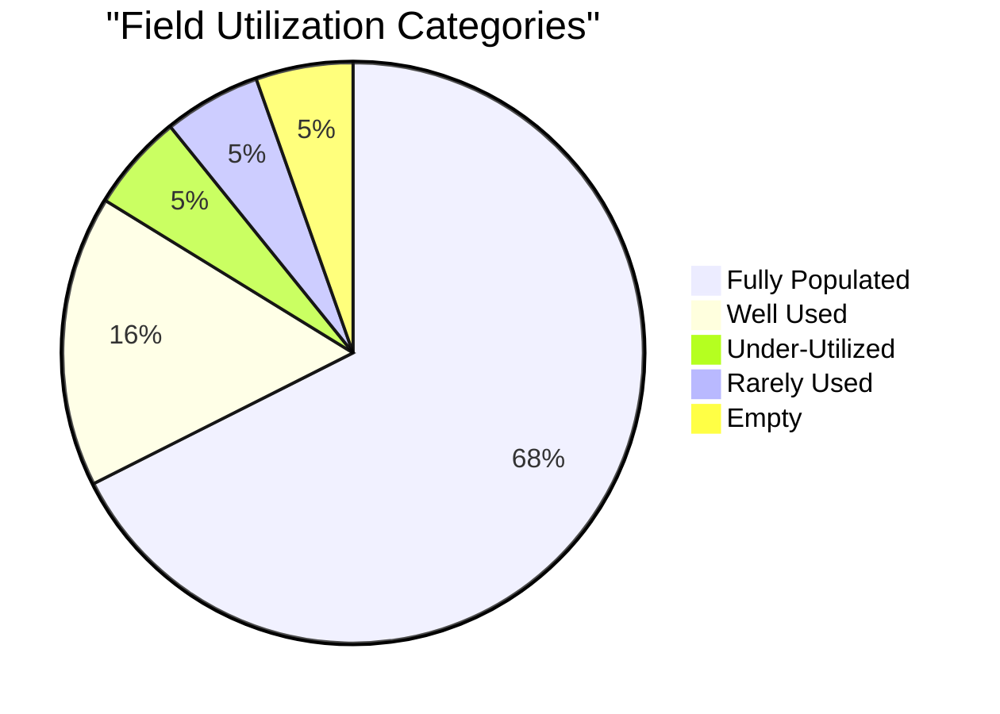
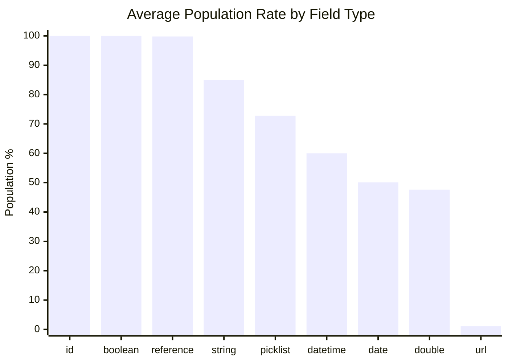
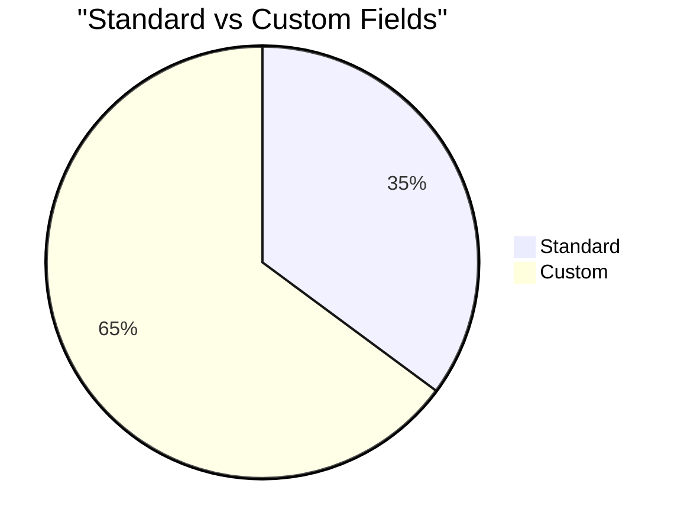
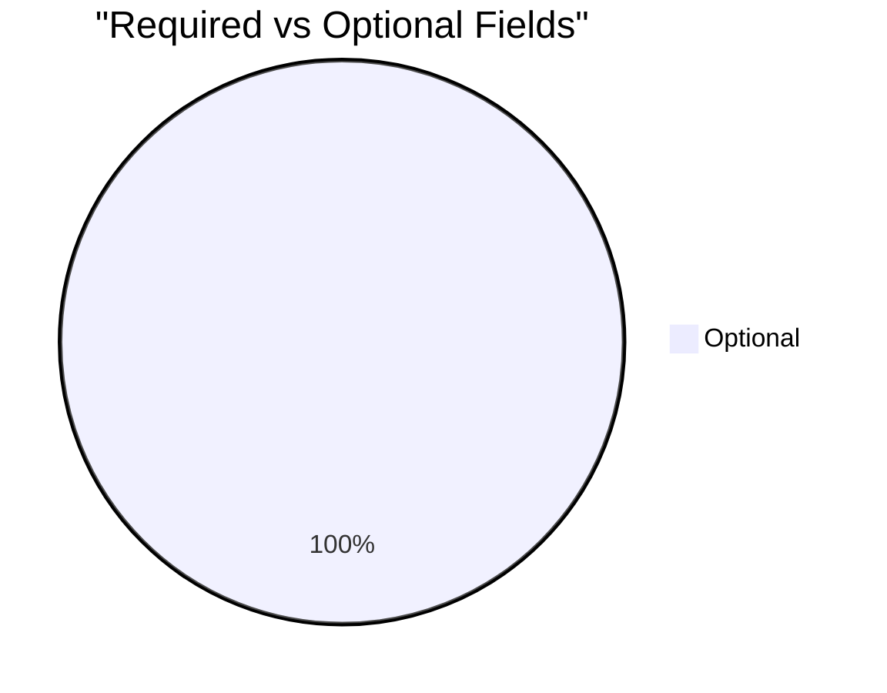

# Field Utilization Analysis: Correspondence (`Correspondence__c`)

> Generated on 2026-03-19 16:10:55

## Executive Summary

| Metric | Value |
| --- | --- |
| **Object** | Correspondence (`Correspondence__c`) |
| **Total Records** | 21,749 |
| **Total Fields Analyzed** | 37 |
| **Standard / Custom** | 13 / 24 |
| **Formula / Calculated** | 10 |
| **Required / Optional** | 0 / 37 |
| **Mean Population Rate** | 79.3% |
| **Median Population Rate** | 100.0% |

## Utilization Category Distribution

| Category | Threshold | Fields | % of Total |
| --- | --- | --- | --- |
| Fully Populated | > 95 % | 25 | 67.6% |
| Well Used | 50 – 95 % | 6 | 16.2% |
| Under-Utilized | 10 – 50 % | 2 | 5.4% |
| Rarely Used | 1 – 10 % | 2 | 5.4% |
| Empty | 0 % | 2 | 5.4% |

## Descriptive Statistics

Population-rate statistics across all analyzed fields:

| Statistic | Value |
| --- | --- |
| N (fields) | 37 |
| Mean | 79.32% |
| Median | 100.00% |
| Std Dev | 33.73% |
| Variance | 1137.57 |
| Min | 0.00% |
| Max | 100.00% |
| Q1 (25th pctl) | 54.79% |
| Q3 (75th pctl) | 100.00% |
| IQR | 45.21% |
| 5th Percentile | 0.00% |
| 95th Percentile | 100.00% |
| Skewness | -1.455 |
| Excess Kurtosis | 0.626 |
| Mode | 100.0% |

**Interpretation:**

- **Skewness (-1.455)** — Left-skewed: most fields are well-populated; a small tail of under-populated fields exists.
- **Kurtosis (0.626)** — Mesokurtic: distribution shape is close to normal.

## Utilization by Field Type

| Field Type | Count | Avg Population Rate |
| --- | --- | --- |
| id | 1 | 100.0% |
| boolean | 6 | 100.0% |
| reference | 5 | 99.8% |
| string | 10 | 85.0% |
| picklist | 6 | 72.8% |
| datetime | 5 | 60.0% |
| date | 2 | 50.1% |
| double | 1 | 47.6% |
| url | 1 | 1.1% |

## Standard vs Custom Field Comparison

| Segment | Fields | Avg Population Rate |
| --- | --- | --- |
| Standard | 13 | 76.9% |
| Custom | 24 | 80.6% |

## Required vs Optional Fields

| Segment | Fields | Avg Population Rate |
| --- | --- | --- |
| Required | 0 | 0.0% |
| Optional | 37 | 79.3% |

## Detailed Field Analysis

### Fully Populated (25 fields)

| Field API Name | Label | Type | Population | Rate | Custom | Required | Formula |
| --- | --- | --- | --- | --- | --- | --- | --- |
| `Id` | Record ID | id | 21,749 | 100.0% |  |  |  |
| `OwnerId` | Owner ID | reference | 21,749 | 100.0% |  |  |  |
| `Name` | CNumber | string | 21,749 | 100.0% |  |  |  |
| `CurrencyIsoCode` | Currency ISO Code | picklist | 21,749 | 100.0% |  |  |  |
| `CreatedDate` | Created Date | datetime | 21,749 | 100.0% |  |  |  |
| `CreatedById` | Created By ID | reference | 21,749 | 100.0% |  |  |  |
| `LastModifiedDate` | Last Modified Date | datetime | 21,749 | 100.0% |  |  |  |
| `LastModifiedById` | Last Modified By ID | reference | 21,749 | 100.0% |  |  |  |
| `SystemModstamp` | System Modstamp | datetime | 21,749 | 100.0% |  |  |  |
| `Correspondence_Snip__c` | Correspondence Snip | string | 21,749 | 100.0% | Yes |  | Yes |
| `Mine__c` | Mine | string | 21,749 | 100.0% | Yes |  | Yes |
| `Case_Manager__c` | Case Manager | string | 21,749 | 100.0% | Yes |  | Yes |
| `Year_Formula__c` | Year Formula | string | 21,749 | 100.0% | Yes |  | Yes |
| `IsDeleted` | Deleted | boolean | 21,749 | 100.0% |  |  |  |
| `Updater__c` | Updater | boolean | 21,749 | 100.0% | Yes |  |  |
| `Count_This_One__c` | Count This One | boolean | 21,749 | 100.0% | Yes |  | Yes |
| `Originator_is_Sponsor__c` | Originator is Sponsor | boolean | 21,749 | 100.0% | Yes |  | Yes |
| `After_PS__c` | After PS? | boolean | 21,749 | 100.0% | Yes |  | Yes |
| `Correspondence_has_Photos__c` | Correspondence has Photos? | boolean | 21,749 | 100.0% | Yes |  |  |
| `Date_of_Correspondence__c` | Date of Correspondence | date | 21,711 | 99.8% | Yes |  |  |
| `Originator__c` | Originator | picklist | 21,708 | 99.8% | Yes |  |  |
| `Child_First_Name_corresp__c` | Child First Name corresp | string | 21,688 | 99.7% | Yes |  | Yes |
| `c_Student__c` | *c Student | reference | 21,688 | 99.7% | Yes |  |  |
| `Child_Case_Manager_Id__c` | Child Case Manager Id | string | 21,688 | 99.7% | Yes |  | Yes |
| `Comm_Donor__c` | Sponsor | reference | 21,640 | 99.5% | Yes |  |  |

### Well Used (6 fields)

| Field API Name | Label | Type | Population | Rate | Custom | Required | Formula |
| --- | --- | --- | --- | --- | --- | --- | --- |
| `Mail_Status__c` | Mail Status | picklist | 15,616 | 71.8% | Yes |  |  |
| `Subject_Type__c` | Subject Type | picklist | 12,051 | 55.4% | Yes |  |  |
| `Medium__c` | Medium | picklist | 12,036 | 55.3% | Yes |  |  |
| `Message_Status__c` | Message Status | picklist | 11,798 | 54.2% | Yes |  |  |
| `post_title__c` | Message Subject | string | 11,426 | 52.5% | Yes |  |  |
| `Describe_Correspondence__c` | Additional Description | string | 11,004 | 50.6% | Yes |  |  |

### Under-Utilized (2 fields)

| Field API Name | Label | Type | Population | Rate | Custom | Required | Formula |
| --- | --- | --- | --- | --- | --- | --- | --- |
| `post_id__c` | WordPress Post ID | double | 10,350 | 47.6% | Yes |  |  |
| `WordPress_Correspondence_Link__c` | WordPress Correspondence Link | string | 10,350 | 47.6% | Yes |  | Yes |

### Rarely Used (2 fields)

| Field API Name | Label | Type | Population | Rate | Custom | Required | Formula |
| --- | --- | --- | --- | --- | --- | --- | --- |
| `Video_URL__c` | Video URL | url | 244 | 1.1% | Yes |  |  |
| `LastActivityDate` | Last Activity Date | date | 65 | 0.3% |  |  |  |

### Empty (2 fields)

| Field API Name | Label | Type | Population | Rate | Custom | Required | Formula |
| --- | --- | --- | --- | --- | --- | --- | --- |
| `LastViewedDate` | Last Viewed Date | datetime | 0 | 0.0% |  |  |  |
| `LastReferencedDate` | Last Referenced Date | datetime | 0 | 0.0% |  |  |  |

### Skipped Fields (compound / non-queryable)

| Field API Name | Label | Type |
| --- | --- | --- |
| `post_content__c` | Message Content | textarea |
| `post_attachments__c` | Message Attachments | textarea |
| `Attachments_Display__c` | Attachments Display | textarea |

## Recommendations

### Fields Recommended for Deletion Review

No custom fields with 0 % population found — all custom fields contain at least some data.

### Fields Needing a Data Collection Strategy

These fields are **< 25 % populated** and user-editable. Evaluate whether the data is valuable;
if so, consider validation rules, required-field configuration, screen flows, or training to improve collection.

| Field | Label | Type | Rate | Custom |
| --- | --- | --- | --- | --- |
| `Video_URL__c` | Video URL | url | 1.1% | Yes |

---

*Analysis performed on 2026-03-19 16:10:55 against `Correspondence__c` with 21,749 records.*
