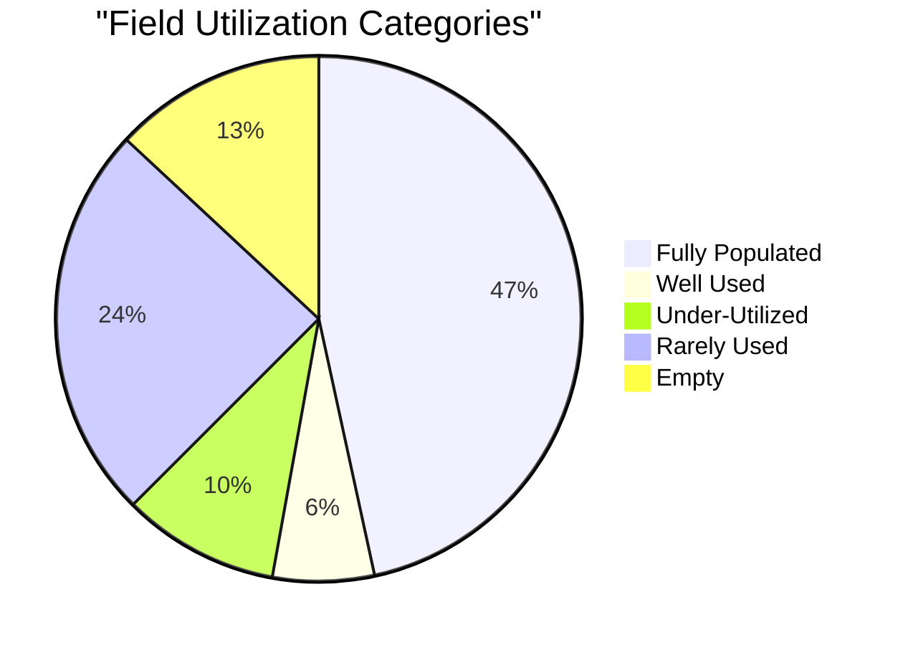
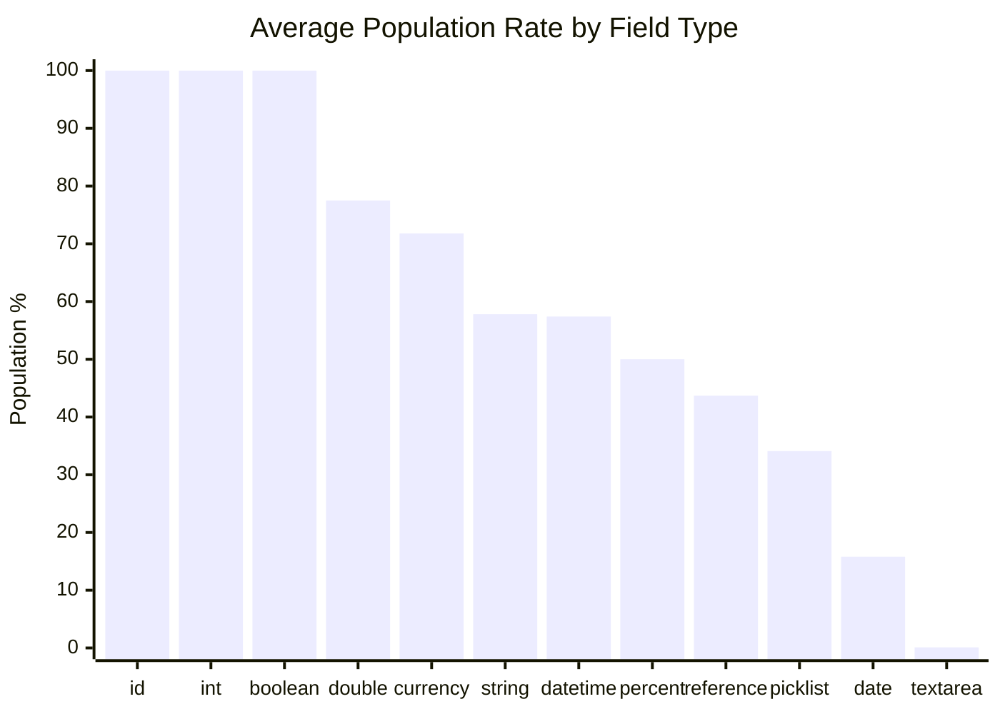
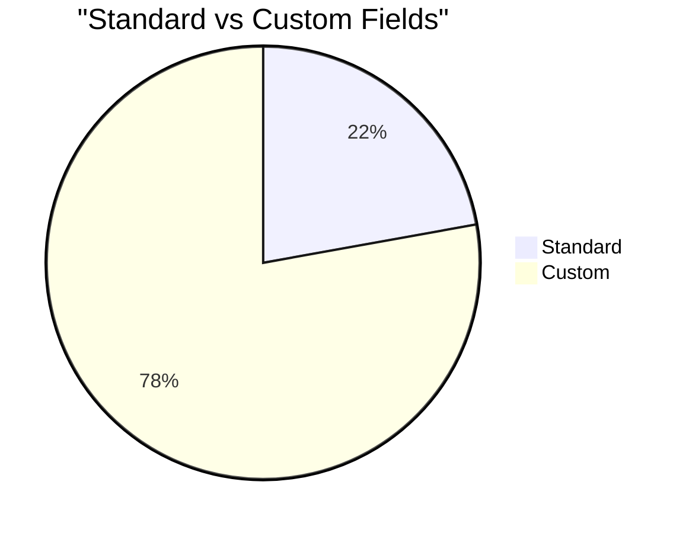
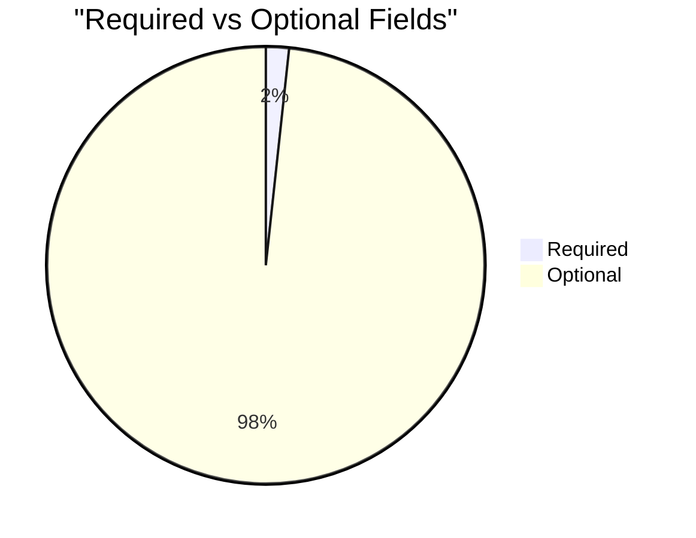

# Field Utilization Analysis: Donation (`Opportunity`)

> Generated on 2026-03-19 16:11:34

## Executive Summary

| Metric | Value |
| --- | --- |
| **Object** | Donation (`Opportunity`) |
| **Total Records** | 29,441 |
| **Total Fields Analyzed** | 176 |
| **Standard / Custom** | 39 / 137 |
| **Formula / Calculated** | 43 |
| **Required / Optional** | 3 / 173 |
| **Mean Population Rate** | 53.9% |
| **Median Population Rate** | 68.5% |

## Utilization Category Distribution

| Category | Threshold | Fields | % of Total |
| --- | --- | --- | --- |
| Fully Populated | > 95 % | 82 | 46.6% |
| Well Used | 50 – 95 % | 11 | 6.2% |
| Under-Utilized | 10 – 50 % | 17 | 9.7% |
| Rarely Used | 1 – 10 % | 43 | 24.4% |
| Empty | 0 % | 23 | 13.1% |

## Descriptive Statistics

Population-rate statistics across all analyzed fields:

| Statistic | Value |
| --- | --- |
| N (fields) | 176 |
| Mean | 53.90% |
| Median | 68.50% |
| Std Dev | 46.39% |
| Variance | 2151.77 |
| Min | 0.00% |
| Max | 100.00% |
| Q1 (25th pctl) | 0.40% |
| Q3 (75th pctl) | 100.00% |
| IQR | 99.60% |
| 5th Percentile | 0.00% |
| 95th Percentile | 100.00% |
| Skewness | -0.138 |
| Excess Kurtosis | -1.868 |
| Mode | 100.0% |

**Interpretation:**

- **Skewness (-0.138)** — Approximately symmetric distribution of population rates.
- **Kurtosis (-1.868)** — Platykurtic: light tails and a flat peak — population rates are broadly spread.

## Utilization by Field Type

| Field Type | Count | Avg Population Rate |
| --- | --- | --- |
| id | 1 | 100.0% |
| int | 3 | 100.0% |
| boolean | 19 | 100.0% |
| double | 9 | 77.5% |
| currency | 17 | 71.8% |
| string | 47 | 57.8% |
| datetime | 6 | 57.4% |
| percent | 2 | 50.0% |
| reference | 21 | 43.7% |
| picklist | 26 | 34.1% |
| date | 19 | 15.8% |
| textarea | 4 | 0.1% |
| email | 1 | 0.0% |
| url | 1 | 0.0% |

## Standard vs Custom Field Comparison

| Segment | Fields | Avg Population Rate |
| --- | --- | --- |
| Standard | 39 | 77.3% |
| Custom | 137 | 47.2% |

## Required vs Optional Fields

| Segment | Fields | Avg Population Rate |
| --- | --- | --- |
| Required | 3 | 100.0% |
| Optional | 173 | 53.1% |

## Detailed Field Analysis

### Fully Populated (82 fields)

| Field API Name | Label | Type | Population | Rate | Custom | Required | Formula |
| --- | --- | --- | --- | --- | --- | --- | --- |
| `Id` | Donation ID | id | 29,441 | 100.0% |  |  |  |
| `AccountId` | Organization Name | reference | 29,441 | 100.0% |  |  |  |
| `RecordTypeId` | Donation Record Type | reference | 29,441 | 100.0% |  |  |  |
| `Name` | Donation Name | string | 29,441 | 100.0% |  | Yes |  |
| `StageName` | Stage | picklist | 29,441 | 100.0% |  | Yes |  |
| `Probability` | Probability (%) | percent | 29,441 | 100.0% |  |  |  |
| `CloseDate` | Close Date | date | 29,441 | 100.0% |  | Yes |  |
| `ForecastCategory` | Forecast Category | picklist | 29,441 | 100.0% |  |  |  |
| `ForecastCategoryName` | Forecast Category | picklist | 29,441 | 100.0% |  |  |  |
| `CurrencyIsoCode` | Donation Currency | picklist | 29,441 | 100.0% |  |  |  |
| `OwnerId` | Donation Owner | reference | 29,441 | 100.0% |  |  |  |
| `CreatedDate` | Created Date | datetime | 29,441 | 100.0% |  |  |  |
| `CreatedById` | Created By ID | reference | 29,441 | 100.0% |  |  |  |
| `LastModifiedDate` | Last Modified Date | datetime | 29,441 | 100.0% |  |  |  |
| `LastModifiedById` | Last Modified By ID | reference | 29,441 | 100.0% |  |  |  |
| `SystemModstamp` | System Modstamp | datetime | 29,441 | 100.0% |  |  |  |
| `PushCount` | Push Count | int | 29,441 | 100.0% |  |  |  |
| `FiscalQuarter` | Fiscal Quarter | int | 29,441 | 100.0% |  |  |  |
| `FiscalYear` | Fiscal Year | int | 29,441 | 100.0% |  |  |  |
| `Fiscal` | Fiscal Period | string | 29,441 | 100.0% |  |  |  |
| `npo02__CombinedRollupFieldset__c` | Combined Rollup Fieldset | string | 29,441 | 100.0% | Yes |  | Yes |
| `Count__c` | Count | double | 29,441 | 100.0% | Yes |  | Yes |
| `Year_Formula__c` | Year Formula | string | 29,441 | 100.0% | Yes |  | Yes |
| `npe01__Amount_Outstanding__c` | Remaining Balance | currency | 29,441 | 100.0% | Yes |  | Yes |
| `Is_CY_Spring_Appeal_Donor__c` | Is CY Spring Appeal Donor? | string | 29,441 | 100.0% | Yes |  | Yes |
| `npe01__Is_Opp_From_Individual__c` | Is Opp From Individual | string | 29,441 | 100.0% | Yes |  | Yes |
| `CaseSafe_ID__c` | CaseSafe ID | string | 29,441 | 100.0% | Yes |  | Yes |
| `Matching_Payment_Due__c` | Matching Payment Due | currency | 29,441 | 100.0% | Yes |  | Yes |
| `Total_Value_of_Contribution__c` | Total Value of Contribution | currency | 29,441 | 100.0% | Yes |  | Yes |
| `Merge_Do_not_contact__c` | Merge: Do not contact | string | 29,441 | 100.0% | Yes |  | Yes |
| `Merge_Deceased__c` | Merge: Deceased | string | 29,441 | 100.0% | Yes |  | Yes |
| `Closed_Month__c` | Closed Month | string | 29,441 | 100.0% | Yes |  | Yes |
| `Renewal_In_7_Days__c` | Renewal In 7 Days | string | 29,441 | 100.0% | Yes |  | Yes |
| `Merge_Mailing_Address__c` | Merge: Mailing Address | string | 29,441 | 100.0% | Yes |  | Yes |
| `Sponsorship_Renewal_URL__c` | Sponsorship Renewal URL | string | 29,441 | 100.0% | Yes |  | Yes |
| `Amount_Recurring_Amount_Diff__c` | Amount/Recurring Amount Diff | currency | 29,441 | 100.0% | Yes |  | Yes |
| `Donation_CaseSafe_ID__c` | Donation CaseSafe ID | string | 29,441 | 100.0% | Yes |  | Yes |
| `Rollup_Amount__c` | Rollup Amount | currency | 29,441 | 100.0% | Yes |  | Yes |
| `IsDeleted` | Deleted | boolean | 29,441 | 100.0% |  |  |  |
| `IsClosed` | Closed | boolean | 29,441 | 100.0% |  |  |  |
| `IsWon` | Won | boolean | 29,441 | 100.0% |  |  |  |
| `HasOpportunityLineItem` | Has Line Item | boolean | 29,441 | 100.0% |  |  |  |
| `HasOpenActivity` | Has Open Activity | boolean | 29,441 | 100.0% |  |  |  |
| `HasOverdueTask` | Has Overdue Task | boolean | 29,441 | 100.0% |  |  |  |
| `Gift_Aid__c` | xDEP Gift Aid | boolean | 29,441 | 100.0% | Yes |  |  |
| `npe01__Do_Not_Automatically_Create_Payment__c` | Do Not Automatically Create Payment | boolean | 29,441 | 100.0% | Yes |  |  |
| `Is_Matching_Gift__c` | Is Matching Gift | boolean | 29,441 | 100.0% | Yes |  |  |
| `npsp__Is_Grant_Renewal__c` | Is Grant Renewal | boolean | 29,441 | 100.0% | Yes |  |  |
| `Postal_Thanks_Required__c` | Postal Thanks Required | boolean | 29,441 | 100.0% | Yes |  |  |
| `Thank_You_Email_Sent__c` | Thank You Email Sent | boolean | 29,441 | 100.0% | Yes |  |  |
| `Reminder_Email_1_Sent__c` | Reminder Email #1 Sent? | boolean | 29,441 | 100.0% | Yes |  |  |
| `Reminder_Email_2_Sent__c` | Reminder Email #2 Sent? | boolean | 29,441 | 100.0% | Yes |  |  |
| `Data_cleansing_tool__c` | Data cleansing tool | boolean | 29,441 | 100.0% | Yes |  |  |
| `HAD_MULTIPLE_PAYMENTS_recurring__c` | HAD MULTIPLE PAYMENTS (recurring!) | boolean | 29,441 | 100.0% | Yes |  |  |
| `Updater__c` | Updater | boolean | 29,441 | 100.0% | Yes |  |  |
| `fix__c` | fix? | boolean | 29,441 | 100.0% | Yes |  | Yes |
| `Paid_Amount_Match__c` | Paid Amount match? | boolean | 29,441 | 100.0% | Yes |  | Yes |
| `Matched_Gifts__c` | # Matched Gifts | double | 29,440 | 100.0% | Yes |  |  |
| `Tax_Deductible_Amount__c` | Non-Purchase Allocations | currency | 29,440 | 100.0% | Yes |  |  |
| `Donation_Country__c` | Donation Country | picklist | 29,440 | 100.0% | Yes |  |  |
| `Matching_Status__c` | Matching Status | picklist | 29,439 | 100.0% | Yes |  |  |
| `Amount` | Amount | currency | 29,429 | 100.0% |  |  |  |
| `name_formula__c` | name formula | string | 29,409 | 99.9% | Yes |  | Yes |
| `Payment_Method__c` | Payment Method | picklist | 29,390 | 99.8% | Yes |  |  |
| `Total_Payments_CY__c` | Total Payments CY | currency | 29,386 | 99.8% | Yes |  | Yes |
| `npe01__Amount_Written_Off__c` | Payment Writeoff Amount | currency | 29,386 | 99.8% | Yes |  | Yes |
| `npe01__Payments_Made__c` | Payment Amount Received | currency | 29,386 | 99.8% | Yes |  | Yes |
| `Payment_tot__c` | Payment tot | currency | 29,386 | 99.8% | Yes |  | Yes |
| `Paid_Payments__c` | Paid Payments | currency | 29,386 | 99.8% | Yes |  | Yes |
| `Currency__c` | *Currency | picklist | 29,351 | 99.7% | Yes |  |  |
| `how_many_products__c` | how many products | double | 29,344 | 99.7% | Yes |  | Yes |
| `Product_Count__c` | Product Count | double | 29,344 | 99.7% | Yes |  | Yes |
| `Amount2__c` | *Amount* | double | 29,340 | 99.7% | Yes |  |  |
| `npe01__Number_of_Payments__c` | Number of Payments | double | 29,332 | 99.6% | Yes |  | Yes |
| `Days_Since_Reminder__c` | Days Since Reminder | double | 29,150 | 99.0% | Yes |  | Yes |
| `GAUs__c` | GAUs | string | 28,947 | 98.3% | Yes |  |  |
| `GAU_Type__c` | GAU Type | string | 28,945 | 98.3% | Yes |  |  |
| `ContactId` | Contact ID | reference | 28,784 | 97.8% |  |  |  |
| `npsp__Primary_Contact__c` | Primary Contact | reference | 28,716 | 97.5% | Yes |  |  |
| `Merge_Primary_Contact_Full_Name__c` | Merge: Primary Contact Full Name | string | 28,716 | 97.5% | Yes |  | Yes |
| `Merge_First_Name__c` | Merge: First Name | string | 28,682 | 97.4% | Yes |  | Yes |
| `Merge_Relationship_Manager__c` | Merge: Relationship Manager | string | 28,362 | 96.3% | Yes |  | Yes |

### Well Used (11 fields)

| Field API Name | Label | Type | Population | Rate | Custom | Required | Formula |
| --- | --- | --- | --- | --- | --- | --- | --- |
| `Merge_Donor_Email__c` | Merge: Donor Email | string | 26,179 | 88.9% | Yes |  | Yes |
| `npe01__Contact_Id_for_Role__c` | Contact Id for Role | string | 24,430 | 83.0% | Yes |  |  |
| `Deposit_Date__c` | Deposit Date | date | 22,831 | 77.5% | Yes |  |  |
| `npe03__Recurring_Donation__c` | Recurring Donation | reference | 20,166 | 68.5% | Yes |  |  |
| `RD_Installment_Period__c` | RD Installment Period | string | 20,166 | 68.5% | Yes |  | Yes |
| `RD_Auto_Renewing__c` | RD Auto Renewing | string | 20,166 | 68.5% | Yes |  | Yes |
| `Recurring_Donation_ID__c` | Recurring Donation ID | string | 20,166 | 68.5% | Yes |  | Yes |
| `Name_Historical__c` | Name - Historical | string | 19,944 | 67.7% | Yes |  |  |
| `GAU_Default__c` | GAU Default | picklist | 19,613 | 66.6% | Yes |  |  |
| `Payment_Date__c` | xDEP Payment Date | date | 18,978 | 64.5% | Yes |  |  |
| `Check_Reference_Number__c` | Check/Reference Number | string | 18,283 | 62.1% | Yes |  |  |

### Under-Utilized (17 fields)

| Field API Name | Label | Type | Population | Rate | Custom | Required | Formula |
| --- | --- | --- | --- | --- | --- | --- | --- |
| `LastCloseDateChangedHistoryId` | Donation History ID | reference | 13,461 | 45.7% |  |  |  |
| `LastStageChangeDate` | Last Stage Change Date | datetime | 13,160 | 44.7% |  |  |  |
| `LastAmountChangedHistoryId` | Donation History ID | reference | 11,557 | 39.3% |  |  |  |
| `Card_Last_4__c` | Card Last 4 | string | 11,279 | 38.3% | Yes |  | Yes |
| `Scheduled_Date__c` | Scheduled Date | date | 10,312 | 35.0% | Yes |  |  |
| `Origin_Oppty_ID__c` | Origin Oppty ID | string | 10,116 | 34.4% | Yes |  |  |
| `Pricebook2Id` | Price Book ID | reference | 9,335 | 31.7% |  |  |  |
| `RD_Active_Students__c` | RD Active Students | string | 7,832 | 26.6% | Yes |  | Yes |
| `Merge_Active_RD_Students__c` | Merge: Active RD Students | string | 7,832 | 26.6% | Yes |  | Yes |
| `CampaignId` | Campaign ID | reference | 7,534 | 25.6% |  |  |  |
| `Campaign__c` | Campaign | string | 7,534 | 25.6% | Yes |  | Yes |
| `Recurring_Donation_Amount__c` | Recurring Donation Amount | currency | 5,924 | 20.1% | Yes |  |  |
| `LastActivityDate` | Last Activity | date | 5,735 | 19.5% |  |  |  |
| `PMT_QB_ERROR__c` | PMT QB ERROR | string | 5,632 | 19.1% | Yes |  |  |
| `PMT_QB_ID__c` | PMT QB ID | string | 5,576 | 18.9% | Yes |  |  |
| `Merge_Donor_Alternative_Email__c` | Merge: Donor Alternative Email | string | 4,656 | 15.8% | Yes |  | Yes |
| `Type` | Donation Type | picklist | 3,544 | 12.0% |  |  |  |

### Rarely Used (43 fields)

| Field API Name | Label | Type | Population | Rate | Custom | Required | Formula |
| --- | --- | --- | --- | --- | --- | --- | --- |
| `Donor_QB_ID__c` | Donor QB ID | string | 2,113 | 7.2% | Yes |  |  |
| `Invoice__c` | QB Invoice # | string | 2,101 | 7.1% | Yes |  |  |
| `Third_Party_Administrator__c` | Third Party Administrator | reference | 2,001 | 6.8% | Yes |  |  |
| `Renewal_Email_1_Date__c` | Renewal Email #1 Date | date | 652 | 2.2% | Yes |  |  |
| `npsp__Tribute_Type__c` | Tribute Type | picklist | 593 | 2.0% | Yes |  |  |
| `Email_to_Send__c` | Email to Send | picklist | 502 | 1.7% | Yes |  |  |
| `npsp__Honoree_Contact__c` | Honoree Contact | reference | 425 | 1.4% | Yes |  |  |
| `npsp__Notification_Preference__c` | Notification Preference | picklist | 382 | 1.3% | Yes |  |  |
| `npsp__Matching_Gift_Account__c` | Matching Gift Account | reference | 364 | 1.2% | Yes |  |  |
| `npsp__Matching_Gift__c` | Matching Gift | reference | 350 | 1.2% | Yes |  |  |
| `npsp__Matching_Gift_Status__c` | Matching Gift Status | picklist | 348 | 1.2% | Yes |  |  |
| `Renewal_Postal_1_Sent__c` | Renewal Postal #1 Sent | date | 340 | 1.2% | Yes |  |  |
| `In_Kind_Description__c` | In Kind Description | string | 317 | 1.1% | Yes |  |  |
| `Wire_Status__c` | Wire Status | picklist | 252 | 0.9% | Yes |  |  |
| `Correspondent__c` | Correspondent | reference | 190 | 0.6% | Yes |  |  |
| `Matching_Amount_Pledged__c` | Matching Amount Pledged | currency | 188 | 0.6% | Yes |  |  |
| `Dedication_Honoree_Name__c` | Dedication Honoree Name | string | 188 | 0.6% | Yes |  |  |
| `Matching_Organization__c` | Matching Organization | string | 184 | 0.6% | Yes |  |  |
| `Matching_Amount_Paid__c` | Matching Amount Paid | currency | 170 | 0.6% | Yes |  |  |
| `Renewal_Delinquent_Notice_1__c` | Delinquent Notice #1 | date | 132 | 0.4% | Yes |  |  |
| `Matching_Close_Date__c` | Matching Close Date | date | 129 | 0.4% | Yes |  |  |
| `npsp__Acknowledgment_Status__c` | Acknowledgment Status | picklist | 120 | 0.4% | Yes |  |  |
| `Dedication_Recipient_First_Name__c` | Dedication Recipient First Name | string | 117 | 0.4% | Yes |  |  |
| `Dedication_Recipient_Last_Name__c` | Dedication Recipient Last Name | string | 115 | 0.4% | Yes |  |  |
| `npsp__Notification_Recipient_Contact__c` | Notification Recipient Contact | reference | 100 | 0.3% | Yes |  |  |
| `LeadSource` | Lead Source | picklist | 75 | 0.3% |  |  |  |
| `Stock_Name__c` | Stock Name | textarea | 73 | 0.2% | Yes |  |  |
| `Delinquent_2_Sent__c` | Delinquent #2 | date | 68 | 0.2% | Yes |  |  |
| `Number_of_Shares__c` | Number of Shares | double | 65 | 0.2% | Yes |  |  |
| `Matching_Org_Address__c` | Matching Org. Address | textarea | 28 | 0.1% | Yes |  |  |
| `npo02__systemHouseholdContactRoleProcessor__c` | _SYSTEM: HOUSEHOLD CONTACT ROLEPROCESSOR | picklist | 13 | 0.0% | Yes |  |  |
| `Dedication_Recipient_Email_Address__c` | Dedication Recipient Email Address | email | 13 | 0.0% | Yes |  |  |
| `npsp__Requested_Amount__c` | Requested Amount | currency | 8 | 0.0% | Yes |  |  |
| `Delinquent_RM_Date__c` | Delinquent RM Date | date | 7 | 0.0% | Yes |  |  |
| `Dedication_Recipient_Address__c` | Dedication Recipient Address | textarea | 7 | 0.0% | Yes |  |  |
| `Pick_a_Reminder_Email_to_Send__c` | Pick a Reminder Email to Send | picklist | 7 | 0.0% | Yes |  |  |
| `npsp__Grant_Program_Area_s__c` | Program Areas | textarea | 6 | 0.0% | Yes |  |  |
| `npsp__Grant_Requirements_Website__c` | Grant Requirements Website | url | 4 | 0.0% | Yes |  |  |
| `npsp__Acknowledgment_Date__c` | Acknowledgment Date | date | 3 | 0.0% | Yes |  |  |
| `npsp__Grant_Period_End_Date__c` | Grant Period End Date | date | 2 | 0.0% | Yes |  |  |
| `npsp__Grant_Period_Start_Date__c` | Grant Period Start Date | date | 2 | 0.0% | Yes |  |  |
| `USD_Exchange_Rate__c` | USD Exchange Rate | double | 2 | 0.0% | Yes |  |  |
| `npsp__Previous_Grant_Opportunity__c` | Previous Grant/Gift Opportunity | reference | 1 | 0.0% | Yes |  |  |

### Empty (23 fields)

| Field API Name | Label | Type | Population | Rate | Custom | Required | Formula |
| --- | --- | --- | --- | --- | --- | --- | --- |
| `LastViewedDate` | Last Viewed Date | datetime | 0 | 0.0% |  |  |  |
| `LastReferencedDate` | Last Referenced Date | datetime | 0 | 0.0% |  |  |  |
| `SyncedQuoteId` | Quote ID | reference | 0 | 0.0% |  |  |  |
| `npsp__Batch__c` | Batch | reference | 0 | 0.0% | Yes |  |  |
| `npo02__CurrentGenerators__c` | Current Generator(s) - DEPRECATED | string | 0 | 0.0% | Yes |  |  |
| `Dedication_Acknowledgement_Type__c` | Dedication Acknowledgement Type | picklist | 0 | 0.0% | Yes |  |  |
| `Reporting_Deadline__c` | Reporting Deadline | date | 0 | 0.0% | Yes |  |  |
| `Matching__c` | Matching % | percent | 0 | 0.0% | Yes |  |  |
| `npo02__DeliveryInstallationStatus__c` | Delivery/Installation Status- DEPRECATED | picklist | 0 | 0.0% | Yes |  |  |
| `npo02__MainCompetitors__c` | Main Competitor(s) - DEPRECATED | string | 0 | 0.0% | Yes |  |  |
| `npo02__OrderNumber__c` | Order Number - DEPRECATED | string | 0 | 0.0% | Yes |  |  |
| `npo02__TrackingNumber__c` | Tracking Number - DEPRECATED | string | 0 | 0.0% | Yes |  |  |
| `Grant_Amount__c` | Grant Amount | currency | 0 | 0.0% | Yes |  |  |
| `Program_Designation__c` | Program Designation | picklist | 0 | 0.0% | Yes |  |  |
| `Dedication_Type__c` | Dedication Type | picklist | 0 | 0.0% | Yes |  |  |
| `npe01__Member_Level__c` | Member Level | picklist | 0 | 0.0% | Yes |  |  |
| `npe01__Membership_End_Date__c` | Membership End Date | date | 0 | 0.0% | Yes |  |  |
| `npe01__Membership_Origin__c` | Membership Origin | picklist | 0 | 0.0% | Yes |  |  |
| `npe01__Membership_Start_Date__c` | Membership Start Date | date | 0 | 0.0% | Yes |  |  |
| `npsp__Grant_Contract_Date__c` | Grant Contract Date | date | 0 | 0.0% | Yes |  |  |
| `npsp__Grant_Contract_Number__c` | Grant Contract Number | string | 0 | 0.0% | Yes |  |  |
| `npsp__Next_Grant_Deadline_Due_Date__c` | Next Deliverable Date | date | 0 | 0.0% | Yes |  | Yes |
| `npsp__Gift_Strategy__c` | Gift Strategy | picklist | 0 | 0.0% | Yes |  |  |

### Skipped Fields (compound / non-queryable)

| Field API Name | Label | Type |
| --- | --- | --- |
| `Description` | Description | textarea |
| `Reporting_Requirements__c` | Reporting Requirements | textarea |
| `Payment_Proc_Notes__c` | Payment Processing Notes | textarea |
| `Dedication_Personal_Note__c` | Dedication Personal Note | textarea |
| `Directed_Purpose__c` | xDEP Directed Purpose for Gift | textarea |
| `Match_Instructions__c` | Match Instructions | textarea |
| `npsp__Notification_Message__c` | Notification Message | textarea |

## Recommendations

### Fields Recommended for Deletion Review

These **custom** fields have **0 % population**, are not required, and are not formula fields.
They are strong candidates for removal after confirming they are not referenced in automation, reports, or integrations.

- `npsp__Batch__c` (Batch) — reference
- `npo02__CurrentGenerators__c` (Current Generator(s) - DEPRECATED) — string
- `Dedication_Acknowledgement_Type__c` (Dedication Acknowledgement Type) — picklist
- `Reporting_Deadline__c` (Reporting Deadline) — date
- `Matching__c` (Matching %) — percent
- `npo02__DeliveryInstallationStatus__c` (Delivery/Installation Status- DEPRECATED) — picklist
- `npo02__MainCompetitors__c` (Main Competitor(s) - DEPRECATED) — string
- `npo02__OrderNumber__c` (Order Number - DEPRECATED) — string
- `npo02__TrackingNumber__c` (Tracking Number - DEPRECATED) — string
- `Grant_Amount__c` (Grant Amount) — currency
- `Program_Designation__c` (Program Designation) — picklist
- `Dedication_Type__c` (Dedication Type) — picklist
- `npe01__Member_Level__c` (Member Level) — picklist
- `npe01__Membership_End_Date__c` (Membership End Date) — date
- `npe01__Membership_Origin__c` (Membership Origin) — picklist
- `npe01__Membership_Start_Date__c` (Membership Start Date) — date
- `npsp__Grant_Contract_Date__c` (Grant Contract Date) — date
- `npsp__Grant_Contract_Number__c` (Grant Contract Number) — string
- `npsp__Gift_Strategy__c` (Gift Strategy) — picklist

### Fields Needing a Data Collection Strategy

These fields are **< 25 % populated** and user-editable. Evaluate whether the data is valuable;
if so, consider validation rules, required-field configuration, screen flows, or training to improve collection.

| Field | Label | Type | Rate | Custom |
| --- | --- | --- | --- | --- |
| `npsp__Previous_Grant_Opportunity__c` | Previous Grant/Gift Opportunity | reference | 0.0% | Yes |
| `npsp__Grant_Period_End_Date__c` | Grant Period End Date | date | 0.0% | Yes |
| `npsp__Grant_Period_Start_Date__c` | Grant Period Start Date | date | 0.0% | Yes |
| `USD_Exchange_Rate__c` | USD Exchange Rate | double | 0.0% | Yes |
| `npsp__Acknowledgment_Date__c` | Acknowledgment Date | date | 0.0% | Yes |
| `npsp__Grant_Requirements_Website__c` | Grant Requirements Website | url | 0.0% | Yes |
| `npsp__Grant_Program_Area_s__c` | Program Areas | textarea | 0.0% | Yes |
| `Delinquent_RM_Date__c` | Delinquent RM Date | date | 0.0% | Yes |
| `Dedication_Recipient_Address__c` | Dedication Recipient Address | textarea | 0.0% | Yes |
| `Pick_a_Reminder_Email_to_Send__c` | Pick a Reminder Email to Send | picklist | 0.0% | Yes |
| `npsp__Requested_Amount__c` | Requested Amount | currency | 0.0% | Yes |
| `npo02__systemHouseholdContactRoleProcessor__c` | _SYSTEM: HOUSEHOLD CONTACT ROLEPROCESSOR | picklist | 0.0% | Yes |
| `Dedication_Recipient_Email_Address__c` | Dedication Recipient Email Address | email | 0.0% | Yes |
| `Matching_Org_Address__c` | Matching Org. Address | textarea | 0.1% | Yes |
| `Number_of_Shares__c` | Number of Shares | double | 0.2% | Yes |
| `Delinquent_2_Sent__c` | Delinquent #2 | date | 0.2% | Yes |
| `Stock_Name__c` | Stock Name | textarea | 0.2% | Yes |
| `LeadSource` | Lead Source | picklist | 0.3% |  |
| `npsp__Notification_Recipient_Contact__c` | Notification Recipient Contact | reference | 0.3% | Yes |
| `Dedication_Recipient_Last_Name__c` | Dedication Recipient Last Name | string | 0.4% | Yes |
| `Dedication_Recipient_First_Name__c` | Dedication Recipient First Name | string | 0.4% | Yes |
| `npsp__Acknowledgment_Status__c` | Acknowledgment Status | picklist | 0.4% | Yes |
| `Matching_Close_Date__c` | Matching Close Date | date | 0.4% | Yes |
| `Renewal_Delinquent_Notice_1__c` | Delinquent Notice #1 | date | 0.4% | Yes |
| `Matching_Amount_Paid__c` | Matching Amount Paid | currency | 0.6% | Yes |
| `Matching_Organization__c` | Matching Organization | string | 0.6% | Yes |
| `Matching_Amount_Pledged__c` | Matching Amount Pledged | currency | 0.6% | Yes |
| `Dedication_Honoree_Name__c` | Dedication Honoree Name | string | 0.6% | Yes |
| `Correspondent__c` | Correspondent | reference | 0.6% | Yes |
| `Wire_Status__c` | Wire Status | picklist | 0.9% | Yes |
| `In_Kind_Description__c` | In Kind Description | string | 1.1% | Yes |
| `Renewal_Postal_1_Sent__c` | Renewal Postal #1 Sent | date | 1.2% | Yes |
| `npsp__Matching_Gift_Status__c` | Matching Gift Status | picklist | 1.2% | Yes |
| `npsp__Matching_Gift__c` | Matching Gift | reference | 1.2% | Yes |
| `npsp__Matching_Gift_Account__c` | Matching Gift Account | reference | 1.2% | Yes |
| `npsp__Notification_Preference__c` | Notification Preference | picklist | 1.3% | Yes |
| `npsp__Honoree_Contact__c` | Honoree Contact | reference | 1.4% | Yes |
| `Email_to_Send__c` | Email to Send | picklist | 1.7% | Yes |
| `npsp__Tribute_Type__c` | Tribute Type | picklist | 2.0% | Yes |
| `Renewal_Email_1_Date__c` | Renewal Email #1 Date | date | 2.2% | Yes |
| `Third_Party_Administrator__c` | Third Party Administrator | reference | 6.8% | Yes |
| `Invoice__c` | QB Invoice # | string | 7.1% | Yes |
| `Donor_QB_ID__c` | Donor QB ID | string | 7.2% | Yes |
| `Type` | Donation Type | picklist | 12.0% |  |
| `PMT_QB_ID__c` | PMT QB ID | string | 18.9% | Yes |
| `PMT_QB_ERROR__c` | PMT QB ERROR | string | 19.1% | Yes |
| `Recurring_Donation_Amount__c` | Recurring Donation Amount | currency | 20.1% | Yes |

---

*Analysis performed on 2026-03-19 16:11:34 against `Opportunity` with 29,441 records.*
