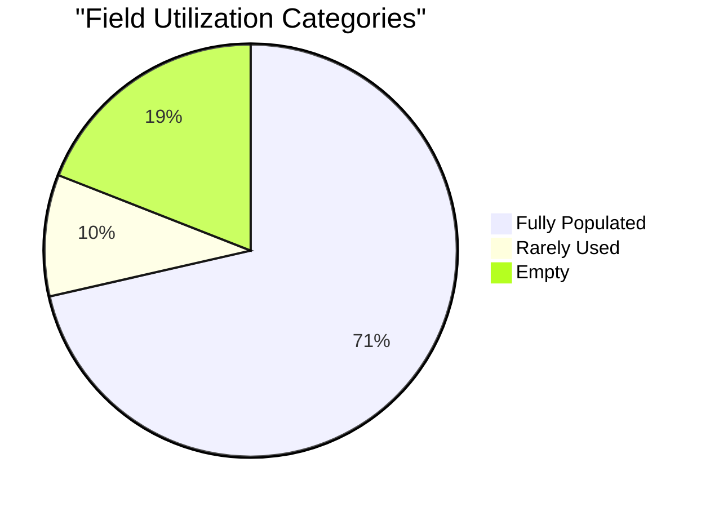
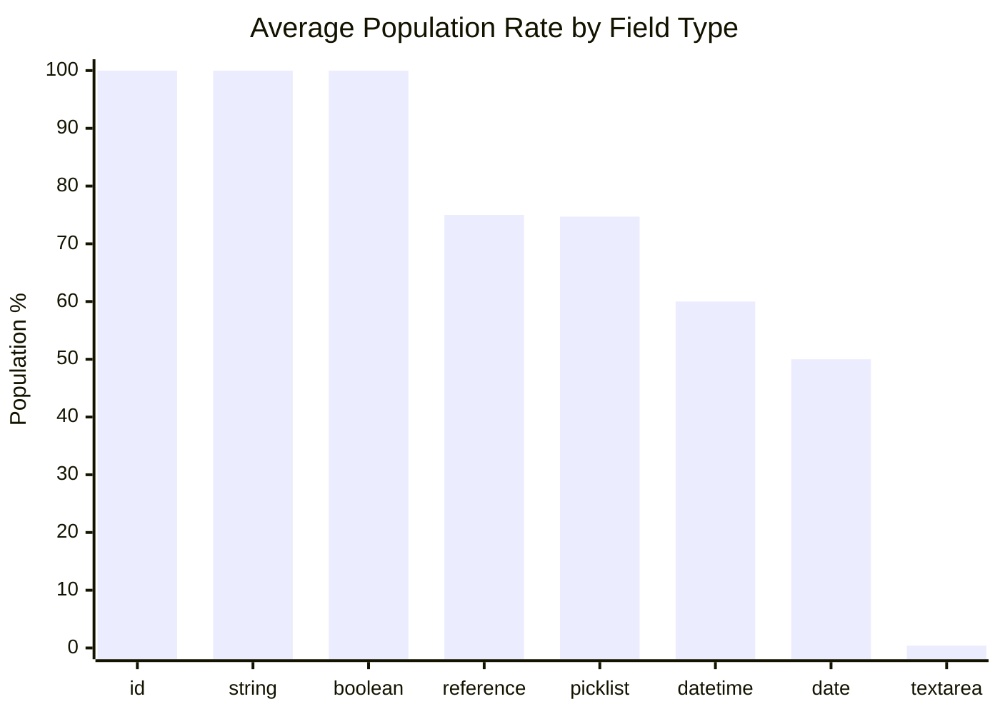
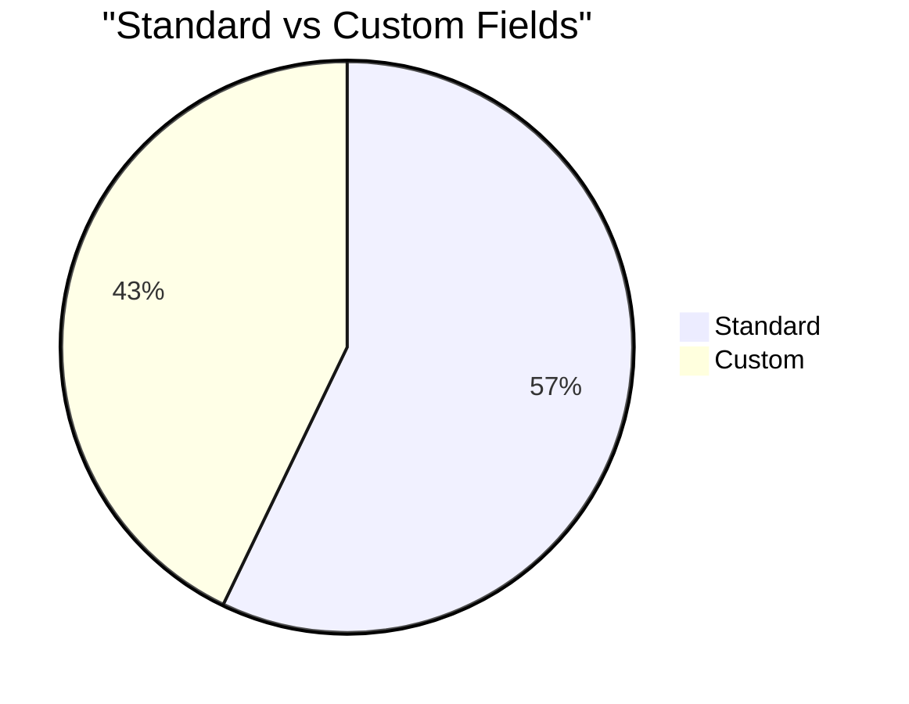
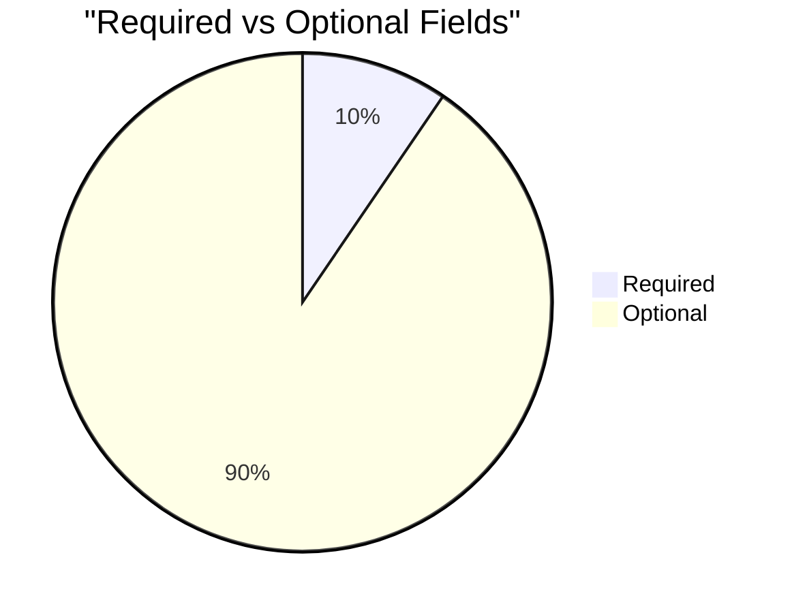

# Field Utilization Analysis: Record of Attendance (`Record_of_Attendance__c`)

> Generated on 2026-03-19 14:33:51

## Executive Summary

| Metric | Value |
| --- | --- |
| **Object** | Record of Attendance (`Record_of_Attendance__c`) |
| **Total Records** | 93,713 |
| **Total Fields Analyzed** | 21 |
| **Standard / Custom** | 12 / 9 |
| **Formula / Calculated** | 0 |
| **Required / Optional** | 2 / 19 |
| **Mean Population Rate** | 71.4% |
| **Median Population Rate** | 100.0% |

## Utilization Category Distribution

| Category | Threshold | Fields | % of Total |
| --- | --- | --- | --- |
| Fully Populated | > 95 % | 15 | 71.4% |
| Well Used | 50 – 95 % | 0 | 0.0% |
| Under-Utilized | 10 – 50 % | 0 | 0.0% |
| Rarely Used | 1 – 10 % | 2 | 9.5% |
| Empty | 0 % | 4 | 19.0% |

## Descriptive Statistics

Population-rate statistics across all analyzed fields:

| Statistic | Value |
| --- | --- |
| N (fields) | 21 |
| Mean | 71.40% |
| Median | 100.00% |
| Std Dev | 46.22% |
| Variance | 2135.85 |
| Min | 0.00% |
| Max | 100.00% |
| Q1 (25th pctl) | 0.26% |
| Q3 (75th pctl) | 100.00% |
| IQR | 99.74% |
| 5th Percentile | 0.00% |
| 95th Percentile | 100.00% |
| Skewness | -1.023 |
| Excess Kurtosis | -1.100 |
| Mode | 100.0% |

**Interpretation:**

- **Skewness (-1.023)** — Left-skewed: most fields are well-populated; a small tail of under-populated fields exists.
- **Kurtosis (-1.100)** — Platykurtic: light tails and a flat peak — population rates are broadly spread.

## Utilization by Field Type

| Field Type | Count | Avg Population Rate |
| --- | --- | --- |
| id | 1 | 100.0% |
| string | 1 | 100.0% |
| boolean | 3 | 100.0% |
| reference | 4 | 75.0% |
| picklist | 4 | 74.7% |
| datetime | 5 | 60.0% |
| date | 2 | 50.0% |
| textarea | 1 | 0.4% |

## Standard vs Custom Field Comparison

| Segment | Fields | Avg Population Rate |
| --- | --- | --- |
| Standard | 12 | 75.0% |
| Custom | 9 | 66.6% |

## Required vs Optional Fields

| Segment | Fields | Avg Population Rate |
| --- | --- | --- |
| Required | 2 | 100.0% |
| Optional | 19 | 68.4% |

## Detailed Field Analysis

### Fully Populated (15 fields)

| Field API Name | Label | Type | Population | Rate | Custom | Required | Formula |
| --- | --- | --- | --- | --- | --- | --- | --- |
| `Id` | Record ID | id | 93,713 | 100.0% |  |  |  |
| `Name` | Attendance Record ID | string | 93,713 | 100.0% |  |  |  |
| `CurrencyIsoCode` | Currency ISO Code | picklist | 93,713 | 100.0% |  |  |  |
| `CreatedDate` | Created Date | datetime | 93,713 | 100.0% |  |  |  |
| `CreatedById` | Created By ID | reference | 93,713 | 100.0% |  |  |  |
| `LastModifiedDate` | Last Modified Date | datetime | 93,713 | 100.0% |  |  |  |
| `LastModifiedById` | Last Modified By ID | reference | 93,713 | 100.0% |  |  |  |
| `SystemModstamp` | System Modstamp | datetime | 93,713 | 100.0% |  |  |  |
| `Activity_Date__c` | Activity Date | date | 93,713 | 100.0% | Yes | Yes |  |
| `c_Student__c` | *c Student | reference | 93,713 | 100.0% | Yes | Yes |  |
| `IsDeleted` | Deleted | boolean | 93,713 | 100.0% |  |  |  |
| `Contraceptives_Received__c` | Contraceptives Received? | boolean | 93,713 | 100.0% | Yes |  |  |
| `Attended_Health__c` | Attended Health Care Appointment | boolean | 93,713 | 100.0% | Yes |  |  |
| `Present_at_Event__c` | Roll Call | picklist | 93,710 | 100.0% | Yes |  |  |
| `Activity__c` | Activity | picklist | 92,624 | 98.8% | Yes |  |  |

### Rarely Used (2 fields)

| Field API Name | Label | Type | Population | Rate | Custom | Required | Formula |
| --- | --- | --- | --- | --- | --- | --- | --- |
| `Attendance_Comments__c` | Attendance Comments | textarea | 376 | 0.4% | Yes |  |  |
| `Reason_for_absence__c` | Reason for absence | picklist | 116 | 0.1% | Yes |  |  |

### Empty (4 fields)

| Field API Name | Label | Type | Population | Rate | Custom | Required | Formula |
| --- | --- | --- | --- | --- | --- | --- | --- |
| `LastActivityDate` | Last Activity Date | date | 0 | 0.0% |  |  |  |
| `LastViewedDate` | Last Viewed Date | datetime | 0 | 0.0% |  |  |  |
| `LastReferencedDate` | Last Referenced Date | datetime | 0 | 0.0% |  |  |  |
| `YPP_Trainer_Name__c` | YPP Trainer Name | reference | 0 | 0.0% | Yes |  |  |

## Recommendations

### Fields Recommended for Deletion Review

These **custom** fields have **0 % population**, are not required, and are not formula fields.
They are strong candidates for removal after confirming they are not referenced in automation, reports, or integrations.

- `YPP_Trainer_Name__c` (YPP Trainer Name) — reference

### Fields Needing a Data Collection Strategy

These fields are **< 25 % populated** and user-editable. Evaluate whether the data is valuable;
if so, consider validation rules, required-field configuration, screen flows, or training to improve collection.

| Field | Label | Type | Rate | Custom |
| --- | --- | --- | --- | --- |
| `Reason_for_absence__c` | Reason for absence | picklist | 0.1% | Yes |
| `Attendance_Comments__c` | Attendance Comments | textarea | 0.4% | Yes |

---

*Analysis performed on 2026-03-19 14:33:51 against `Record_of_Attendance__c` with 93,713 records.*
