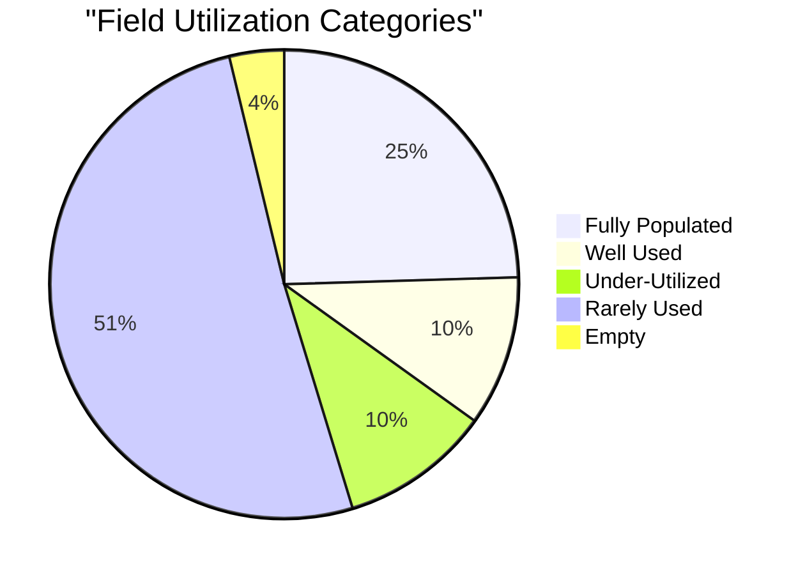
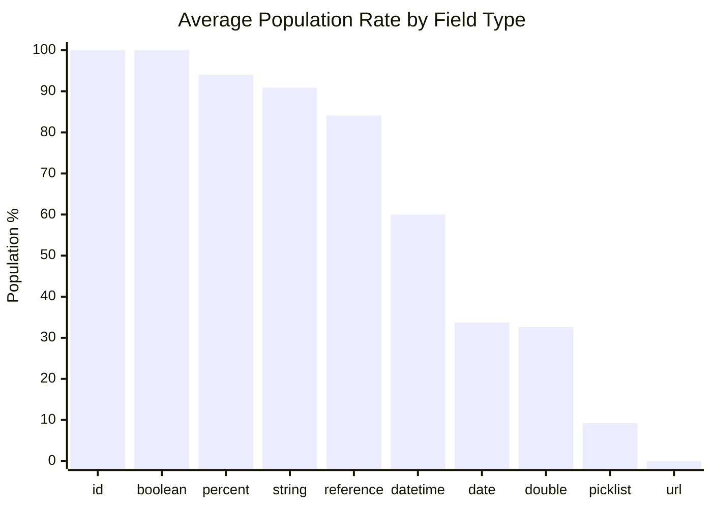
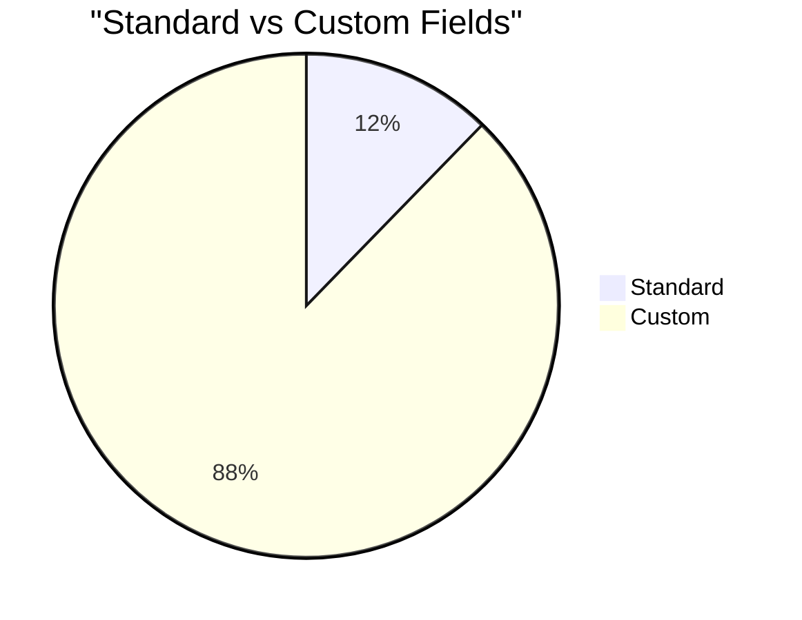
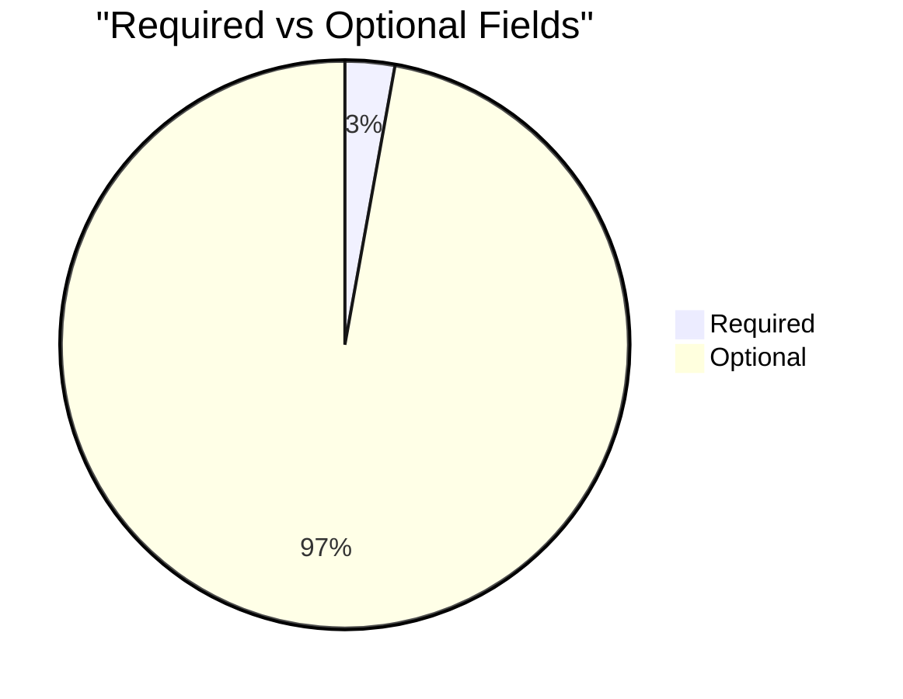

# Field Utilization Analysis: School Marks (`School_Marks__c`)

> Generated on 2026-03-19 16:12:20

## Executive Summary

| Metric | Value |
| --- | --- |
| **Object** | School Marks (`School_Marks__c`) |
| **Total Records** | 14,496 |
| **Total Fields Analyzed** | 106 |
| **Standard / Custom** | 13 / 93 |
| **Formula / Calculated** | 15 |
| **Required / Optional** | 3 / 103 |
| **Mean Population Rate** | 36.4% |
| **Median Population Rate** | 4.8% |

## Utilization Category Distribution

| Category | Threshold | Fields | % of Total |
| --- | --- | --- | --- |
| Fully Populated | > 95 % | 26 | 24.5% |
| Well Used | 50 – 95 % | 11 | 10.4% |
| Under-Utilized | 10 – 50 % | 11 | 10.4% |
| Rarely Used | 1 – 10 % | 54 | 50.9% |
| Empty | 0 % | 4 | 3.8% |

## Descriptive Statistics

Population-rate statistics across all analyzed fields:

| Statistic | Value |
| --- | --- |
| N (fields) | 106 |
| Mean | 36.39% |
| Median | 4.81% |
| Std Dev | 44.01% |
| Variance | 1937.32 |
| Min | 0.00% |
| Max | 100.00% |
| Q1 (25th pctl) | 0.60% |
| Q3 (75th pctl) | 93.49% |
| IQR | 92.89% |
| 5th Percentile | 0.01% |
| 95th Percentile | 100.00% |
| Skewness | 0.621 |
| Excess Kurtosis | -1.519 |
| Mode | 100.0% |

**Interpretation:**

- **Skewness (0.621)** — Right-skewed: most fields cluster at lower population rates with a few highly populated outliers.
- **Kurtosis (-1.519)** — Platykurtic: light tails and a flat peak — population rates are broadly spread.

## Utilization by Field Type

| Field Type | Count | Avg Population Rate |
| --- | --- | --- |
| id | 1 | 100.0% |
| boolean | 3 | 100.0% |
| percent | 2 | 94.0% |
| string | 7 | 90.9% |
| reference | 6 | 84.1% |
| datetime | 5 | 60.0% |
| date | 6 | 33.7% |
| double | 40 | 32.6% |
| picklist | 35 | 9.2% |
| url | 1 | 0.0% |

## Standard vs Custom Field Comparison

| Segment | Fields | Avg Population Rate |
| --- | --- | --- |
| Standard | 13 | 76.9% |
| Custom | 93 | 30.7% |

## Required vs Optional Fields

| Segment | Fields | Avg Population Rate |
| --- | --- | --- |
| Required | 3 | 68.2% |
| Optional | 103 | 35.5% |

## Detailed Field Analysis

### Fully Populated (26 fields)

| Field API Name | Label | Type | Population | Rate | Custom | Required | Formula |
| --- | --- | --- | --- | --- | --- | --- | --- |
| `Id` | Record ID | id | 14,496 | 100.0% |  |  |  |
| `Name` | Report Number | string | 14,496 | 100.0% |  |  |  |
| `CurrencyIsoCode` | Currency ISO Code | picklist | 14,496 | 100.0% |  |  |  |
| `RecordTypeId` | Record Type ID | reference | 14,496 | 100.0% |  |  |  |
| `CreatedDate` | Created Date | datetime | 14,496 | 100.0% |  |  |  |
| `CreatedById` | Created By ID | reference | 14,496 | 100.0% |  |  |  |
| `LastModifiedDate` | Last Modified Date | datetime | 14,496 | 100.0% |  |  |  |
| `LastModifiedById` | Last Modified By ID | reference | 14,496 | 100.0% |  |  |  |
| `SystemModstamp` | System Modstamp | datetime | 14,496 | 100.0% |  |  |  |
| `Total_Marks_out_of__c` | Total Marks out of | double | 14,496 | 100.0% | Yes |  |  |
| `Marks_type_lookup__c` | Marks type lookup | string | 14,496 | 100.0% | Yes |  | Yes |
| `Record_Type_Name__c` | Record Type Name | string | 14,496 | 100.0% | Yes |  | Yes |
| `c_Student__c` | *c Student | reference | 14,496 | 100.0% | Yes | Yes |  |
| `c_Student_Contact_Record_Type_Id__c` | *c Student Contact Record Type Id | string | 14,496 | 100.0% | Yes |  | Yes |
| `STEM_Performance__c` | STEM Performance | double | 14,496 | 100.0% | Yes |  | Yes |
| `Arts_Sports_Science_Performance__c` | Arts & Sports Science Performance | double | 14,496 | 100.0% | Yes |  | Yes |
| `Social_Sciences_Performance__c` | Social Sciences Performance | double | 14,496 | 100.0% | Yes |  | Yes |
| `IsDeleted` | Deleted | boolean | 14,496 | 100.0% |  |  |  |
| `Rollup_Secondary_Date__c` | Rollup Secondary Date? | boolean | 14,496 | 100.0% | Yes |  | Yes |
| `Merge_Org_is_inactive__c` | Merge: Org is inactive | boolean | 14,496 | 100.0% | Yes |  | Yes |
| `School_lookup__c` | School lookup | string | 14,394 | 99.3% | Yes |  | Yes |
| `School3__c` | *School | reference | 14,394 | 99.3% | Yes | Yes |  |
| `Total_Marks_pcnt__c` | Total Marks % | percent | 14,389 | 99.3% | Yes |  | Yes |
| `Rollup_Date_for_Sec_Grad__c` | Rollup Date for Sec Grad | date | 14,387 | 99.2% | Yes |  | Yes |
| `Report_Card_Date__c` | Report Card Date | date | 14,314 | 98.7% | Yes |  |  |
| `Marks_for_Period__c` | Marks for Period | picklist | 14,150 | 97.6% | Yes |  |  |

### Well Used (11 fields)

| Field API Name | Label | Type | Population | Rate | Custom | Required | Formula |
| --- | --- | --- | --- | --- | --- | --- | --- |
| `Total_Marks__c` | Total Marks | double | 13,354 | 92.1% | Yes |  |  |
| `Math__c` | Math | double | 13,305 | 91.8% | Yes |  |  |
| `English_Total__c` | English Total | double | 13,304 | 91.8% | Yes |  |  |
| `Performance_Level__c` | Performance Level | string | 13,267 | 91.5% | Yes |  | Yes |
| `Kswahili_Total__c` | Kswahili Total | double | 13,044 | 90.0% | Yes |  |  |
| `Total_Students_in_Class__c` | Total Students in Class | double | 12,910 | 89.1% | Yes |  |  |
| `Rank__c` | Rank % | percent | 12,872 | 88.8% | Yes |  | Yes |
| `Class_Level_for_Marks__c` | Class Level for Marks | picklist | 12,423 | 85.7% | Yes |  |  |
| `Class_Rank__c` | Class Rank | double | 11,749 | 81.0% | Yes |  |  |
| `Social_Studies__c` | Social Studies | double | 8,635 | 59.6% | Yes |  |  |
| `Science__c` | Science | double | 7,638 | 52.7% | Yes |  |  |

### Under-Utilized (11 fields)

| Field API Name | Label | Type | Population | Rate | Custom | Required | Formula |
| --- | --- | --- | --- | --- | --- | --- | --- |
| `PS_SM__c` | PSSM-ID | string | 6,611 | 45.6% | Yes |  |  |
| `Chemistry__c` | Chemistry | double | 4,242 | 29.3% | Yes |  |  |
| `Biology__c` | Biology | double | 3,948 | 27.2% | Yes |  |  |
| `Religious_Ed__c` | Religious Ed | double | 3,915 | 27.0% | Yes |  |  |
| `History_Government__c` | History & Government | double | 3,601 | 24.8% | Yes |  |  |
| `Agriculture__c` | Agriculture | double | 3,214 | 22.2% | Yes |  |  |
| `Business_Studies__c` | Business Studies | double | 2,883 | 19.9% | Yes |  |  |
| `Physics__c` | Physics | double | 2,633 | 18.2% | Yes |  |  |
| `Geography__c` | Geography | double | 2,628 | 18.1% | Yes |  |  |
| `Home_Science__c` | Home Science | double | 1,684 | 11.6% | Yes |  |  |
| `CRE__c` | CRE | double | 1,575 | 10.9% | Yes |  |  |

### Rarely Used (54 fields)

| Field API Name | Label | Type | Population | Rate | Custom | Required | Formula |
| --- | --- | --- | --- | --- | --- | --- | --- |
| `Music_Art_and_Craft__c` | Art and Craft | double | 1,405 | 9.7% | Yes |  |  |
| `Computer__c` | Computer | double | 1,084 | 7.5% | Yes |  |  |
| `Science_and_Technology__c` | Science and Technology | double | 860 | 5.9% | Yes |  |  |
| `Enrollment_Record__c` | *Enrollment Record | reference | 756 | 5.2% | Yes | Yes |  |
| `Current_Term__c` | Current Term | picklist | 703 | 4.8% | Yes |  |  |
| `Course_Marks_for_Term__c` | Course Marks for Term | picklist | 692 | 4.8% | Yes |  |  |
| `Physical_and_Health_Education__c` | Physical and Health Education | double | 679 | 4.7% | Yes |  |  |
| `Integrated_Science__c` | Integrated Science | double | 583 | 4.0% | Yes |  |  |
| `Pre_Technical_Studies__c` | Pre-Technical Studies | double | 548 | 3.8% | Yes |  |  |
| `Marks_Type__c` | Marks Type | picklist | 449 | 3.1% | Yes |  |  |
| `Attendance__c` | Attendance | picklist | 420 | 2.9% | Yes |  |  |
| `Transcript_Date__c` | Transcript Date | date | 394 | 2.7% | Yes |  |  |
| `Year__c` | Year | double | 360 | 2.5% | Yes |  |  |
| `Mean_Grade_KcSe__c` | Mean Grade - KCSE | picklist | 350 | 2.4% | Yes |  |  |
| `Mean_Grade_KCSE_Numerical_Equiv__c` | Mean Grade KCSE Numerical Equiv. | double | 350 | 2.4% | Yes |  | Yes |
| `English_KcSe__c` | English - KCSE | picklist | 316 | 2.2% | Yes |  |  |
| `Kiswahili_KcSe__c` | Kiswahili - KCSE | picklist | 316 | 2.2% | Yes |  |  |
| `Math_KcSe__c` | Math - KCSE | picklist | 316 | 2.2% | Yes |  |  |
| `Chemistry_KcSe__c` | Chemistry - KCSE | picklist | 307 | 2.1% | Yes |  |  |
| `Biology_KcSe__c` | Biology - KCSE | picklist | 277 | 1.9% | Yes |  |  |
| `CRE_Religion_KcSe__c` | CRE (Religion) - KCSE | picklist | 275 | 1.9% | Yes |  |  |
| `History_KcSe__c` | History - KCSE | picklist | 239 | 1.6% | Yes |  |  |
| `Environmental_Science__c` | Environmental Science | double | 201 | 1.4% | Yes |  |  |
| `Business_KcSe__c` | Business - KCSE | picklist | 156 | 1.1% | Yes |  |  |
| `Course_Status__c` | Course Status | picklist | 143 | 1.0% | Yes |  |  |
| `Expected_Duration_of_Course__c` | Expected Duration of Course | picklist | 143 | 1.0% | Yes |  |  |
| `French_Foreign_Language_Sign_Language__c` | French/Foreign Language/Sign Language | double | 131 | 0.9% | Yes |  |  |
| `Performing_Arts__c` | Performing Arts | double | 116 | 0.8% | Yes |  |  |
| `Music__c` | Music | double | 98 | 0.7% | Yes |  |  |
| `Date_of_Enrollment_in_Course__c` | Date of Enrollment in Course | date | 88 | 0.6% | Yes |  |  |
| `Date_of_Expected_Course_Completion__c` | Date of Expected Course Completion | date | 88 | 0.6% | Yes |  |  |
| `Marks_for_Year__c` | Marks for Year | double | 88 | 0.6% | Yes |  | Yes |
| `Agriculture_KcSe__c` | Agriculture - KCSE | picklist | 84 | 0.6% | Yes |  |  |
| `Life_Skills_Education__c` | Life Skills Education | double | 83 | 0.6% | Yes |  |  |
| `Physics_KcSe__c` | Physics - KCSE | picklist | 82 | 0.6% | Yes |  |  |
| `Geography_KcSe__c` | Geography - KCSE | picklist | 81 | 0.6% | Yes |  |  |
| `Visual_Arts__c` | Visual Arts | double | 49 | 0.3% | Yes |  |  |
| `Home_Science_KcSe__c` | Home Science - KCSE | picklist | 41 | 0.3% | Yes |  |  |
| `English_KJSEA__c` | English - KJSEA | picklist | 33 | 0.2% | Yes |  |  |
| `Kiswahili_KJSEA__c` | Kiswahili - KJSEA | picklist | 33 | 0.2% | Yes |  |  |
| `Mathematics_KJSEA__c` | Mathematics - KJSEA | picklist | 33 | 0.2% | Yes |  |  |
| `Integrated_Science_KJSEA__c` | Integrated Science - KJSEA | picklist | 33 | 0.2% | Yes |  |  |
| `Agriculture_KJSEA__c` | Agriculture - KJSEA | picklist | 33 | 0.2% | Yes |  |  |
| `Social_Studies_KJSEA__c` | Social Studies - KJSEA | picklist | 33 | 0.2% | Yes |  |  |
| `CRE_KJSEA__c` | CRE - KJSEA | picklist | 33 | 0.2% | Yes |  |  |
| `Creative_Arts_Sports_KJSEA__c` | Creative Arts & Sports - KJSEA | picklist | 33 | 0.2% | Yes |  |  |
| `Pre_technical_Studies_KJSEA__c` | Pre-technical Studies - KJSEA | picklist | 33 | 0.2% | Yes |  |  |
| `Arts_Sports_Pathway_KJSEA__c` | Arts & Sports Pathway - KJSEA | double | 33 | 0.2% | Yes |  |  |
| `Social_Sciences_Pathway_KJSEA__c` | Social Sciences Pathway - KJSEA | double | 33 | 0.2% | Yes |  |  |
| `STEM_Pathway_KJSEA__c` | STEM Pathway - KJSEA | double | 33 | 0.2% | Yes |  |  |
| `Computer_KCSE__c` | Computer - KCSE | picklist | 10 | 0.1% | Yes |  |  |
| `Google_Doc_Attachment__c` | Google Doc Attachment | url | 2 | 0.0% | Yes |  |  |
| `Sign_Language_KCSE__c` | Sign Language - KCSE | picklist | 2 | 0.0% | Yes |  |  |
| `French_KCSE__c` | French - KCSE | picklist | 1 | 0.0% | Yes |  |  |

### Empty (4 fields)

| Field API Name | Label | Type | Population | Rate | Custom | Required | Formula |
| --- | --- | --- | --- | --- | --- | --- | --- |
| `LastActivityDate` | Last Activity Date | date | 0 | 0.0% |  |  |  |
| `LastViewedDate` | Last Viewed Date | datetime | 0 | 0.0% |  |  |  |
| `LastReferencedDate` | Last Referenced Date | datetime | 0 | 0.0% |  |  |  |
| `CBCT_Marks__c` | CBCT Marks | picklist | 0 | 0.0% | Yes |  |  |

### Skipped Fields (compound / non-queryable)

| Field API Name | Label | Type |
| --- | --- | --- |
| `Transcript__c` | Transcript | textarea |

## Recommendations

### Fields Recommended for Deletion Review

These **custom** fields have **0 % population**, are not required, and are not formula fields.
They are strong candidates for removal after confirming they are not referenced in automation, reports, or integrations.

- `CBCT_Marks__c` (CBCT Marks) — picklist

### Fields Needing a Data Collection Strategy

These fields are **< 25 % populated** and user-editable. Evaluate whether the data is valuable;
if so, consider validation rules, required-field configuration, screen flows, or training to improve collection.

| Field | Label | Type | Rate | Custom |
| --- | --- | --- | --- | --- |
| `French_KCSE__c` | French - KCSE | picklist | 0.0% | Yes |
| `Google_Doc_Attachment__c` | Google Doc Attachment | url | 0.0% | Yes |
| `Sign_Language_KCSE__c` | Sign Language - KCSE | picklist | 0.0% | Yes |
| `Computer_KCSE__c` | Computer - KCSE | picklist | 0.1% | Yes |
| `English_KJSEA__c` | English - KJSEA | picklist | 0.2% | Yes |
| `Kiswahili_KJSEA__c` | Kiswahili - KJSEA | picklist | 0.2% | Yes |
| `Mathematics_KJSEA__c` | Mathematics - KJSEA | picklist | 0.2% | Yes |
| `Integrated_Science_KJSEA__c` | Integrated Science - KJSEA | picklist | 0.2% | Yes |
| `Agriculture_KJSEA__c` | Agriculture - KJSEA | picklist | 0.2% | Yes |
| `Social_Studies_KJSEA__c` | Social Studies - KJSEA | picklist | 0.2% | Yes |
| `CRE_KJSEA__c` | CRE - KJSEA | picklist | 0.2% | Yes |
| `Creative_Arts_Sports_KJSEA__c` | Creative Arts & Sports - KJSEA | picklist | 0.2% | Yes |
| `Pre_technical_Studies_KJSEA__c` | Pre-technical Studies - KJSEA | picklist | 0.2% | Yes |
| `Arts_Sports_Pathway_KJSEA__c` | Arts & Sports Pathway - KJSEA | double | 0.2% | Yes |
| `Social_Sciences_Pathway_KJSEA__c` | Social Sciences Pathway - KJSEA | double | 0.2% | Yes |
| `STEM_Pathway_KJSEA__c` | STEM Pathway - KJSEA | double | 0.2% | Yes |
| `Home_Science_KcSe__c` | Home Science - KCSE | picklist | 0.3% | Yes |
| `Visual_Arts__c` | Visual Arts | double | 0.3% | Yes |
| `Geography_KcSe__c` | Geography - KCSE | picklist | 0.6% | Yes |
| `Physics_KcSe__c` | Physics - KCSE | picklist | 0.6% | Yes |
| `Life_Skills_Education__c` | Life Skills Education | double | 0.6% | Yes |
| `Agriculture_KcSe__c` | Agriculture - KCSE | picklist | 0.6% | Yes |
| `Date_of_Enrollment_in_Course__c` | Date of Enrollment in Course | date | 0.6% | Yes |
| `Date_of_Expected_Course_Completion__c` | Date of Expected Course Completion | date | 0.6% | Yes |
| `Music__c` | Music | double | 0.7% | Yes |
| `Performing_Arts__c` | Performing Arts | double | 0.8% | Yes |
| `French_Foreign_Language_Sign_Language__c` | French/Foreign Language/Sign Language | double | 0.9% | Yes |
| `Course_Status__c` | Course Status | picklist | 1.0% | Yes |
| `Expected_Duration_of_Course__c` | Expected Duration of Course | picklist | 1.0% | Yes |
| `Business_KcSe__c` | Business - KCSE | picklist | 1.1% | Yes |
| `Environmental_Science__c` | Environmental Science | double | 1.4% | Yes |
| `History_KcSe__c` | History - KCSE | picklist | 1.6% | Yes |
| `CRE_Religion_KcSe__c` | CRE (Religion) - KCSE | picklist | 1.9% | Yes |
| `Biology_KcSe__c` | Biology - KCSE | picklist | 1.9% | Yes |
| `Chemistry_KcSe__c` | Chemistry - KCSE | picklist | 2.1% | Yes |
| `English_KcSe__c` | English - KCSE | picklist | 2.2% | Yes |
| `Kiswahili_KcSe__c` | Kiswahili - KCSE | picklist | 2.2% | Yes |
| `Math_KcSe__c` | Math - KCSE | picklist | 2.2% | Yes |
| `Mean_Grade_KcSe__c` | Mean Grade - KCSE | picklist | 2.4% | Yes |
| `Year__c` | Year | double | 2.5% | Yes |
| `Transcript_Date__c` | Transcript Date | date | 2.7% | Yes |
| `Attendance__c` | Attendance | picklist | 2.9% | Yes |
| `Marks_Type__c` | Marks Type | picklist | 3.1% | Yes |
| `Pre_Technical_Studies__c` | Pre-Technical Studies | double | 3.8% | Yes |
| `Integrated_Science__c` | Integrated Science | double | 4.0% | Yes |
| `Physical_and_Health_Education__c` | Physical and Health Education | double | 4.7% | Yes |
| `Course_Marks_for_Term__c` | Course Marks for Term | picklist | 4.8% | Yes |
| `Current_Term__c` | Current Term | picklist | 4.8% | Yes |
| `Enrollment_Record__c` | *Enrollment Record | reference | 5.2% | Yes |
| `Science_and_Technology__c` | Science and Technology | double | 5.9% | Yes |
| `Computer__c` | Computer | double | 7.5% | Yes |
| `Music_Art_and_Craft__c` | Art and Craft | double | 9.7% | Yes |
| `CRE__c` | CRE | double | 10.9% | Yes |
| `Home_Science__c` | Home Science | double | 11.6% | Yes |
| `Geography__c` | Geography | double | 18.1% | Yes |
| `Physics__c` | Physics | double | 18.2% | Yes |
| `Business_Studies__c` | Business Studies | double | 19.9% | Yes |
| `Agriculture__c` | Agriculture | double | 22.2% | Yes |
| `History_Government__c` | History & Government | double | 24.8% | Yes |

### Required Fields with Unexpected Gaps

These fields are marked as required but have < 100 % population, possibly due to
historical records created before the requirement was enforced.

- `School3__c` (*School) — 99.3% populated
- `Enrollment_Record__c` (*Enrollment Record) — 5.2% populated

---

*Analysis performed on 2026-03-19 16:12:20 against `School_Marks__c` with 14,496 records.*
