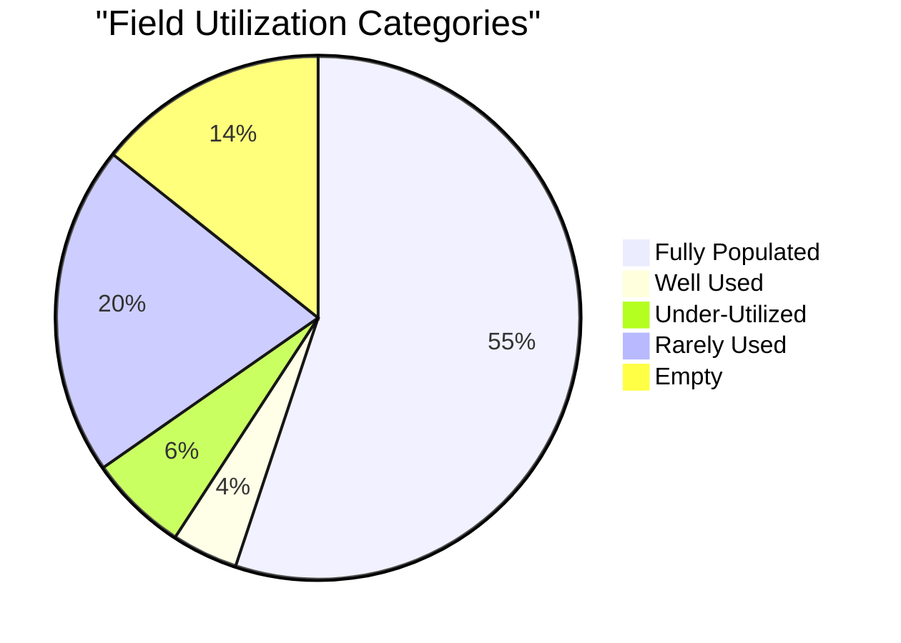
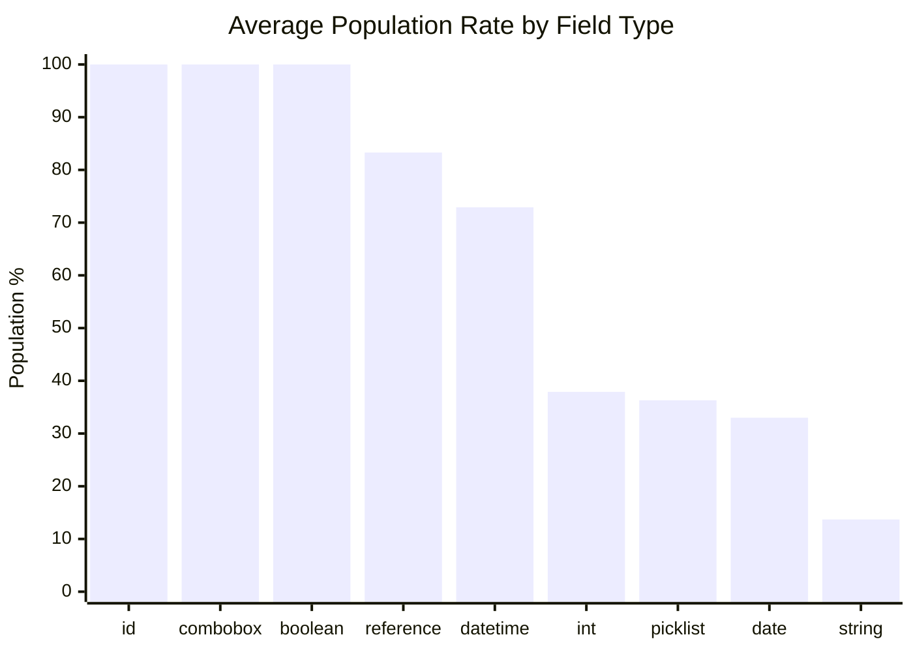
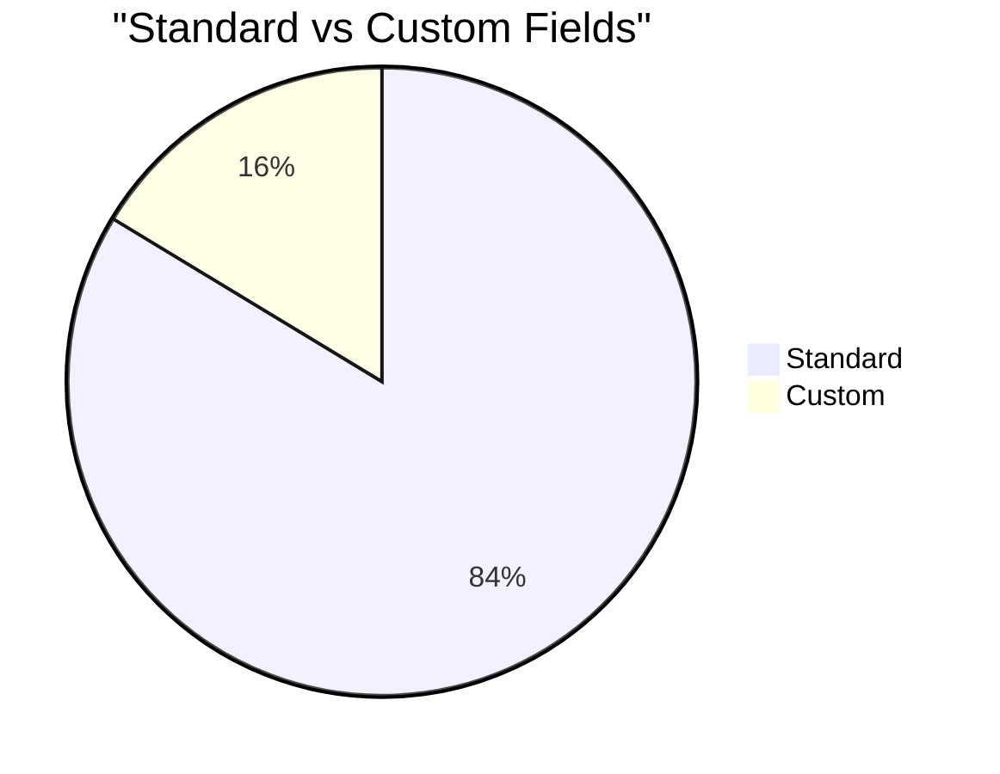
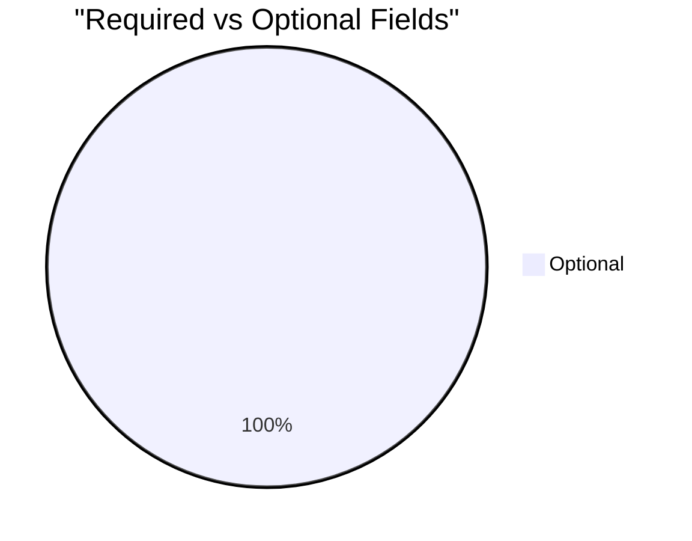

# Field Utilization Analysis: Task (`Task`)

> Generated on 2026-03-19 16:12:33

## Executive Summary

| Metric | Value |
| --- | --- |
| **Object** | Task (`Task`) |
| **Total Records** | 33,311 |
| **Total Fields Analyzed** | 49 |
| **Standard / Custom** | 41 / 8 |
| **Formula / Calculated** | 3 |
| **Required / Optional** | 0 / 49 |
| **Mean Population Rate** | 60.4% |
| **Median Population Rate** | 96.3% |

## Utilization Category Distribution

| Category | Threshold | Fields | % of Total |
| --- | --- | --- | --- |
| Fully Populated | > 95 % | 27 | 55.1% |
| Well Used | 50 – 95 % | 2 | 4.1% |
| Under-Utilized | 10 – 50 % | 3 | 6.1% |
| Rarely Used | 1 – 10 % | 10 | 20.4% |
| Empty | 0 % | 7 | 14.3% |

## Descriptive Statistics

Population-rate statistics across all analyzed fields:

| Statistic | Value |
| --- | --- |
| N (fields) | 49 |
| Mean | 60.42% |
| Median | 96.28% |
| Std Dev | 47.05% |
| Variance | 2213.83 |
| Min | 0.00% |
| Max | 100.00% |
| Q1 (25th pctl) | 0.02% |
| Q3 (75th pctl) | 100.00% |
| IQR | 99.98% |
| 5th Percentile | 0.00% |
| 95th Percentile | 100.00% |
| Skewness | -0.448 |
| Excess Kurtosis | -1.732 |
| Mode | 100.0% |

**Interpretation:**

- **Skewness (-0.448)** — Approximately symmetric distribution of population rates.
- **Kurtosis (-1.732)** — Platykurtic: light tails and a flat peak — population rates are broadly spread.

## Utilization by Field Type

| Field Type | Count | Avg Population Rate |
| --- | --- | --- |
| id | 1 | 100.0% |
| combobox | 1 | 100.0% |
| boolean | 9 | 100.0% |
| reference | 7 | 83.3% |
| datetime | 6 | 72.9% |
| int | 6 | 37.9% |
| picklist | 13 | 36.3% |
| date | 3 | 33.0% |
| string | 3 | 13.7% |

## Standard vs Custom Field Comparison

| Segment | Fields | Avg Population Rate |
| --- | --- | --- |
| Standard | 41 | 61.1% |
| Custom | 8 | 56.8% |

## Required vs Optional Fields

| Segment | Fields | Avg Population Rate |
| --- | --- | --- |
| Required | 0 | 0.0% |
| Optional | 49 | 60.4% |

## Detailed Field Analysis

### Fully Populated (27 fields)

| Field API Name | Label | Type | Population | Rate | Custom | Required | Formula |
| --- | --- | --- | --- | --- | --- | --- | --- |
| `Id` | Activity ID | id | 33,311 | 100.0% |  |  |  |
| `WhoCount` | Relation Count | int | 33,311 | 100.0% |  |  |  |
| `WhatCount` | Related To Count | int | 33,311 | 100.0% |  |  |  |
| `Subject` | Subject | combobox | 33,311 | 100.0% |  |  |  |
| `Status` | Status | picklist | 33,311 | 100.0% |  |  |  |
| `Priority` | Priority | picklist | 33,311 | 100.0% |  |  |  |
| `OwnerId` | Assigned To ID | reference | 33,311 | 100.0% |  |  |  |
| `CurrencyIsoCode` | Currency ISO Code | picklist | 33,311 | 100.0% |  |  |  |
| `CreatedDate` | Created Date | datetime | 33,311 | 100.0% |  |  |  |
| `CreatedById` | Created By ID | reference | 33,311 | 100.0% |  |  |  |
| `LastModifiedDate` | Last Modified Date | datetime | 33,311 | 100.0% |  |  |  |
| `LastModifiedById` | Last Modified By ID | reference | 33,311 | 100.0% |  |  |  |
| `SystemModstamp` | System Modstamp | datetime | 33,311 | 100.0% |  |  |  |
| `TaskSubtype` | Task Subtype | picklist | 33,311 | 100.0% |  |  |  |
| `IsHighPriority` | High Priority | boolean | 33,311 | 100.0% |  |  |  |
| `IsDeleted` | Deleted | boolean | 33,311 | 100.0% |  |  |  |
| `IsClosed` | Closed | boolean | 33,311 | 100.0% |  |  |  |
| `IsArchived` | Archived | boolean | 33,311 | 100.0% |  |  |  |
| `IsReminderSet` | Reminder Set | boolean | 33,311 | 100.0% |  |  |  |
| `IsRecurrence` | Create Recurring Series of Tasks | boolean | 33,311 | 100.0% |  |  |  |
| `Africa__c` | Africa | boolean | 33,311 | 100.0% | Yes |  | Yes |
| `Leadership_Touchpoint__c` | Leadership Touchpoint | boolean | 33,311 | 100.0% | Yes |  |  |
| `MixmaxInsights__Is_Mixmax_Sequence_Activity__c` | Is Mixmax Sequence Email Activity? | boolean | 33,311 | 100.0% | Yes |  | Yes |
| `ActivityDate` | Due Date Only | date | 32,963 | 99.0% |  |  |  |
| `CompletedDateTime` | Completed Date/Time | datetime | 32,073 | 96.3% |  |  |  |
| `WhoId` | Name ID | reference | 31,896 | 95.8% |  |  |  |
| `AccountId` | Organization | reference | 31,811 | 95.5% |  |  |  |

### Well Used (2 fields)

| Field API Name | Label | Type | Population | Rate | Custom | Required | Formula |
| --- | --- | --- | --- | --- | --- | --- | --- |
| `WhatId` | Related To ID | reference | 30,615 | 91.9% |  |  |  |
| `Activity_Type__c` | Activity Type | picklist | 24,097 | 72.3% | Yes |  |  |

### Under-Utilized (3 fields)

| Field API Name | Label | Type | Population | Rate | Custom | Required | Formula |
| --- | --- | --- | --- | --- | --- | --- | --- |
| `MixmaxInsights__Mixmax_Type__c` | Mixmax Type | string | 13,710 | 41.2% | Yes |  | Yes |
| `MixmaxInsights__MixmaxActivityDateTime__c` | Mixmax Insights Activity Date Time | datetime | 13,671 | 41.0% | Yes |  |  |
| `CallDurationInSeconds` | Call Duration | int | 9,146 | 27.5% |  |  |  |

### Rarely Used (10 fields)

| Field API Name | Label | Type | Population | Rate | Custom | Required | Formula |
| --- | --- | --- | --- | --- | --- | --- | --- |
| `ReminderDateTime` | Reminder Date/Time | datetime | 55 | 0.2% |  |  |  |
| `RecurrenceInterval` | Recurrence Interval | int | 16 | 0.0% |  |  |  |
| `RecurrenceRegeneratedType` | Repeat This Task | picklist | 12 | 0.0% |  |  |  |
| `RecurrenceActivityId` | Recurrence Activity ID | reference | 6 | 0.0% |  |  |  |
| `RecurrenceStartDateOnly` | Recurrence Start | date | 6 | 0.0% |  |  |  |
| `RecurrenceEndDateOnly` | Recurrence End | date | 6 | 0.0% |  |  |  |
| `RecurrenceTimeZoneSidKey` | Recurrence Time Zone | picklist | 6 | 0.0% |  |  |  |
| `RecurrenceType` | Recurrence Type | picklist | 6 | 0.0% |  |  |  |
| `RecurrenceDayOfMonth` | Recurrence Day of Month | int | 6 | 0.0% |  |  |  |
| `RecurrenceMonthOfYear` | Recurrence Month of Year | picklist | 2 | 0.0% |  |  |  |

### Empty (7 fields)

| Field API Name | Label | Type | Population | Rate | Custom | Required | Formula |
| --- | --- | --- | --- | --- | --- | --- | --- |
| `CallType` | Call Type | picklist | 0 | 0.0% |  |  |  |
| `CallDisposition` | Call Result | string | 0 | 0.0% |  |  |  |
| `CallObject` | Call Object Identifier | string | 0 | 0.0% |  |  |  |
| `RecurrenceDayOfWeekMask` | Recurrence Day of Week Mask | int | 0 | 0.0% |  |  |  |
| `RecurrenceInstance` | Recurrence Instance | picklist | 0 | 0.0% |  |  |  |
| `Answered__c` | Answered? | picklist | 0 | 0.0% | Yes |  |  |
| `MixmaxInsights__Mixmax_Call_Disposition__c` | Mixmax Call Disposition | picklist | 0 | 0.0% | Yes |  |  |

### Skipped Fields (compound / non-queryable)

| Field API Name | Label | Type |
| --- | --- | --- |
| `Description` | Description | textarea |

## Recommendations

### Fields Recommended for Deletion Review

These **custom** fields have **0 % population**, are not required, and are not formula fields.
They are strong candidates for removal after confirming they are not referenced in automation, reports, or integrations.

- `Answered__c` (Answered?) — picklist
- `MixmaxInsights__Mixmax_Call_Disposition__c` (Mixmax Call Disposition) — picklist

### Fields Needing a Data Collection Strategy

These fields are **< 25 % populated** and user-editable. Evaluate whether the data is valuable;
if so, consider validation rules, required-field configuration, screen flows, or training to improve collection.

| Field | Label | Type | Rate | Custom |
| --- | --- | --- | --- | --- |
| `RecurrenceMonthOfYear` | Recurrence Month of Year | picklist | 0.0% |  |
| `RecurrenceStartDateOnly` | Recurrence Start | date | 0.0% |  |
| `RecurrenceEndDateOnly` | Recurrence End | date | 0.0% |  |
| `RecurrenceTimeZoneSidKey` | Recurrence Time Zone | picklist | 0.0% |  |
| `RecurrenceType` | Recurrence Type | picklist | 0.0% |  |
| `RecurrenceDayOfMonth` | Recurrence Day of Month | int | 0.0% |  |
| `RecurrenceRegeneratedType` | Repeat This Task | picklist | 0.0% |  |
| `RecurrenceInterval` | Recurrence Interval | int | 0.0% |  |
| `ReminderDateTime` | Reminder Date/Time | datetime | 0.2% |  |

---

*Analysis performed on 2026-03-19 16:12:33 against `Task` with 33,311 records.*
