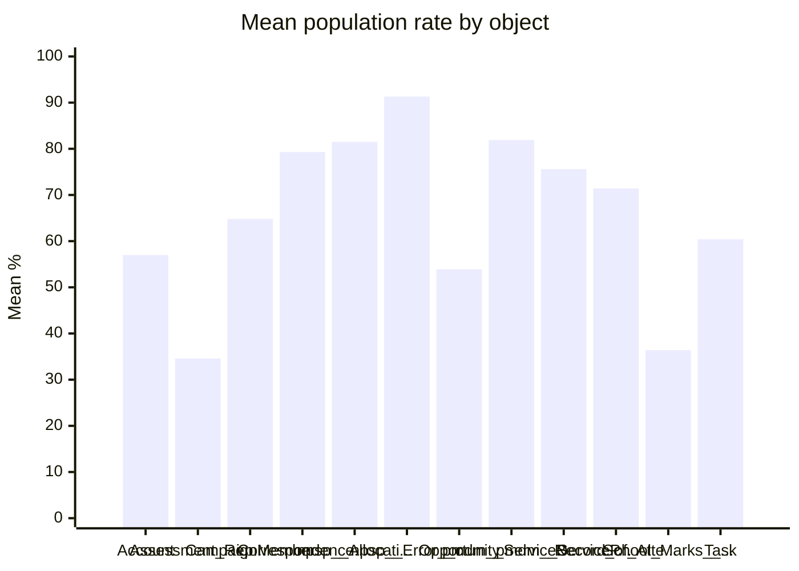
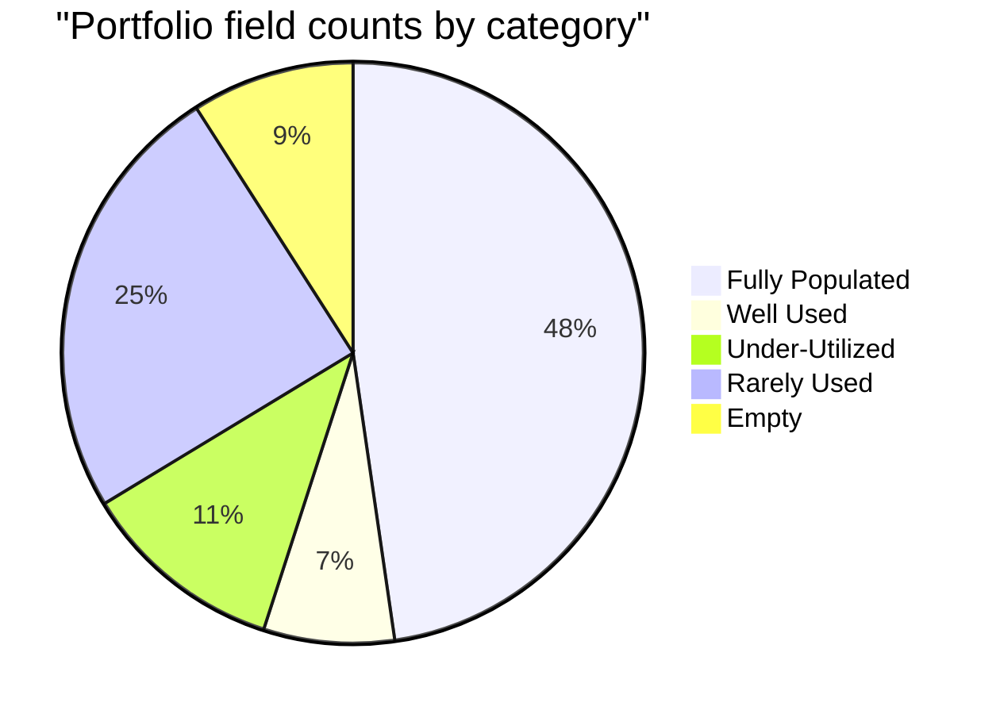

# Field utilization — portfolio summary

> Generated on 2026-03-19 15:51:13

This document rolls up **12** object report(s) from `*_field_analysis.md` in [`reports/`](./). Use **Subreports** below for direct links to each analysis (Markdown + PDF). For PDFs with **rendered Mermaid charts**, install [Mermaid CLI](https://github.com/mermaid-js/mermaid-cli) (`npm i -g @mermaid-js/mermaid-cli`) or use `npx`; then re-run the analysis or summary script.

## Contents

- [Subreports](#subreports)
- [Objects at a glance](#objects-at-a-glance)
- [Portfolio rollups](#portfolio-rollups)
- [Mean population rate by object](#mean-population-rate-by-object)
- [Field counts by utilization category (summed across objects)](#field-counts-by-utilization-category-summed-across-objects)
- [Per-object snapshot](#per-object-snapshot)

## Subreports

| Object (API) | Markdown | PDF |
| --- | --- | --- |
| `Account` | [Account_field_analysis.md](./Account_field_analysis.md) | [Account_field_analysis.pdf](./Account_field_analysis.pdf) |
| `Assessment_Report__c` | [Assessment_Report__c_field_analysis.md](./Assessment_Report__c_field_analysis.md) | [Assessment_Report__c_field_analysis.pdf](./Assessment_Report__c_field_analysis.pdf) |
| `CampaignMember` | [CampaignMember_field_analysis.md](./CampaignMember_field_analysis.md) | [CampaignMember_field_analysis.pdf](./CampaignMember_field_analysis.pdf) |
| `Correspondence__c` | [Correspondence__c_field_analysis.md](./Correspondence__c_field_analysis.md) | [Correspondence__c_field_analysis.pdf](./Correspondence__c_field_analysis.pdf) |
| `npsp__Allocation__c` | [npsp__Allocation__c_field_analysis.md](./npsp__Allocation__c_field_analysis.md) | [npsp__Allocation__c_field_analysis.pdf](./npsp__Allocation__c_field_analysis.pdf) |
| `npsp__Error__c` | [npsp__Error__c_field_analysis.md](./npsp__Error__c_field_analysis.md) | [npsp__Error__c_field_analysis.pdf](./npsp__Error__c_field_analysis.pdf) |
| `Opportunity` | [Opportunity_field_analysis.md](./Opportunity_field_analysis.md) | [Opportunity_field_analysis.pdf](./Opportunity_field_analysis.pdf) |
| `pmdm__ServiceDelivery__c` | [pmdm__ServiceDelivery__c_field_analysis.md](./pmdm__ServiceDelivery__c_field_analysis.md) | [pmdm__ServiceDelivery__c_field_analysis.pdf](./pmdm__ServiceDelivery__c_field_analysis.pdf) |
| `pmdm__ServiceParticipant__c` | [pmdm__ServiceParticipant__c_field_analysis.md](./pmdm__ServiceParticipant__c_field_analysis.md) | [pmdm__ServiceParticipant__c_field_analysis.pdf](./pmdm__ServiceParticipant__c_field_analysis.pdf) |
| `Record_of_Attendance__c` | [Record_of_Attendance__c_field_analysis.md](./Record_of_Attendance__c_field_analysis.md) | [Record_of_Attendance__c_field_analysis.pdf](./Record_of_Attendance__c_field_analysis.pdf) |
| `School_Marks__c` | [School_Marks__c_field_analysis.md](./School_Marks__c_field_analysis.md) | [School_Marks__c_field_analysis.pdf](./School_Marks__c_field_analysis.pdf) |
| `Task` | [Task_field_analysis.md](./Task_field_analysis.md) | [Task_field_analysis.pdf](./Task_field_analysis.pdf) |

## Objects at a glance

| Object (API) | Label | Records | Fields | Std / Cust | Mean pop % | Median pop % | Empty | Deletion candidates* | Reports |
| --- | --- | ---: | ---: | --- | ---: | ---: | ---: | ---: | --- |
| Account | Organization | 8,311 | 181 | 44 / 137 | 57.0% | 86.3% | 19 | 6 | [Markdown](./Account_field_analysis.md) · [PDF](./Account_field_analysis.pdf) |
| Assessment_Report__c | Assessment Report | 18,689 | 72 | 13 / 59 | 34.6% | 14.0% | 2 | 0 | [Markdown](./Assessment_Report__c_field_analysis.md) · [PDF](./Assessment_Report__c_field_analysis.pdf) |
| CampaignMember | Campaign Member | 128,646 | 53 | 37 / 16 | 64.8% | 94.1% | 1 | 1 | [Markdown](./CampaignMember_field_analysis.md) · [PDF](./CampaignMember_field_analysis.pdf) |
| Correspondence__c | Correspondence | 21,749 | 37 | 13 / 24 | 79.3% | 100.0% | 2 | 0 | [Markdown](./Correspondence__c_field_analysis.md) · [PDF](./Correspondence__c_field_analysis.pdf) |
| npsp__Allocation__c | GAU Allocation | 32,756 | 22 | 10 / 12 | 81.5% | 100.0% | 1 | 1 | [Markdown](./npsp__Allocation__c_field_analysis.md) · [PDF](./npsp__Allocation__c_field_analysis.pdf) |
| npsp__Error__c | Error | 19,172 | 17 | 10 / 7 | 91.3% | 100.0% | 0 | 0 | [Markdown](./npsp__Error__c_field_analysis.md) · [PDF](./npsp__Error__c_field_analysis.pdf) |
| Opportunity | Donation | 29,441 | 176 | 39 / 137 | 53.9% | 68.5% | 23 | 19 | [Markdown](./Opportunity_field_analysis.md) · [PDF](./Opportunity_field_analysis.pdf) |
| pmdm__ServiceDelivery__c | Service Delivery | 37,888 | 25 | 12 / 13 | 81.9% | 100.0% | 4 | 2 | [Markdown](./pmdm__ServiceDelivery__c_field_analysis.md) · [PDF](./pmdm__ServiceDelivery__c_field_analysis.pdf) |
| pmdm__ServiceParticipant__c | Service Participant | 10,488 | 25 | 13 / 12 | 75.6% | 100.0% | 4 | 1 | [Markdown](./pmdm__ServiceParticipant__c_field_analysis.md) · [PDF](./pmdm__ServiceParticipant__c_field_analysis.pdf) |
| Record_of_Attendance__c | Record of Attendance | 93,713 | 21 | 12 / 9 | 71.4% | 100.0% | 4 | 1 | [Markdown](./Record_of_Attendance__c_field_analysis.md) · [PDF](./Record_of_Attendance__c_field_analysis.pdf) |
| School_Marks__c | School Marks | 14,496 | 106 | 13 / 93 | 36.4% | 4.8% | 4 | 1 | [Markdown](./School_Marks__c_field_analysis.md) · [PDF](./School_Marks__c_field_analysis.pdf) |
| Task | Task | 33,308 | 49 | 41 / 8 | 60.4% | 96.3% | 7 | 2 | [Markdown](./Task_field_analysis.md) · [PDF](./Task_field_analysis.pdf) |

*Deletion candidates = custom fields at 0% population flagged in each report (review before removing).*

## Portfolio rollups

| Metric | Value |
| --- | --- |
| Objects analyzed | 12 |
| Sum of records (all objects) | 448,657 |
| Sum of fields analyzed | 784 |
| Field-weighted mean population rate | 56.5% |
| Median of per-object mean population rates | 68.1% |
| Total fields in Empty category (summed across objects) | 71 |

## Mean population rate by object

## Field counts by utilization category (summed across objects)

| Category | Total fields |
| --- | ---: |
| Fully Populated | 374 |
| Well Used | 57 |
| Under-Utilized | 89 |
| Rarely Used | 193 |
| Empty | 71 |

## Per-object snapshot

### Organization (`Account`)

- **Markdown:** [Account_field_analysis.md](./Account_field_analysis.md) · **PDF:** [Account_field_analysis.pdf](./Account_field_analysis.pdf) (source generated 2026-03-19 14:41:27)
- Records: 8,311; fields analyzed: 181; mean / median population: 57.0% / 86.3%
- Categories: Fully Populated: 85; Well Used: 13; Under-Utilized: 20; Rarely Used: 44; Empty: 19

### Assessment Report (`Assessment_Report__c`)

- **Markdown:** [Assessment_Report__c_field_analysis.md](./Assessment_Report__c_field_analysis.md) · **PDF:** [Assessment_Report__c_field_analysis.pdf](./Assessment_Report__c_field_analysis.pdf) (source generated 2026-03-19 15:10:12)
- Records: 18,689; fields analyzed: 72; mean / median population: 34.6% / 14.0%
- Categories: Fully Populated: 18; Well Used: 2; Under-Utilized: 28; Rarely Used: 22; Empty: 2

### Campaign Member (`CampaignMember`)

- **Markdown:** [CampaignMember_field_analysis.md](./CampaignMember_field_analysis.md) · **PDF:** [CampaignMember_field_analysis.pdf](./CampaignMember_field_analysis.pdf) (source generated 2026-03-19 14:44:30)
- Records: 128,646; fields analyzed: 53; mean / median population: 64.8% / 94.1%
- Categories: Fully Populated: 26; Well Used: 10; Under-Utilized: 5; Rarely Used: 11; Empty: 1

### Correspondence (`Correspondence__c`)

- **Markdown:** [Correspondence__c_field_analysis.md](./Correspondence__c_field_analysis.md) · **PDF:** [Correspondence__c_field_analysis.pdf](./Correspondence__c_field_analysis.pdf) (source generated 2026-03-19 15:00:21)
- Records: 21,749; fields analyzed: 37; mean / median population: 79.3% / 100.0%
- Categories: Fully Populated: 25; Well Used: 6; Under-Utilized: 2; Rarely Used: 2; Empty: 2

### GAU Allocation (`npsp__Allocation__c`)

- **Markdown:** [npsp__Allocation__c_field_analysis.md](./npsp__Allocation__c_field_analysis.md) · **PDF:** [npsp__Allocation__c_field_analysis.pdf](./npsp__Allocation__c_field_analysis.pdf) (source generated 2026-03-19 14:56:18)
- Records: 32,756; fields analyzed: 22; mean / median population: 81.5% / 100.0%
- Categories: Fully Populated: 18; Rarely Used: 3; Empty: 1

### Error (`npsp__Error__c`)

- **Markdown:** [npsp__Error__c_field_analysis.md](./npsp__Error__c_field_analysis.md) · **PDF:** [npsp__Error__c_field_analysis.pdf](./npsp__Error__c_field_analysis.pdf) (source generated 2026-03-19 15:09:47)
- Records: 19,172; fields analyzed: 17; mean / median population: 91.3% / 100.0%
- Categories: Fully Populated: 14; Well Used: 1; Under-Utilized: 2

### Donation (`Opportunity`)

- **Markdown:** [Opportunity_field_analysis.md](./Opportunity_field_analysis.md) · **PDF:** [Opportunity_field_analysis.pdf](./Opportunity_field_analysis.pdf) (source generated 2026-03-19 15:00:08)
- Records: 29,441; fields analyzed: 176; mean / median population: 53.9% / 68.5%
- Categories: Fully Populated: 82; Well Used: 11; Under-Utilized: 17; Rarely Used: 43; Empty: 23

### Service Delivery (`pmdm__ServiceDelivery__c`)

- **Markdown:** [pmdm__ServiceDelivery__c_field_analysis.md](./pmdm__ServiceDelivery__c_field_analysis.md) · **PDF:** [pmdm__ServiceDelivery__c_field_analysis.pdf](./pmdm__ServiceDelivery__c_field_analysis.pdf) (source generated 2026-03-19 14:45:14)
- Records: 37,888; fields analyzed: 25; mean / median population: 81.9% / 100.0%
- Categories: Fully Populated: 20; Under-Utilized: 1; Empty: 4

### Service Participant (`pmdm__ServiceParticipant__c`)

- **Markdown:** [pmdm__ServiceParticipant__c_field_analysis.md](./pmdm__ServiceParticipant__c_field_analysis.md) · **PDF:** [pmdm__ServiceParticipant__c_field_analysis.pdf](./pmdm__ServiceParticipant__c_field_analysis.pdf) (source generated 2026-03-19 15:10:49)
- Records: 10,488; fields analyzed: 25; mean / median population: 75.6% / 100.0%
- Categories: Fully Populated: 18; Well Used: 1; Rarely Used: 2; Empty: 4

### Record of Attendance (`Record_of_Attendance__c`)

- **Markdown:** [Record_of_Attendance__c_field_analysis.md](./Record_of_Attendance__c_field_analysis.md) · **PDF:** [Record_of_Attendance__c_field_analysis.pdf](./Record_of_Attendance__c_field_analysis.pdf) (source generated 2026-03-19 14:42:36)
- Records: 93,713; fields analyzed: 21; mean / median population: 71.4% / 100.0%
- Categories: Fully Populated: 15; Rarely Used: 2; Empty: 4

### School Marks (`School_Marks__c`)

- **Markdown:** [School_Marks__c_field_analysis.md](./School_Marks__c_field_analysis.md) · **PDF:** [School_Marks__c_field_analysis.pdf](./School_Marks__c_field_analysis.pdf) (source generated 2026-03-19 15:10:32)
- Records: 14,496; fields analyzed: 106; mean / median population: 36.4% / 4.8%
- Categories: Fully Populated: 26; Well Used: 11; Under-Utilized: 11; Rarely Used: 54; Empty: 4

### Task (`Task`)

- **Markdown:** [Task_field_analysis.md](./Task_field_analysis.md) · **PDF:** [Task_field_analysis.pdf](./Task_field_analysis.pdf) (source generated 2026-03-19 14:43:05)
- Records: 33,308; fields analyzed: 49; mean / median population: 60.4% / 96.3%
- Categories: Fully Populated: 27; Well Used: 2; Under-Utilized: 3; Rarely Used: 10; Empty: 7

---

*End of portfolio summary.*
