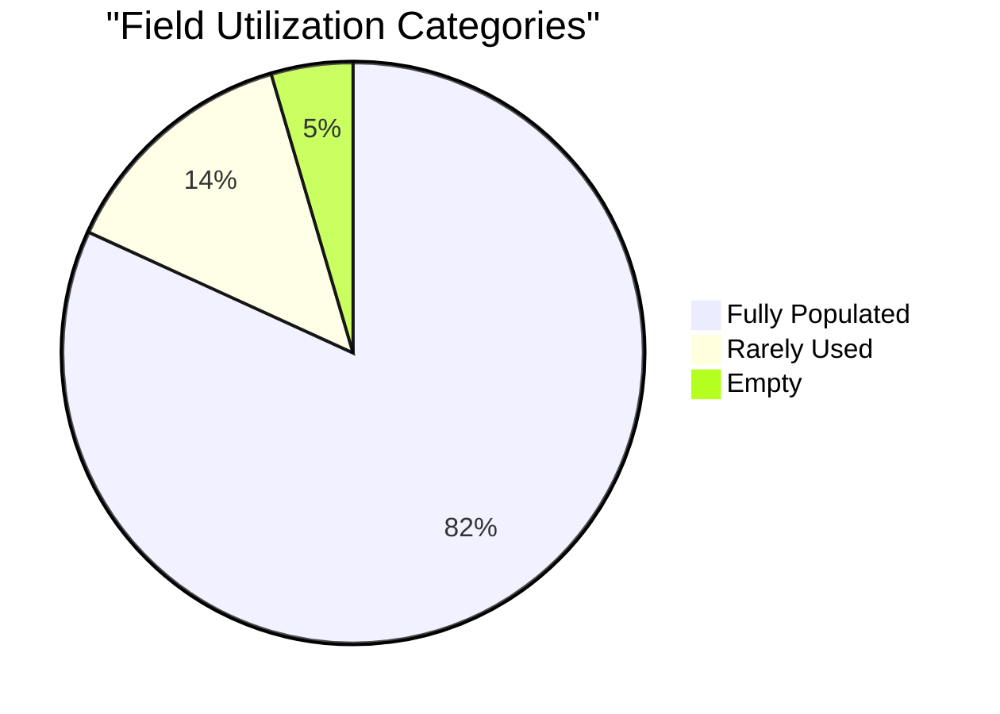
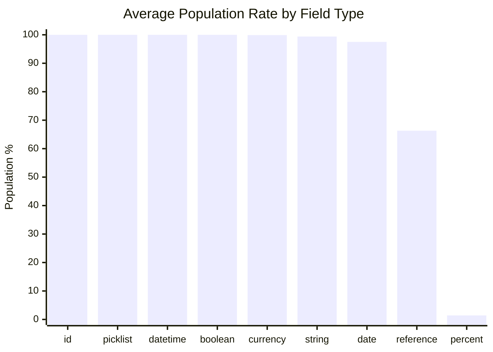
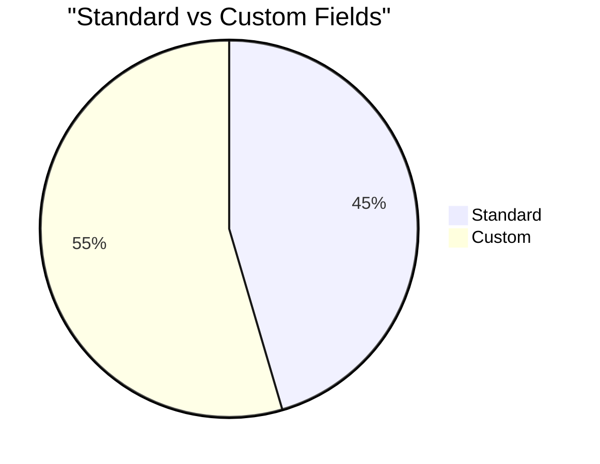
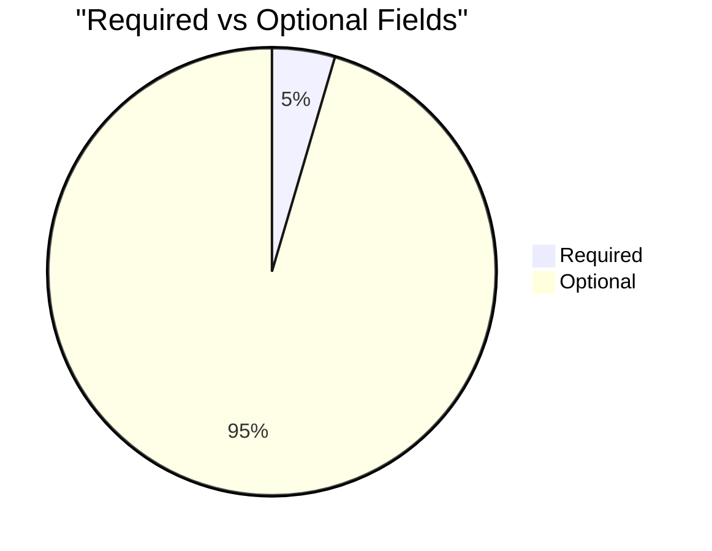

# Field Utilization Analysis: GAU Allocation (`npsp__Allocation__c`)

> Generated on 2026-03-19 16:11:05

## Executive Summary

| Metric | Value |
| --- | --- |
| **Object** | GAU Allocation (`npsp__Allocation__c`) |
| **Total Records** | 32,756 |
| **Total Fields Analyzed** | 22 |
| **Standard / Custom** | 10 / 12 |
| **Formula / Calculated** | 4 |
| **Required / Optional** | 1 / 21 |
| **Mean Population Rate** | 81.5% |
| **Median Population Rate** | 100.0% |

## Utilization Category Distribution

| Category | Threshold | Fields | % of Total |
| --- | --- | --- | --- |
| Fully Populated | > 95 % | 18 | 81.8% |
| Well Used | 50 – 95 % | 0 | 0.0% |
| Under-Utilized | 10 – 50 % | 0 | 0.0% |
| Rarely Used | 1 – 10 % | 3 | 13.6% |
| Empty | 0 % | 1 | 4.5% |

## Descriptive Statistics

Population-rate statistics across all analyzed fields:

| Statistic | Value |
| --- | --- |
| N (fields) | 22 |
| Mean | 81.50% |
| Median | 100.00% |
| Std Dev | 38.87% |
| Variance | 1510.83 |
| Min | 0.00% |
| Max | 100.00% |
| Q1 (25th pctl) | 97.27% |
| Q3 (75th pctl) | 100.00% |
| IQR | 2.73% |
| 5th Percentile | 0.01% |
| 95th Percentile | 100.00% |
| Skewness | -1.771 |
| Excess Kurtosis | 0.720 |
| Mode | 100.0% |

**Interpretation:**

- **Skewness (-1.771)** — Left-skewed: most fields are well-populated; a small tail of under-populated fields exists.
- **Kurtosis (0.720)** — Mesokurtic: distribution shape is close to normal.

## Utilization by Field Type

| Field Type | Count | Avg Population Rate |
| --- | --- | --- |
| id | 1 | 100.0% |
| picklist | 1 | 100.0% |
| datetime | 3 | 100.0% |
| boolean | 1 | 100.0% |
| currency | 1 | 99.9% |
| string | 4 | 99.4% |
| date | 1 | 97.5% |
| reference | 9 | 66.3% |
| percent | 1 | 1.4% |

## Standard vs Custom Field Comparison

| Segment | Fields | Avg Population Rate |
| --- | --- | --- |
| Standard | 10 | 100.0% |
| Custom | 12 | 66.1% |

## Required vs Optional Fields

| Segment | Fields | Avg Population Rate |
| --- | --- | --- |
| Required | 1 | 100.0% |
| Optional | 21 | 80.6% |

## Detailed Field Analysis

### Fully Populated (18 fields)

| Field API Name | Label | Type | Population | Rate | Custom | Required | Formula |
| --- | --- | --- | --- | --- | --- | --- | --- |
| `Id` | Record ID | id | 32,756 | 100.0% |  |  |  |
| `OwnerId` | Owner ID | reference | 32,756 | 100.0% |  |  |  |
| `Name` | GAU Allocation Name | string | 32,756 | 100.0% |  |  |  |
| `CurrencyIsoCode` | Currency ISO Code | picklist | 32,756 | 100.0% |  |  |  |
| `CreatedDate` | Created Date | datetime | 32,756 | 100.0% |  |  |  |
| `CreatedById` | Created By ID | reference | 32,756 | 100.0% |  |  |  |
| `LastModifiedDate` | Last Modified Date | datetime | 32,756 | 100.0% |  |  |  |
| `LastModifiedById` | Last Modified By ID | reference | 32,756 | 100.0% |  |  |  |
| `SystemModstamp` | System Modstamp | datetime | 32,756 | 100.0% |  |  |  |
| `npsp__General_Accounting_Unit__c` | General Accounting Unit | reference | 32,756 | 100.0% | Yes | Yes |  |
| `GAU_Name__c` | GAU Name | string | 32,756 | 100.0% | Yes |  | Yes |
| `IsDeleted` | Deleted | boolean | 32,756 | 100.0% |  |  |  |
| `GAU_Type__c` | GAU Type | string | 32,753 | 100.0% | Yes |  | Yes |
| `npsp__Amount__c` | Amount | currency | 32,739 | 99.9% | Yes |  |  |
| `npsp__Opportunity__c` | Opportunity | reference | 31,928 | 97.5% | Yes |  |  |
| `Opportunity_Stage__c` | Opportunity Stage | string | 31,928 | 97.5% | Yes |  | Yes |
| `Opportunity_Close_Date__c` | Opportunity Close Date | date | 31,928 | 97.5% | Yes |  | Yes |
| `Organization__c` | Organization | reference | 31,668 | 96.7% | Yes |  |  |

### Rarely Used (3 fields)

| Field API Name | Label | Type | Population | Rate | Custom | Required | Formula |
| --- | --- | --- | --- | --- | --- | --- | --- |
| `npsp__Recurring_Donation__c` | Recurring Donation | reference | 813 | 2.5% | Yes |  |  |
| `npsp__Percent__c` | Percent | percent | 447 | 1.4% | Yes |  |  |
| `npsp__Campaign__c` | Campaign | reference | 15 | 0.0% | Yes |  |  |

### Empty (1 fields)

| Field API Name | Label | Type | Population | Rate | Custom | Required | Formula |
| --- | --- | --- | --- | --- | --- | --- | --- |
| `npsp__Payment__c` | Payment | reference | 0 | 0.0% | Yes |  |  |

## Recommendations

### Fields Recommended for Deletion Review

These **custom** fields have **0 % population**, are not required, and are not formula fields.
They are strong candidates for removal after confirming they are not referenced in automation, reports, or integrations.

- `npsp__Payment__c` (Payment) — reference

### Fields Needing a Data Collection Strategy

These fields are **< 25 % populated** and user-editable. Evaluate whether the data is valuable;
if so, consider validation rules, required-field configuration, screen flows, or training to improve collection.

| Field | Label | Type | Rate | Custom |
| --- | --- | --- | --- | --- |
| `npsp__Campaign__c` | Campaign | reference | 0.0% | Yes |
| `npsp__Percent__c` | Percent | percent | 1.4% | Yes |
| `npsp__Recurring_Donation__c` | Recurring Donation | reference | 2.5% | Yes |

---

*Analysis performed on 2026-03-19 16:11:05 against `npsp__Allocation__c` with 32,756 records.*
