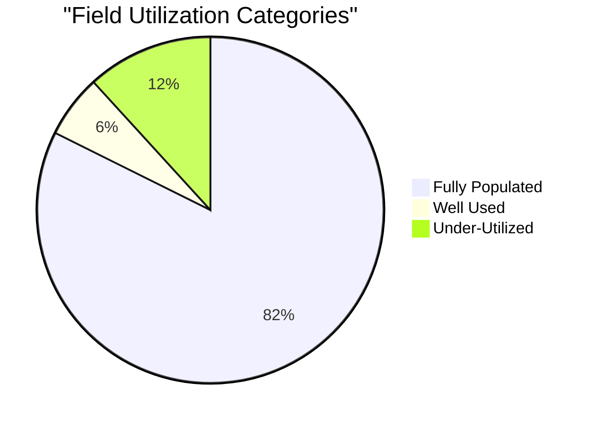
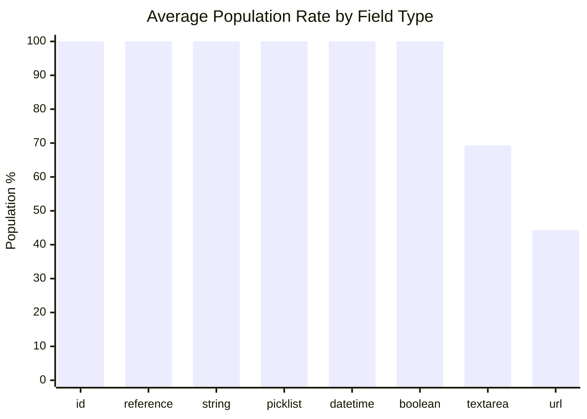
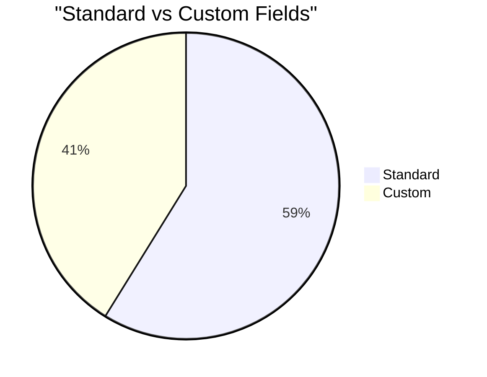
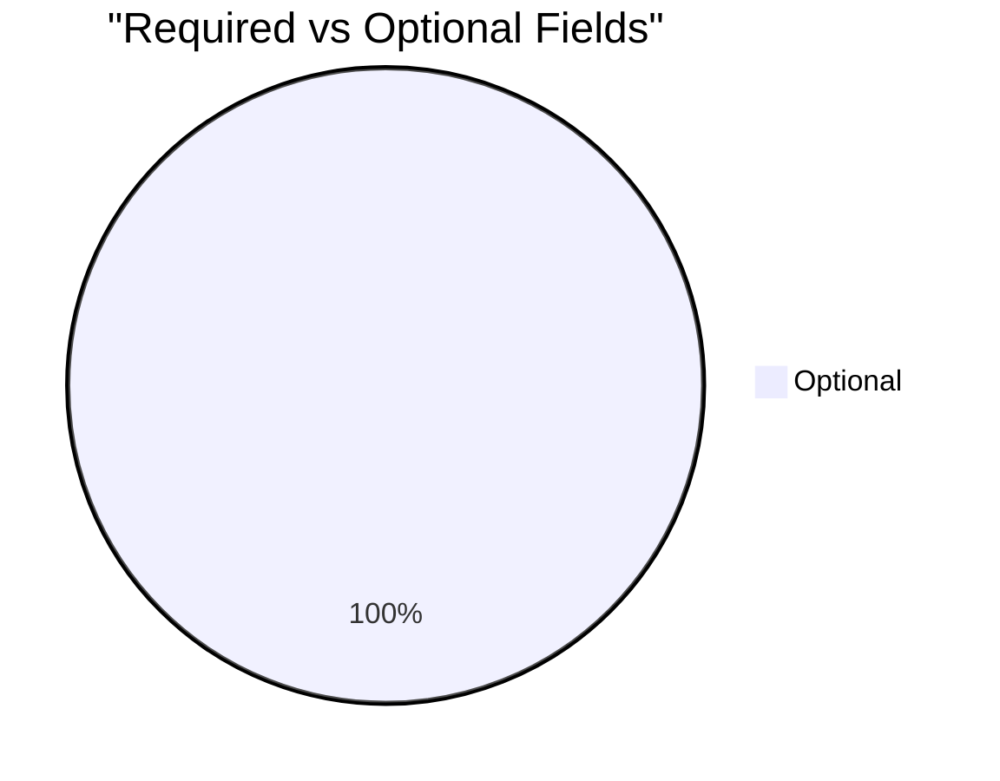

# Field Utilization Analysis: Error (`npsp__Error__c`)

> Generated on 2026-03-19 16:11:13

## Executive Summary

| Metric | Value |
| --- | --- |
| **Object** | Error (`npsp__Error__c`) |
| **Total Records** | 19,172 |
| **Total Fields Analyzed** | 17 |
| **Standard / Custom** | 10 / 7 |
| **Formula / Calculated** | 0 |
| **Required / Optional** | 0 / 17 |
| **Mean Population Rate** | 91.3% |
| **Median Population Rate** | 100.0% |

## Utilization Category Distribution

| Category | Threshold | Fields | % of Total |
| --- | --- | --- | --- |
| Fully Populated | > 95 % | 14 | 82.4% |
| Well Used | 50 – 95 % | 1 | 5.9% |
| Under-Utilized | 10 – 50 % | 2 | 11.8% |
| Rarely Used | 1 – 10 % | 0 | 0.0% |
| Empty | 0 % | 0 | 0.0% |

## Descriptive Statistics

Population-rate statistics across all analyzed fields:

| Statistic | Value |
| --- | --- |
| N (fields) | 17 |
| Mean | 91.31% |
| Median | 100.00% |
| Std Dev | 24.12% |
| Variance | 581.65 |
| Min | 13.66% |
| Max | 100.00% |
| Q1 (25th pctl) | 100.00% |
| Q3 (75th pctl) | 100.00% |
| IQR | 0.00% |
| 5th Percentile | 13.66% |
| 95th Percentile | 100.00% |
| Skewness | -2.842 |
| Excess Kurtosis | 5.111 |
| Mode | 100.0% |

**Interpretation:**

- **Skewness (-2.842)** — Left-skewed: most fields are well-populated; a small tail of under-populated fields exists.
- **Kurtosis (5.111)** — Leptokurtic: heavy tails and a sharp peak — population rates concentrate tightly with notable outliers.

## Utilization by Field Type

| Field Type | Count | Avg Population Rate |
| --- | --- | --- |
| id | 1 | 100.0% |
| reference | 3 | 100.0% |
| string | 1 | 100.0% |
| picklist | 1 | 100.0% |
| datetime | 4 | 100.0% |
| boolean | 3 | 100.0% |
| textarea | 3 | 69.3% |
| url | 1 | 44.3% |

## Standard vs Custom Field Comparison

| Segment | Fields | Avg Population Rate |
| --- | --- | --- |
| Standard | 10 | 100.0% |
| Custom | 7 | 78.9% |

## Required vs Optional Fields

| Segment | Fields | Avg Population Rate |
| --- | --- | --- |
| Required | 0 | 0.0% |
| Optional | 17 | 91.3% |

## Detailed Field Analysis

### Fully Populated (14 fields)

| Field API Name | Label | Type | Population | Rate | Custom | Required | Formula |
| --- | --- | --- | --- | --- | --- | --- | --- |
| `Id` | Record ID | id | 19,172 | 100.0% |  |  |  |
| `OwnerId` | Owner ID | reference | 19,172 | 100.0% |  |  |  |
| `Name` | Error Number | string | 19,172 | 100.0% |  |  |  |
| `CurrencyIsoCode` | Currency ISO Code | picklist | 19,172 | 100.0% |  |  |  |
| `CreatedDate` | Created Date | datetime | 19,172 | 100.0% |  |  |  |
| `CreatedById` | Created By ID | reference | 19,172 | 100.0% |  |  |  |
| `LastModifiedDate` | Last Modified Date | datetime | 19,172 | 100.0% |  |  |  |
| `LastModifiedById` | Last Modified By ID | reference | 19,172 | 100.0% |  |  |  |
| `SystemModstamp` | System Modstamp | datetime | 19,172 | 100.0% |  |  |  |
| `npsp__Datetime__c` | Datetime | datetime | 19,172 | 100.0% | Yes |  |  |
| `npsp__Error_Type__c` | Error Type | textarea | 19,172 | 100.0% | Yes |  |  |
| `IsDeleted` | Deleted | boolean | 19,172 | 100.0% |  |  |  |
| `npsp__Email_Sent__c` | Email Sent | boolean | 19,172 | 100.0% | Yes |  |  |
| `npsp__Posted_in_Chatter__c` | Posted in Chatter | boolean | 19,172 | 100.0% | Yes |  |  |

### Well Used (1 fields)

| Field API Name | Label | Type | Population | Rate | Custom | Required | Formula |
| --- | --- | --- | --- | --- | --- | --- | --- |
| `npsp__Object_Type__c` | Object Type | textarea | 18,077 | 94.3% | Yes |  |  |

### Under-Utilized (2 fields)

| Field API Name | Label | Type | Population | Rate | Custom | Required | Formula |
| --- | --- | --- | --- | --- | --- | --- | --- |
| `npsp__Record_URL__c` | Record URL | url | 8,493 | 44.3% | Yes |  |  |
| `npsp__Context_Type__c` | Context Type | textarea | 2,618 | 13.7% | Yes |  |  |

### Skipped Fields (compound / non-queryable)

| Field API Name | Label | Type |
| --- | --- | --- |
| `npsp__Full_Message__c` | Full Message | textarea |
| `npsp__Stack_Trace__c` | Stack Trace | textarea |

## Recommendations

### Fields Recommended for Deletion Review

No custom fields with 0 % population found — all custom fields contain at least some data.

### Fields Needing a Data Collection Strategy

These fields are **< 25 % populated** and user-editable. Evaluate whether the data is valuable;
if so, consider validation rules, required-field configuration, screen flows, or training to improve collection.

| Field | Label | Type | Rate | Custom |
| --- | --- | --- | --- | --- |
| `npsp__Context_Type__c` | Context Type | textarea | 13.7% | Yes |

---

*Analysis performed on 2026-03-19 16:11:13 against `npsp__Error__c` with 19,172 records.*
