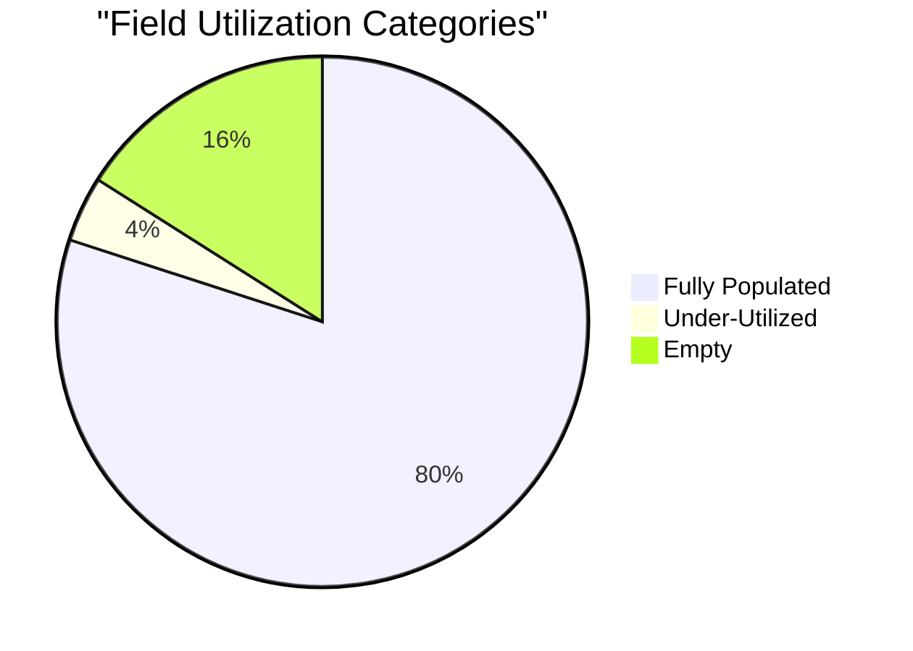
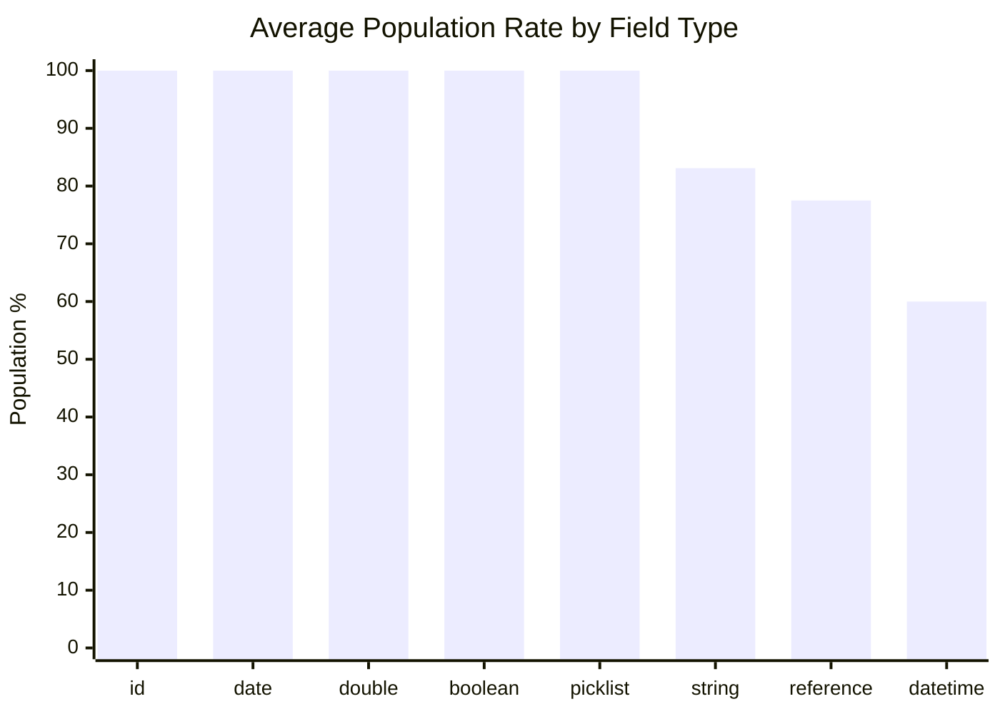
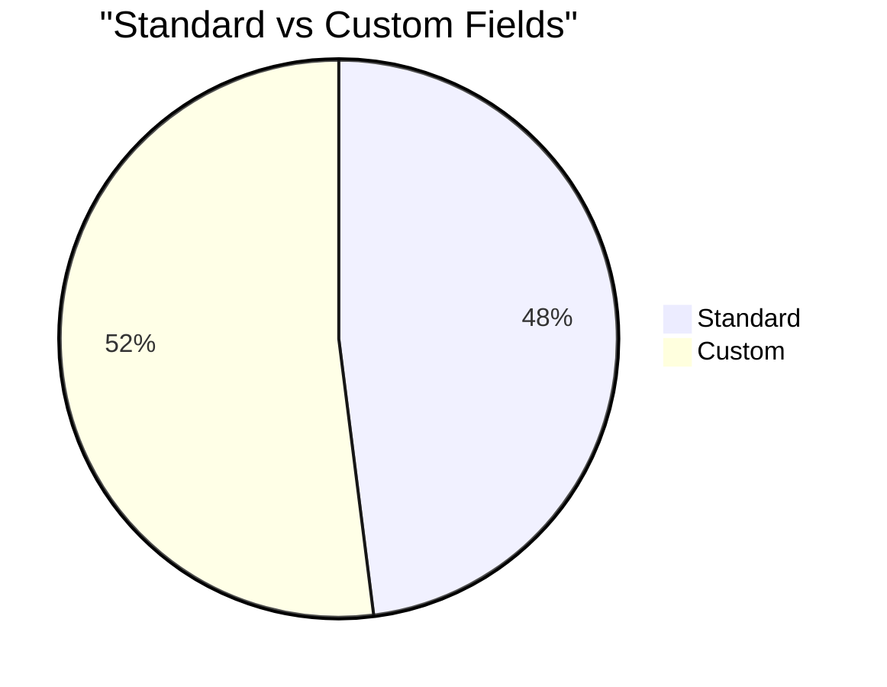
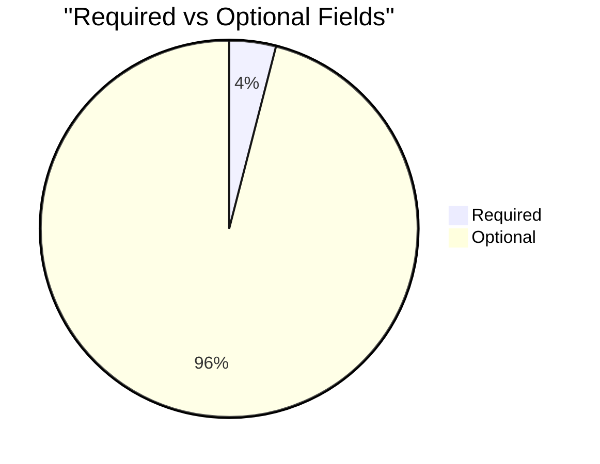

# Field Utilization Analysis: Service Delivery (`pmdm__ServiceDelivery__c`)

> Generated on 2026-03-19 16:11:46

## Executive Summary

| Metric | Value |
| --- | --- |
| **Object** | Service Delivery (`pmdm__ServiceDelivery__c`) |
| **Total Records** | 37,888 |
| **Total Fields Analyzed** | 25 |
| **Standard / Custom** | 12 / 13 |
| **Formula / Calculated** | 3 |
| **Required / Optional** | 1 / 24 |
| **Mean Population Rate** | 81.9% |
| **Median Population Rate** | 100.0% |

## Utilization Category Distribution

| Category | Threshold | Fields | % of Total |
| --- | --- | --- | --- |
| Fully Populated | > 95 % | 20 | 80.0% |
| Well Used | 50 – 95 % | 0 | 0.0% |
| Under-Utilized | 10 – 50 % | 1 | 4.0% |
| Rarely Used | 1 – 10 % | 0 | 0.0% |
| Empty | 0 % | 4 | 16.0% |

## Descriptive Statistics

Population-rate statistics across all analyzed fields:

| Statistic | Value |
| --- | --- |
| N (fields) | 25 |
| Mean | 81.86% |
| Median | 100.00% |
| Std Dev | 37.84% |
| Variance | 1431.68 |
| Min | 0.00% |
| Max | 100.00% |
| Q1 (25th pctl) | 98.66% |
| Q3 (75th pctl) | 100.00% |
| IQR | 1.34% |
| 5th Percentile | 0.00% |
| 95th Percentile | 100.00% |
| Skewness | -1.766 |
| Excess Kurtosis | 0.872 |
| Mode | 100.0% |

**Interpretation:**

- **Skewness (-1.766)** — Left-skewed: most fields are well-populated; a small tail of under-populated fields exists.
- **Kurtosis (0.872)** — Mesokurtic: distribution shape is close to normal.

## Utilization by Field Type

| Field Type | Count | Avg Population Rate |
| --- | --- | --- |
| id | 1 | 100.0% |
| date | 1 | 100.0% |
| double | 1 | 100.0% |
| boolean | 3 | 100.0% |
| picklist | 2 | 100.0% |
| string | 3 | 83.1% |
| reference | 9 | 77.5% |
| datetime | 5 | 60.0% |

## Standard vs Custom Field Comparison

| Segment | Fields | Avg Population Rate |
| --- | --- | --- |
| Standard | 12 | 83.3% |
| Custom | 13 | 80.5% |

## Required vs Optional Fields

| Segment | Fields | Avg Population Rate |
| --- | --- | --- |
| Required | 1 | 100.0% |
| Optional | 24 | 81.1% |

## Detailed Field Analysis

### Fully Populated (20 fields)

| Field API Name | Label | Type | Population | Rate | Custom | Required | Formula |
| --- | --- | --- | --- | --- | --- | --- | --- |
| `Id` | Record ID | id | 37,888 | 100.0% |  |  |  |
| `OwnerId` | Owner ID | reference | 37,888 | 100.0% |  |  |  |
| `Name` | Service Delivery Name | string | 37,888 | 100.0% |  |  |  |
| `CurrencyIsoCode` | Currency ISO Code | picklist | 37,888 | 100.0% |  |  |  |
| `CreatedDate` | Created Date | datetime | 37,888 | 100.0% |  |  |  |
| `CreatedById` | Created By ID | reference | 37,888 | 100.0% |  |  |  |
| `LastModifiedDate` | Last Modified Date | datetime | 37,888 | 100.0% |  |  |  |
| `LastModifiedById` | Last Modified By ID | reference | 37,888 | 100.0% |  |  |  |
| `SystemModstamp` | System Modstamp | datetime | 37,888 | 100.0% |  |  |  |
| `pmdm__Contact__c` | Client | reference | 37,888 | 100.0% | Yes |  |  |
| `pmdm__DeliveryDate__c` | Delivery Date | date | 37,888 | 100.0% | Yes |  |  |
| `pmdm__Quantity__c` | Quantity | double | 37,888 | 100.0% | Yes |  |  |
| `pmdm__Service__c` | Service | reference | 37,888 | 100.0% | Yes | Yes |  |
| `MERGE_Client_Department__c` | MERGE: Client Department | string | 37,888 | 100.0% | Yes |  | Yes |
| `IsDeleted` | Deleted | boolean | 37,888 | 100.0% |  |  |  |
| `pmdm__AutonameOverride__c` | Auto-name Override | boolean | 37,888 | 100.0% | Yes |  |  |
| `pmdm__HouseholdBenefit__c` | Household Benefit | boolean | 37,888 | 100.0% | Yes |  | Yes |
| `pmdm__AttendanceStatus__c` | Attendance Status | picklist | 37,881 | 100.0% | Yes |  |  |
| `pmdm__ProgramEngagement__c` | Program Engagement | reference | 37,777 | 99.7% | Yes |  |  |
| `pmdm__ServiceSession__c` | Service Session | reference | 36,984 | 97.6% | Yes |  |  |

### Under-Utilized (1 fields)

| Field API Name | Label | Type | Population | Rate | Custom | Required | Formula |
| --- | --- | --- | --- | --- | --- | --- | --- |
| `pmdm__UnitOfMeasurement__c` | Unit of Measurement | string | 18,639 | 49.2% | Yes |  | Yes |

### Empty (4 fields)

| Field API Name | Label | Type | Population | Rate | Custom | Required | Formula |
| --- | --- | --- | --- | --- | --- | --- | --- |
| `LastViewedDate` | Last Viewed Date | datetime | 0 | 0.0% |  |  |  |
| `LastReferencedDate` | Last Referenced Date | datetime | 0 | 0.0% |  |  |  |
| `pmdm__Account__c` | Household Account | reference | 0 | 0.0% | Yes |  |  |
| `pmdm__Service_Provider__c` | Service Provider | reference | 0 | 0.0% | Yes |  |  |

## Recommendations

### Fields Recommended for Deletion Review

These **custom** fields have **0 % population**, are not required, and are not formula fields.
They are strong candidates for removal after confirming they are not referenced in automation, reports, or integrations.

- `pmdm__Account__c` (Household Account) — reference
- `pmdm__Service_Provider__c` (Service Provider) — reference

### Fields Needing a Data Collection Strategy

All user-editable fields are above 25 % population — no immediate data-collection gaps identified.

---

*Analysis performed on 2026-03-19 16:11:46 against `pmdm__ServiceDelivery__c` with 37,888 records.*
