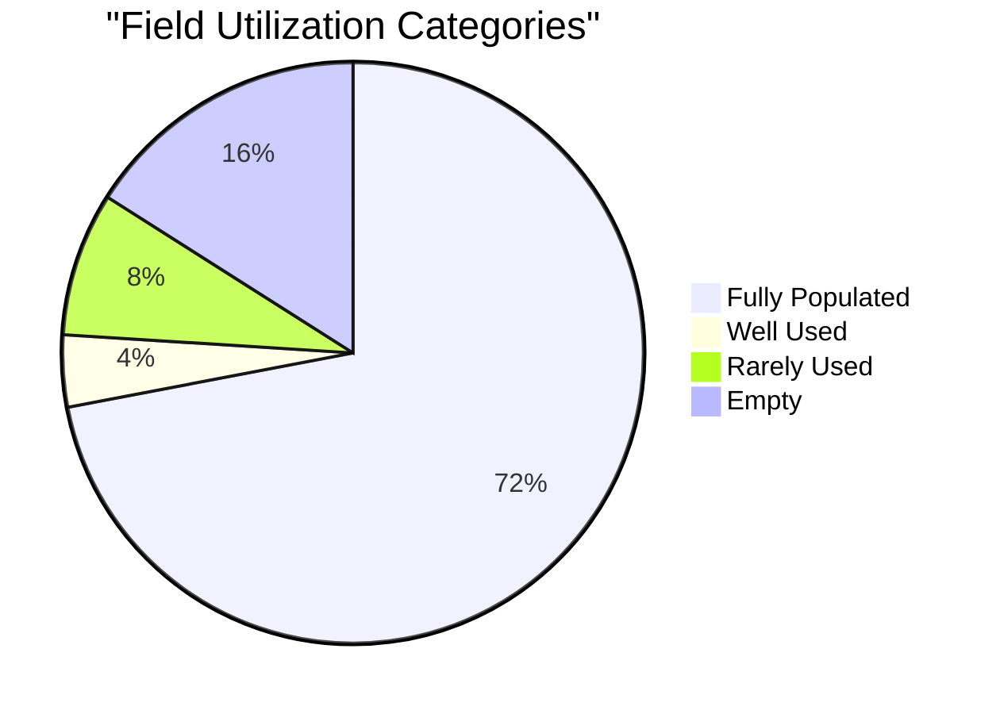
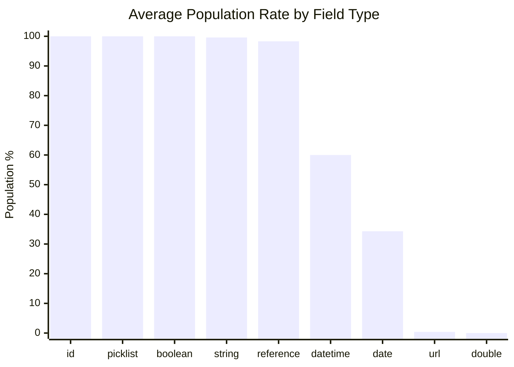
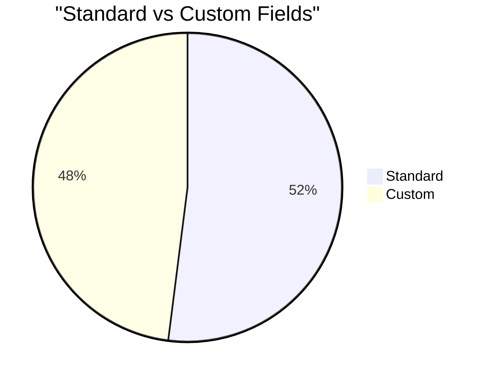
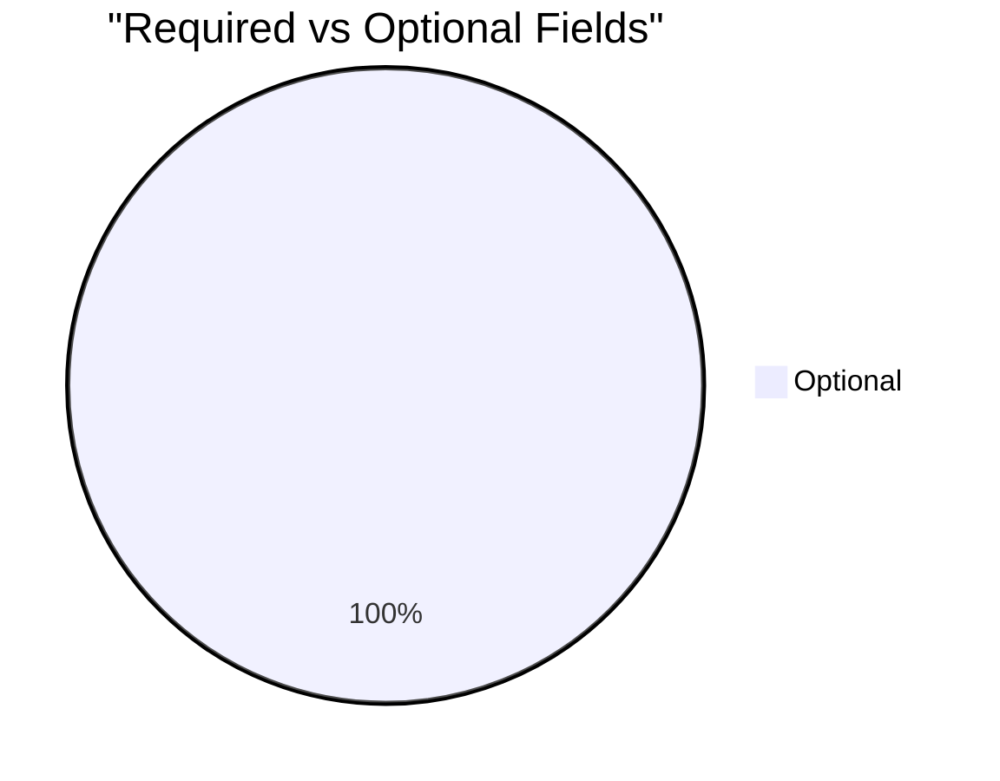

# Field Utilization Analysis: Service Participant (`pmdm__ServiceParticipant__c`)

> Generated on 2026-03-19 16:11:55

## Executive Summary

| Metric | Value |
| --- | --- |
| **Object** | Service Participant (`pmdm__ServiceParticipant__c`) |
| **Total Records** | 10,488 |
| **Total Fields Analyzed** | 25 |
| **Standard / Custom** | 13 / 12 |
| **Formula / Calculated** | 3 |
| **Required / Optional** | 0 / 25 |
| **Mean Population Rate** | 75.6% |
| **Median Population Rate** | 100.0% |

## Utilization Category Distribution

| Category | Threshold | Fields | % of Total |
| --- | --- | --- | --- |
| Fully Populated | > 95 % | 18 | 72.0% |
| Well Used | 50 – 95 % | 1 | 4.0% |
| Under-Utilized | 10 – 50 % | 0 | 0.0% |
| Rarely Used | 1 – 10 % | 2 | 8.0% |
| Empty | 0 % | 4 | 16.0% |

## Descriptive Statistics

Population-rate statistics across all analyzed fields:

| Statistic | Value |
| --- | --- |
| N (fields) | 25 |
| Mean | 75.58% |
| Median | 99.96% |
| Std Dev | 43.07% |
| Variance | 1855.19 |
| Min | 0.00% |
| Max | 100.00% |
| Q1 (25th pctl) | 46.72% |
| Q3 (75th pctl) | 100.00% |
| IQR | 53.28% |
| 5th Percentile | 0.00% |
| 95th Percentile | 100.00% |
| Skewness | -1.291 |
| Excess Kurtosis | -0.522 |
| Mode | 100.0% |

**Interpretation:**

- **Skewness (-1.291)** — Left-skewed: most fields are well-populated; a small tail of under-populated fields exists.
- **Kurtosis (-0.522)** — Mesokurtic: distribution shape is close to normal.

## Utilization by Field Type

| Field Type | Count | Avg Population Rate |
| --- | --- | --- |
| id | 1 | 100.0% |
| picklist | 2 | 100.0% |
| boolean | 1 | 100.0% |
| string | 4 | 99.6% |
| reference | 7 | 98.3% |
| datetime | 5 | 60.0% |
| date | 3 | 34.3% |
| url | 1 | 0.4% |
| double | 1 | 0.0% |

## Standard vs Custom Field Comparison

| Segment | Fields | Avg Population Rate |
| --- | --- | --- |
| Standard | 13 | 76.9% |
| Custom | 12 | 74.1% |

## Required vs Optional Fields

| Segment | Fields | Avg Population Rate |
| --- | --- | --- |
| Required | 0 | 0.0% |
| Optional | 25 | 75.6% |

## Detailed Field Analysis

### Fully Populated (18 fields)

| Field API Name | Label | Type | Population | Rate | Custom | Required | Formula |
| --- | --- | --- | --- | --- | --- | --- | --- |
| `Id` | Record ID | id | 10,488 | 100.0% |  |  |  |
| `OwnerId` | Owner ID | reference | 10,488 | 100.0% |  |  |  |
| `Name` | Service Participant Name | string | 10,488 | 100.0% |  |  |  |
| `CurrencyIsoCode` | Currency ISO Code | picklist | 10,488 | 100.0% |  |  |  |
| `CreatedDate` | Created Date | datetime | 10,488 | 100.0% |  |  |  |
| `CreatedById` | Created By ID | reference | 10,488 | 100.0% |  |  |  |
| `LastModifiedDate` | Last Modified Date | datetime | 10,488 | 100.0% |  |  |  |
| `LastModifiedById` | Last Modified By ID | reference | 10,488 | 100.0% |  |  |  |
| `SystemModstamp` | System Modstamp | datetime | 10,488 | 100.0% |  |  |  |
| `pmdm__SignUpDate__c` | Sign Up Date | date | 10,488 | 100.0% | Yes |  |  |
| `pmdm__Status__c` | Status | picklist | 10,488 | 100.0% | Yes |  |  |
| `IsDeleted` | Deleted | boolean | 10,488 | 100.0% |  |  |  |
| `pmdm__Contact__c` | Contact | reference | 10,484 | 100.0% | Yes |  |  |
| `Merge_Service_Participant_Gender__c` | Merge: Service Participant Gender | string | 10,476 | 99.9% | Yes |  | Yes |
| `pmdm__Service__c` | Service | reference | 10,400 | 99.2% | Yes |  |  |
| `Service_Name__c` | Service Name | string | 10,400 | 99.2% | Yes |  | Yes |
| `Program__c` | Program | string | 10,400 | 99.2% | Yes |  | Yes |
| `pmdm__ProgramEngagement__c` | Program Engagement | reference | 10,307 | 98.3% | Yes |  |  |

### Well Used (1 fields)

| Field API Name | Label | Type | Population | Rate | Custom | Required | Formula |
| --- | --- | --- | --- | --- | --- | --- | --- |
| `pmdm__ServiceSchedule__c` | Service Schedule | reference | 9,494 | 90.5% | Yes |  |  |

### Rarely Used (2 fields)

| Field API Name | Label | Type | Population | Rate | Custom | Required | Formula |
| --- | --- | --- | --- | --- | --- | --- | --- |
| `Completion_Date__c` | Completion Date | date | 306 | 2.9% | Yes |  |  |
| `Photo_Link__c` | Photo Link | url | 45 | 0.4% | Yes |  |  |

### Empty (4 fields)

| Field API Name | Label | Type | Population | Rate | Custom | Required | Formula |
| --- | --- | --- | --- | --- | --- | --- | --- |
| `LastActivityDate` | Last Activity Date | date | 0 | 0.0% |  |  |  |
| `LastViewedDate` | Last Viewed Date | datetime | 0 | 0.0% |  |  |  |
| `LastReferencedDate` | Last Referenced Date | datetime | 0 | 0.0% |  |  |  |
| `Currently_Employed__c` | Currently Employed | double | 0 | 0.0% | Yes |  |  |

## Recommendations

### Fields Recommended for Deletion Review

These **custom** fields have **0 % population**, are not required, and are not formula fields.
They are strong candidates for removal after confirming they are not referenced in automation, reports, or integrations.

- `Currently_Employed__c` (Currently Employed) — double

### Fields Needing a Data Collection Strategy

These fields are **< 25 % populated** and user-editable. Evaluate whether the data is valuable;
if so, consider validation rules, required-field configuration, screen flows, or training to improve collection.

| Field | Label | Type | Rate | Custom |
| --- | --- | --- | --- | --- |
| `Photo_Link__c` | Photo Link | url | 0.4% | Yes |
| `Completion_Date__c` | Completion Date | date | 2.9% | Yes |

---

*Analysis performed on 2026-03-19 16:11:55 against `pmdm__ServiceParticipant__c` with 10,488 records.*
